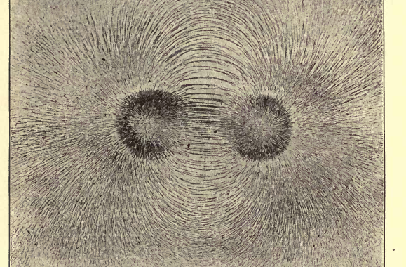
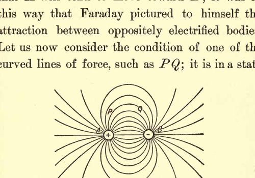
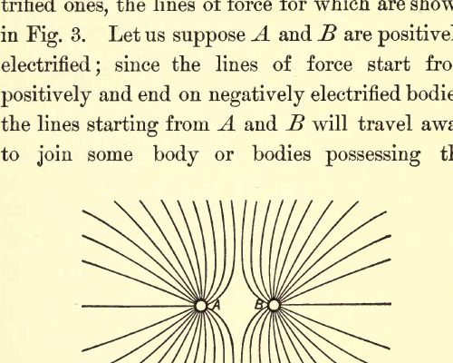
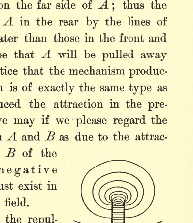
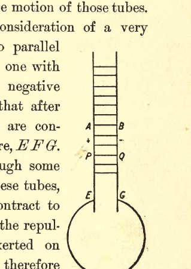
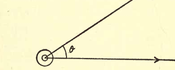
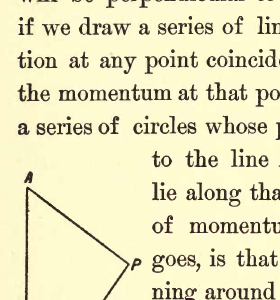
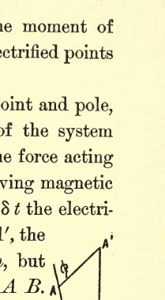
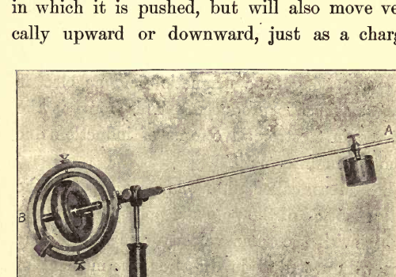

# ELECTRICITY AND MATTER

## CHAPTER I: REPRESENTATION OF THE ELECTRIC FIELD BY LINES OF FORCE

### Introduction

My object in these lectures is to put before you in as simple and untechnical a manner as I can some views as to the nature of electricity, of the processes going on in the electric field, and of the connection between electrical and ordinary matter which have been suggested by the results of recent investigations.

The progress of electrical science has been greatly promoted by speculations as to the nature of electricity. Indeed, it is hardly possible to overestimate the services rendered by two theories as old almost as the science itself; I mean the theories known as the two- and the one-fluid theories of electricity.

#### The Two-Fluid Theory

The two-fluid theory explains the phenomena of electro-statics by supposing that in the universe there are two fluids, uncreatable and indestructible, whose presence gives rise to electrical effects; one of these fluids is called positive, the other negative electricity, and electrical phenomena are explained by ascribing to the fluids the following properties. The particles of the positive fluid repel each other with forces varying inversely as the square of the distance between them, as do also the particles of the negative fluid; on the other hand, the particles of the positive fluid attract those of the negative fluid. The attraction between two charges, $m$ and $m'$, of opposite signs are in one form of the theory supposed to be exactly equal to the repulsion between two charges, $m$ and $m'$ of the same sign, placed in the same position as the previous charges. In another development of the theory the attraction is supposed to slightly exceed the repulsion, so as to afford a basis for the explanation of gravitation.

The fluids are supposed to be exceedingly mobile and able to pass with great ease through conductors. The state of electrification of a body is determined by the *difference* between the quantities of the two electric fluids contained by it; if it contains more positive fluid than negative it is positively electrified, if it contains equal quantities it is uncharged. Since the fluids are uncreatable and indestructible, the appearance of the positive fluid in one place must be accompanied by the departure of the same quantity from some other place, so that the production of electrification of one sign must always be accompanied by the production of an equal amount of electrification of the opposite sign.

On this view, every body is supposed to consist of three things: ordinary matter, positive electricity, negative electricity. The two latter are supposed to exert forces on themselves and on each other, but in the earlier form of the theory no action was contemplated between ordinary matter and the electric fluids; it was not until a comparatively recent date that Helmholtz introduced the idea of a specific attraction between ordinary matter and the electric fluids. He did this to explain what is known as contact electricity, i.e., the electrical separation produced when two metals, say zinc and copper, are put in contact with each other, the zinc becoming positively, the copper negatively electrified. Helmholtz supposed that there are forces between ordinary matter and the electric fluids varying for different kinds of matter, the attraction of zinc for positive electricity being greater than that of copper, so that when these metals are put in contact the zinc robs the copper of some of its positive electricity.

There is an indefiniteness about the two-fluid theory which may be illustrated by the consideration of an unelectrified body. All that the two-fluid theory tells us about such a body is that it contains equal quantities of the two fluids. It gives no information about the amount of either; indeed, it implies that if equal quantities of the two are added to the body, the body will be unaltered, equal quantities of the two fluids exactly neutralizing each other. If we regard these fluids as being anything more substantial than the mathematical symbols + and −, this leads us into difficulties; if we regard them as physical fluids, for example, we have to suppose that the mixture of the two fluids in equal proportions is something so devoid of physical properties that its existence has never been detected.

#### The One-Fluid Theory

The other fluid theory—the one-fluid theory of Benjamin Franklin—is not open to this objection. On this view there is only one electric fluid, the positive; the part of the other is taken by ordinary matter, the particles of which are supposed to repel each other and attract the positive fluid, just as the particles of the negative fluid do on the two-fluid theory. Matter when unelectrified is supposed to be associated with just so much of the electric fluid that the attraction of the matter on a portion of the electric fluid outside it is just sufficient to counteract the repulsion exerted on the same fluid by the electric fluid associated with the matter. On this view, if the quantity of matter in a body is known the quantity of electric fluid is at once determined.

#### Services of the Fluid Theories

The services which the fluid theories have rendered to electricity are independent of the notion of a fluid with any physical properties; the fluids were mathematical fictions, intended merely to give a local habitation to the attractions and repulsions existing between electrified bodies, and served as the means by which the splendid mathematical development of the theory of forces varying inversely as the square of the distance which was inspired by the discovery of gravitation could be brought to bear on electrical phenomena. As long as we confine ourself to questions which only involve the law of forces between electrified bodies, and the simultaneous production of equal quantities of + and − electricity, both theories must give the same results and there can be nothing to decide between them. The physicists and mathematicians who did most to develop the "Fluid Theories" confined themselves to questions of this kind, and refined and idealized the conception of these fluids until any reference to their physical properties was considered almost indelicate. It is not until we investigate phenomena which involve the physical properties of the fluid that we can hope to distinguish between the rival fluid theories. Let us take a case which has actually arisen. We have been able to measure the masses associated with given charges of electricity in gases at low pressures, and it has been found that the mass associated with a positive charge is immensely greater than that associated with a negative one. This difference is what we should expect on Franklin's one-fluid theory, if that theory were modified by making the electric fluid correspond to negative instead of positive electricity, while we have no reason to anticipate so great a difference on the two-fluid theory. We shall, I am sure, be struck by the similarity between some of the views which we are led to take by the results of the most recent researches with those enunciated by Franklin in the very infancy of the subject.

### Faraday's Line of Force Theory

The fluid theories, from their very nature, imply the idea of action at a distance. This idea, although its convenience for mathematical analysis has made it acceptable to many mathematicians, is one which many of the greatest physicists have felt utterly unable to accept, and have devoted much thought and labor to replacing it by something involving mechanical continuity. Pre-eminent among them is Faraday. Faraday was deeply influenced by the axiom, or if you prefer it, dogma that matter cannot act where it is not. Faraday, who possessed, I believe, almost unrivalled mathematical insight, had had no training in analysis, so that the convenience of the idea of action at a distance for purposes of calculation had no chance of mitigating the repugnance he felt to the idea of forces acting far away from their base and with no physical connection with their origin. He therefore cast about for some way of picturing to himself the actions in the electric field which would get rid of the idea of action at a distance, and replace it by one which would bring into prominence some continuous connection between the bodies exerting the forces. He was able to do this by the conception of lines of force. As I shall have continually to make use of this method, and as I believe its powers and possibilities have never been adequately realized, I shall devote some time to the discussion and development of this conception of the electric field.

The method was suggested to Faraday by the consideration of the lines of force round a bar magnet. If iron filings are scattered on a smooth surface near a magnet they arrange themselves as in Fig. 1; well-marked lines can be traced running from one pole of the magnet to the other; the direction of these lines at any point coincides with the direction of the magnetic force, while the intensity of the force is indicated by the concentration of the lines. Starting from any point in the field and travelling always in the direction of the magnetic force, we shall trace out a line which will not stop until we reach the negative pole of the magnet; if such lines are drawn at all points in the field, the space through which the magnetic field extends will be filled with a system of lines, giving the space a fibrous structure like that possessed by a stack of hay or straw, the grain of the structure being along the lines of force.

> Two dark circular pole regions are visible near the center, with iron filings forming dense radial spikes around each pole and smooth arching loops bridging between them. The pattern is approximately left-right symmetric, and the line crowding is strongest close to the poles, fading outward into finer texture.

I have spoken so far only of lines of magnetic force; the same considerations will apply to the electric field, and we may regard the electric field as full of lines of electric force, which start from positively and end on negatively electrified bodies. Up to this point the process has been entirely geometrical, and could have been employed by those who looked at the question from the point of view of action at a distance; to Faraday, however, the lines of force were far more than mathematical abstractions-they were physical realities. Faraday materialized the lines of force and endowed them with physical properties so as to explain the phenomena of the electric field. Thus he supposed that they were in a state of tension, and that they repelled each other. Instead of an intangible action at a distance between two electrified bodies, Faraday regarded the whole space between the bodies as full of stretched mutually repellent springs. The charges of electricity to which alone an interpretation had been given on the fluid theories of electricity were on this view just the ends of these springs, and an electric charge, instead of being a portion of fluid confined to the electrified body, was an extensive arsenal of springs spreading out in all directions to all parts of the field.

#### Analysis of Simple Cases

To make our ideas clear on this point let us consider some simple cases from Faraday's point of view. Let us first take the case of two bodies with equal and opposite charges, whose lines of force are shown in Fig. 2. You notice that the lines of force are most dense along $AB$, the line joining the bodies, and that there are more lines of force on the side of $A$ nearest to $B$ than on the opposite side.

> A plus charge at left and a minus charge at right are connected by many curved field lines. Several inner lines arc tightly from left to right between the charges, while outer lines bow broadly around the pair; labels such as P, Q, and B are drawn on selected curves.

Consider the effect of the lines of force on $A$; the lines are in a state of tension and are pulling away at $A$; as there are more pulling at $A$ on the side nearest to $B$ than on the opposite side, the pulls on $A$ toward $B$ overpower those pulling $A$ away from $B$, so that $A$ will tend to move toward $B$; it was in this way that Faraday pictured to himself the attraction between oppositely electrified bodies.

Let us now consider the condition of one of the curved lines of force, such as $PQ$; it is in a state of tension and will therefore tend to straighten itself, how is it prevented from doing this and maintained in equilibrium in a curved position? We can see the reason for this if we remember that the lines of force repel each other and that the lines are more concentrated in the region between $PQ$ and $AB$ than on the other side of $PQ$; thus the repulsion of the lines inside $PQ$ will be greater than the repulsion of those outside and the line $PQ$ will be bent outwards.

Let us now pass from the case of two oppositely electrified bodies to that of two similarly electrified ones, the lines of force for which are shown in Fig. 3. Let us suppose $A$ and $B$ are positively electrified; since the lines of force start from positively and end on negatively electrified bodies, the lines starting from $A$ and $B$ will travel away to join some body or bodies possessing the negative charges corresponding to the positive ones on $A$ and $B$; let us suppose that these charges are a considerable distance away, so that the lines of force from $A$ would, if $B$ were not present, spread out, in the part of the field under consideration, uniformly in all directions.

> Two neighboring point charges labeled A and B emit outward field lines that bend away from the central gap, showing mutual repulsion. The central separatrix-like region is pinched between the charges, and no lines connect directly from one charge to the other.

Consider now the effect of making the system of lines of force attached to $A$ and $B$ approach each other; since these lines repel each other the lines of force on the side of $A$ nearest $B$ will be pushed to the opposite side of $A$, so that the lines of force will now be densest on the far side of $A$; thus the pulls exerted on $A$ in the rear by the lines of force will be greater than those in the front and the result will be that $A$ will be pulled away from $B$. We notice that the mechanism producing this repulsion is of exactly the same type as that which produced the attraction in the previous case, and we may if we please regard the repulsion between $A$ and $B$ as due to the attractions on $A$ and $B$ of the complementary negative charges which must exist in other parts of the field.

The results of the repulsion of the lines of force are clearly shown in the case represented in Fig. 4, that of two oppositely electrified plates; you will notice that the lines of force between the plates are straight except near the edges of the plates; this is what we should expect as the downward pressure exerted by the lines of force above a line in this part of the field will be equal to the upward pressure exerted by those below it. For a line of force near the edge of the plate, however, the pressure of the lines of force below will exceed the pressure from those above, and the line of force will bulge out until its curvature and tension counteract the squeeze from inside; this bulging is very plainly shown in Fig. 4.

> The extracted image is a partial crop: it shows the top of a plate-like electrode and a stack of concentric curved contours above it. The visible contours are tightly nested near the centerline and expand outward, indicating field-line bulging near an edge region.

#### Tubes of Force and Electric Displacement

So far our use of the lines of force has been descriptive rather than metrical; it is, however, easy to develop the method so as to make it metrical. We can do this by introducing the idea of *tubes of force*. If through the boundary of any small closed curve in the electric field we draw the lines of force, these lines will form a tubular surface, and if we follow the lines back to the positively electrified surface from which they start and forward on to the negatively electrified surface on which they end, we can prove that the positive charge enclosed by the tube at its origin is equal to the negative charge enclosed by it at its end. By properly choosing the area of the small curve through which we draw the lines of force, we may arrange that the charge enclosed by the tube is equal to the unit charge. Let us call such a tube a *Faraday tube*; then each unit of positive electricity in the field may be regarded as the origin and each unit of negative electricity as the termination of a Faraday tube. We regard these Faraday tubes as having direction, their direction being the same as that of the electric force, so that the positive direction is from the positive to the negative end of the tube. If we draw any closed surface then the difference between the number of Faraday tubes which pass out of the surface and those which pass in will be equal to the algebraic sum of the charges inside the surface; this sum is what Maxwell called the *electric displacement* through the surface. What Maxwell called the *electric displacement in any direction at a point* is the number of Faraday tubes which pass through a unit area through the point drawn at right angles to that direction, the number being reckoned algebraically; i.e., the lines which pass through in one direction being taken as positive, while those which pass through in the opposite direction are taken as negative, and the number passing through the area is the difference between the number passing through positively and the number passing through negatively.

For my own part, I have found the conception of Faraday tubes to lend itself much more readily to the formation of a mental picture of the processes going on in the electric field than that of electric displacement, and have for many years abandoned the latter method.

#### Maxwell's Treatment of Tensions and Pressures

Maxwell took up the question of the tensions and pressures in the lines of force in the electric field, and carried the problem one step further than Faraday. By calculating the amount of these tensions he showed that the mechanical effects in the electrostatic field could be explained by supposing that each Faraday tube force exerted a tension equal to $R$, $R$ being the intensity of the electric force, and that, in addition to this tension, there was in the medium through which the tubes pass a hydrostatic pressure equal to $\frac{1}{2}NR$, $N$ being the density of the Faraday tubes; i.e., the number passing through a unit area drawn at right angles to the electric force. If we consider the effect of these tensions and pressure on a unit volume of the medium in the electric field, we see that they are equivalent to a tension $\frac{1}{2}NR$ along the direction of the electric force and an equal pressure in all directions at right angles to that force.

### Moving Faraday Tubes

Hitherto we have supposed the Faraday tubes to be at rest, let us now proceed to the study of the effects produced by the motion of those tubes.

Let us begin with the consideration of a very simple case—that of two parallel plates, $A$ and $B$, charged, one with positive the other with negative electricity, and suppose that after being charged the plates are connected by a conducting wire, $EFG$. This wire will pass through some of the outlying tubes; these tubes, when in a conductor, contract to molecular dimensions and the repulsion they previously exerted on neighboring tubes will therefore disappear.

> The crop shows two narrow vertical plates with short horizontal connectors between them, labeled around A, B, P, and Q. Lower down, the plate pair descends toward labels E and G and meets a large circular conductor outline, consistent with a discharge path geometry.

Consider the effect of this on a tube $PQ$ between the plates; $PQ$ was originally in equilibrium under its own tension, and the repulsion exerted by the neighboring tubes. The repulsions due to those cut by $EFG$ have now, however, disappeared so that $PQ$ will no longer be in equilibrium, but will be pushed towards $EFG$. Thus, more and more tubes will be pushed into $EFG$, and we shall have a movement of the whole set of tubes between the plates toward $EFG$. Thus, while the discharge of the plates is going on, the tubes between the plates are moving at right angles to themselves. What physical effect accompanies this movement of the tubes? The result of connecting the plates by $EFG$ is to produce a current of electricity flowing from the positively charged plate through $EFG$ to the negatively charged plate; this is, as we know, accompanied by a magnetic force between the plates. This magnetic force is at right angles to the plane of the paper and equal to $4\pi$ times the intensity of the current in the plate, or, if $\sigma$ is the density of the charge of electricity on the plates and $v$ the velocity with which the charge moves, the magnetic force is equal to $4\pi\sigma v$.

Here we have two phenomena which do not take place in the steady electrostatic field, one the movement of the Faraday tubes, the other the existence of a magnetic force; this suggests that there is a connection between the two, and that motion of the Faraday tubes is accompanied by the production of magnetic force. I have followed up the consequences of this supposition and have shown that, if the connection between the magnetic force and the moving tubes is that given below, this view will account for Ampère's laws connecting current and magnetic force, and for Faraday's law of the induction of currents. Maxwell's great contribution to electrical theory, that variation in the electric displacement in a dielectric produces magnetic force, follows at once from this view. For, since the electric displacement is measured by the density of the Faraday tubes, if the electric displacement at any place changes, Faraday tubes must move up to or away from the place, and motion of Faraday tubes, by hypothesis, implies magnetic force.

#### Law of Magnetic Force Production

The law connecting magnetic force with the motion of the Faraday tubes is as follows: A Faraday tube moving with velocity $v$ at a point $P$, produces at $P$ a magnetic force whose magnitude is $4\pi v \sin \theta$, the direction of the magnetic force being at right angles to the Faraday tube, and also to its direction of motion; $\theta$ is the angle between the Faraday tube and the direction in which it is moving. We see that it is only the motion of a tube at right angles to itself which produces magnetic force; no such force is produced by the gliding of a tube along its length.

### Motion of a Charged Sphere

We shall apply these results to a very simple and important case—the steady motion of a charged sphere. If the velocity of the sphere is small compared with that of light then the Faraday tubes will, as when the sphere is at rest, be uniformly distributed and radial in direction. They will be carried along with the sphere. If $e$ is the charge on the sphere, $O$ its centre, the density of the Faraday tubes at $P$ is $\frac{e}{4\pi OP^2}$; so that if $v$ is the velocity of the sphere, $\theta$ the angle between $OP$ and the direction of motion of the sphere, then, according to the above rule, the magnetic force at $P$ will be $\frac{ev\sin\theta}{r^2}$, the direction of the force will be at right angles to $OP$, and at right angles to the direction of motion of the sphere; the lines of magnetic force will thus be circles, having their centres on the path of the centre of the sphere and their planes at right angles to this path.

> A small circled point at the left is the charge center, with a horizontal arrow pointing right to indicate motion. A second ray rises diagonally from the same point, and the interior wedge between the two rays is marked by the angle $\theta$.

Thus, a moving charge of electricity will be accompanied by a magnetic field. The existence of a magnetic field implies energy; we know that in a unit volume of the field at a place where the magnetic force is $H$ there are $\frac{\mu H^2}{8\pi}$ units of energy, where $\mu$ is the magnetic permeability of the medium. In the case of the moving sphere the energy per unit volume at $P$ is $\frac{\mu e^2v^2\sin^2\theta}{8\pi OP^4}$. Taking the sum of this energy for all parts of the field outside the sphere, we find that it amounts to $\frac{\mu e^2v^2}{3a}$, where $a$ is the radius of the sphere. If $m$ is the mass of the sphere, the kinetic energy in the sphere is $\frac{1}{2}mv^2$; in addition to that we have the energy outside the sphere, which as we have seen is $\frac{\mu e^2v^2}{3a}$; so that the whole kinetic energy of the system is $\frac{1}{2}\left(m + \frac{2\mu e^2}{3a}\right)v^2$, or the energy is the same as if the mass of the sphere were $m + \frac{2\mu e^2}{3a}$ instead of $m$. Thus, in consequence of the electric charge, the mass of the sphere is measured by $\frac{2\mu e^2}{3a}$. This is a very important result, since it shows that part of the mass of a charged sphere is due to its charge. I shall later on have to bring before you considerations which show that it is not impossible that the whole mass of a body may arise in the way.

Before passing on to this point, however, I should like to illustrate the increase which takes place in the mass of the sphere by some analogies drawn from other branches of physics. The first of these is the case of a sphere moving through a frictionless liquid. When the sphere moves it sets the fluid around it moving with a velocity proportioned to its own, so that to move the sphere we have not merely to move the substance of the sphere itself, but also the liquid around it; the consequence of this is, that the sphere behaves as if its mass were increased by that of a certain volume of the liquid. This volume, as was shown by Green in 1833, is half the volume of the sphere. In the case of a cylinder moving at right angles to its length, its mass is increased by the mass of an equal volume of the liquid. In the case of an elongated body like a cylinder, the amount by which the mass is increased depends upon the direction in which the body is moving, being much smaller when the body moves point foremost than when moving sideways. The mass of such a body depends on the direction in which it is moving.

Let us, however, return to the moving electrified sphere. We have seen that in consequence of its charge its mass is increased by $\frac{2\mu e^2}{3a}$; thus, if it is moving with the velocity $v$, the momentum is not $mv$, but $\left(m + \frac{2\mu e^2}{3a}\right)v$. The additional momentum $\frac{2\mu e^2}{3a}v$ is not in the sphere, but in the space surrounding the sphere. There is in this space *ordinary mechanical momentum*, whose resultant is $\frac{2\mu e^2}{3a}v$ and whose direction is parallel to the direction of motion of the sphere. It is important to bear in mind that this momentum is not in any way different from ordinary mechanical momentum and can be given up to or taken from the momentum of moving bodies. I want to bring the existence of this momentum before you as vividly and forcibly as I can, because the recognition of it makes the behavior of the electric field entirely analogous to that of a mechanical system. To take an example, according to Newton's Third Law of Motion, Action and Reaction are equal and opposite, so that the momentum in any direction of any self-contained system is invariable. Now, in the case of many electrical systems there are apparent violations of this principle; thus, take the case of a charged body at rest struck by an electric pulse, the charged body when exposed to the electric force in the pulse acquires velocity and momentum, so that when the pulse has passed over it, its momentum is not what it was originally. Thus, if we confine our attention to the momentum in the charged body, i.e., if we suppose that momentum is necessarily confined to what we consider ordinary matter, there has been a violation of the Third Law of Motion, for the only momentum recognized on this restricted view has been changed. The phenomenon is, however, brought into accordance with this law if we recognize the existence of the momentum in the electric field; for, on this view, before the pulse reached the charged body there was momentum in the pulse, but none in the body; after the pulse passed over the body there was some momentum in the body and a smaller amount in the pulse, the loss of momentum in the pulse being equal to the gain of momentum by the body.

We now proceed to consider this momentum more in detail. I have in my "Recent Researches on Electricity and Magnetism" calculated the amount of momentum at any point in the electric field, and have shown that if $N$ is the number of Faraday tubes passing through a unit area drawn at right angles to their direction, $B$ the magnetic induction, $\theta$ the angle between the induction and the Faraday tubes, then the momentum per unit volume is equal to $NB\sin\theta$, the direction of the momentum being at right angles to the magnetic induction and also to the Faraday tubes.

Many of you will notice that the momentum is parallel to what is known as Poynting's vector—the vector whose direction gives the direction in which energy is flowing through the field.

### Moment of Momentum Due to an Electrified Point and a Magnetic Pole

To familiarize ourselves with this distribution of momentum let us consider some simple cases in detail. Let us begin with the simplest, that of an electrified point and a magnetic pole; let $A$, Fig. 7, be the point, $B$ the pole. Then, since the momentum at any point $P$ is at right angles to $AP$, the direction of the Faraday tubes and also to $BP$, the magnetic induction, we see that the momentum will be perpendicular to the plane $ABP$; thus, if we draw a series of lines such that their direction at any point coincides with the direction of the momentum at that point, these lines will form a series of circles whose planes are perpendicular to the line $AB$, and whose centres lie along that line. This distribution of momentum, as far as direction goes, is that possessed by a top spinning around $AB$.

> This figure is partially cropped in the current extraction: the left side of a triangular line construction is visible with vertex labels including A and P, and surrounding text indicates the geometric setup for momentum directions around line AB.

Let us now find what this distribution of momentum throughout the field is equivalent to. It is evident that the resultant momentum in any direction is zero, but since the system is spinning round $AB$, the direction of rotation being everywhere the same, there will be a finite moment of momentum round $AB$. Calculating the value of this from the expression for the momentum given above, we obtain the very simple expression $em$ as the value of the moment of momentum about $AB$, $e$ being the charge on the point and $m$ the strength of the pole. By means of this expression we can at once find the moment of momentum of any distribution of electrified points and magnetic poles.

To return to the system of the point and pole, this conception of the momentum of the system leads directly to the evaluation of the force acting on a moving electric charge or a moving magnetic pole. For suppose that in the time $\delta t$ the electrified point were to move from $A$ to $A'$, the moment of momentum is still $em$, but its axis is along $A'B$ instead of $AB$. The moment of momentum of the field has thus changed, but the whole moment of momentum of the system comprising point, pole, and field must be constant, so that the change in the moment of momentum of the field must be accompanied by an equal and opposite change in the moment of momentum of the pole and point.

> A partial geometric sketch shows a slanted segment with upper point labeled $A'$, a nearby angle mark $\theta$, and lower labeling around A and B. The visible construction corresponds to the displaced-point triangle used in the momentum-change argument.

The momentum gained by the point must be equal and opposite to that gained by the pole, since the whole momentum is zero. If $\theta$ is the angle $ABA'$, the change in the moment of momentum is $em\sin\theta$, with an axis at right angles to $AB$ in the plane of the paper. Let $\delta I$ be the change in the momentum of $A$, $\delta I$ that of $B$, then $\delta I$ and $-\delta I$ must be equivalent to a couple whose axis is at right angles to $AB$ in the plane of the paper, and whose moment is $em\sin\theta$. Thus $\delta I$ must be at right angles to the plane of the paper and

$$\delta I \cdot AB = em\sin\theta = \frac{em \cdot AA' \sin \phi}{AB}$$

Where $\phi$ is the angle $BAA'$. If $v$ is the velocity of $A$, $AA' = v\delta t$ and we get

$$\delta I = \frac{emv\sin\phi \delta t}{AB^2}$$

This change in the momentum may be supposed due to the action of a force $F$ perpendicular to the plane of the paper, $F$ being the rate of increase of the momentum, or $\frac{\delta I}{\delta t}$. We thus get $F = \frac{emv\sin\phi}{AB^2}$; or the point is acted on by a force equal to $e$ multiplied by the component of the magnetic force at right angles to the direction of motion. The direction of the force acting on the point is at right angles to its velocity and also to the magnetic force. There is an equal and opposite force acting on the magnetic pole.

The value we have found for $F$ is the ordinary expression for the mechanical force acting on a moving charged particle in a magnetic field; it may be written as $ev H\sin\phi$, where $H$ is the strength of the magnetic field. The force acting on unit charge is therefore $vH\sin\phi$. This mechanical force may be thus regarded as arising from an electric force $vH\sin\phi$, and we may express the result by saying that when a charged body is moving in a magnetic field an electric force $vH\sin\phi$ is produced. This force is the well-known electromotive force of induction due to motion in a magnetic field.

The forces called into play are due to the *relative* motion of the pole and point; if these are moving with the same velocity, the line joining them will not alter in direction, the moment of momentum of the system will remain unchanged and there will not be any forces acting either on the pole or the point.

The distribution of momentum in the system of pole and point is similar in some respects to that in a top spinning about the line $AB$. We can illustrate the forces acting on a moving electrified body by the behavior of such a top. Thus, let Fig. 9 represent a balanced gyroscope spinning about the axis $AB$, let the ball at $A$ represent the electrified point, that at $B$ the magnetic pole. Suppose the instrument is spinning with $AB$ horizontal, then if with a vertical rod I push against $AB$ horizontally, the point $A$ will not merely move horizontally forward in the direction in which it is pushed, but will also move vertically upward or downward, just as a charged point would do if pushed forward in the same way, and if it were acted upon by a magnetic pole at $B$.

> A photographed mechanical gyroscope apparatus appears on the left with concentric rotating rings and a support stand; a long rod extends to a suspended mass on the right near label A, with label B near the gyroscope side. The image visually supports the analogy between gyroscopic response and electromagnetic force directions.

### Maxwell's Vector Potential

There is a very close connection between the momentum arising from an electrified point and a magnetic system, and the Vector Potential of that system, a quantity which plays a very large part in Maxwell's Theory of Electricity. From the expression we have given for the moment of momentum due to a charged point and a magnetic pole, we can at once find that due to a charge $e$ of electricity at a point $P$, and a little magnet $AB$; let the negative pole of this magnet be at $A$, the positive at $B$, and let $m$ be the strength of either pole. A simple calculation shows that in this case the axis of the resultant moment of momentum is in the plane $PAB$ at right angles to $PO$, $O$ being the middle point of $AB$, and that the magnitude of the moment of momentum is equal to $e.m.AB\frac{\sin\phi}{OP^2}$, where $\phi$ is the angle $AB$ makes with $OP$. This moment of momentum is equivalent in direction and magnitude to that due to a momentum $e.m.AB\frac{\sin\phi}{OP^2}$ at $P$ directed at right angles to the plane $PAB$, and another momentum equal in magnitude and opposite in direction at $O$. The vector $m AB\frac{\sin\phi}{OP^2}$ at $P$ at right angles to the plane $PAB$ is the vector called by Maxwell the *Vector Potential* at $P$ due to the Magnet.

Calling this Vector Potential $I$, we see that the momentum due to the charge and the magnet is equivalent to a momentum $eI$ at $P$ and a momentum $-eI$ at the magnet.

We may evidently extend this to any complex system of magnets, so that if $I$ is the Vector Potential at $P$ of this system, the momentum in the field is equivalent to a momentum $eI$ at $P$ together with momenta at each of the magnets equal to $-e$ (Vector Potential at $P$ due to that magnet).

If the magnetic field arises entirely from electric currents instead of from permanent magnets, the momentum of a system consisting of an electrified point and the currents will differ in some of its features from the momentum when the magnetic field is due to permanent magnets. In the latter case, as we have seen, there is a moment of momentum, but no resultant momentum. When, however, the magnetic field is entirely due to electric currents, it is easy to show that there is a resultant momentum, but that the moment of momentum about any line passing through the electrified particle vanishes. A simple calculation shows that the whole momentum in the field is equivalent to a momentum $eI$ at the electrified point $I$ being the Vector Potential at $P$ due to the currents.

Thus, whether the magnetic field is due to permanent magnets or to electric currents or partly to one and partly to the other, the momentum when an electrified point is placed in the field at $P$ is equivalent to a momentum $eI$ at $P$ where $I$ is .the Vector Potential at $P$. If the magnetic field is entirely due to currents this is a complete representation of the momentum in the field; if the magnetic field is partly due to magnets we have in addition to this momentum at $P$ other momenta at these magnets; the magnitude of the momentum at any particular magnet is $e$ times the Vector Potential at $P$ due to that magnet.

The well-known expressions for the electromotive forces due to Electro-magnetic Induction follow at once from this result. For, from the Third Law of Motion, the momentum of any self-contained system must be constant. Now the momentum consists of (1) the momentum in the field; (2) the momentum of the electrified point, and (3) the momenta of the magnets or circuits carrying the currents. Since (1) is equivalent to a momentum $eI$ at the electrified particle, we see that changes in the momentum of the field must be accompanied by changes in the momentum of the particle. Let $M$ be the mass of the electrified particle, $u, v, w$ the components parallel to the axes of $x, y, z$ of its velocity, $F, G, H$, the components parallel to these axes of the Vector Potential at $P$, then the momentum of the field is equivalent to momenta $eF, eG, eH$ at $P$ parallel to the axes of $x, y, z$; and the momentum of the charged point at $P$ has for components $Mu, Mo, Mw$. As the momentum remains constant, $Mu + eF$ is constant, hence if $\delta u$ and $\delta F$ are simultaneous changes in $u$ and $F$,

$$M\delta u + e\delta F = 0;$$

$$\text{or } m\frac{du}{dt} = -e\frac{dF}{dt}.$$

From this equation we see that the point with the charge behaves as if it were acted upon by a mechanical force parallel to the axis of $x$ and equal to $-e\frac{dF}{dt}$, i.e., by an electric force equal to $-\frac{dF}{dt}$.

In a similar way we see that there are electric forces $-\frac{dG}{dt}$, $-\frac{dH}{dt}$, parallel to $y$ and $z$ respectively. These are the well-known expressions of the forces due to electro-magnetic induction, and we see that they are a direct consequence of the principle that action and reaction are equal and opposite.

Readers of Faraday's Experimental Researches will remember that he is constantly referring to what he called the "Electrotonic State"; thus he regarded a wire traversed by an electric current as being in the Electrotonic State when in a magnetic field. No effects due to this state can be detected as long as the field remains constant; it is when it is changing that it is operative. This Electrotonic State of Faraday is just the *momentum* existing in the field.
