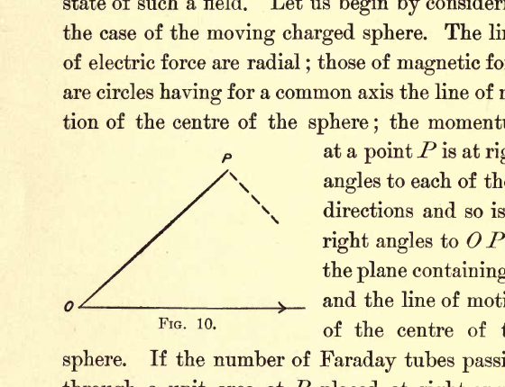
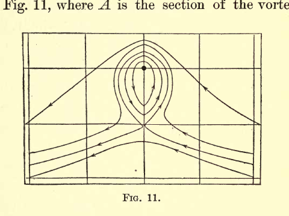

# ELECTRICITY AND MATTER

## CHAPTER II: ELECTRICAL AND BOUND MASS

I wish in this chapter to consider the connection between the momentum in the electric field and the Faraday tubes, by which, as I showed in the last lecture, we can picture to ourselves the state of such a field. Let us begin by considering the case of the moving charged sphere. The lines of electric force are radial; those of magnetic force are circles having for a common axis the line of motion of the centre of the sphere; the momentum at a point $P$ is at right angles to each of these directions and so is at right angles to $OP$ in the plane containing $P$ and the line of motion of the centre of the sphere. If the number of Faraday tubes passing through a unit area at $P$ placed at right angles to $OP$ is $N$, the magnetic induction at $P$ is, if $\mu$ is the magnetic permeability of the medium surrounding the sphere, $4\pi\mu Nv\sin\theta$, $v$ being the velocity of the sphere and $\theta$ the angle $OP$ makes with the direction of motion of the sphere. By the rule given on page 25 the momentum in unit volume of the medium at $P$ is $N \times 4\pi\mu Nv\sin\theta$, or $4\pi\mu N^2v\sin\theta$, and is in the direction of the component of the velocity of the Faraday tubes at right angles to their length. Now this is exactly the momentum which would be produced if the tubes were to carry with them, when they move at right angles to their length, a mass of the surrounding medium equal to $4\pi\mu N^2$ per unit volume, the tubes possessing no mass themselves and not carrying any of the medium with them when they glide through it parallel to their own length. We suppose in fact the tubes to behave very much as long and narrow cylinders behave when moving through water; these if moving endwise, i.e., parallel to their length, carry very little water along with them, while when they move sideways, i.e., at right angles to their axis, each unit length of the tube carries with it a finite mass of water. When the length of the cylinder is very great compared with its breadth, the mass of water carried by it when moving endwise may be neglected in comparison with that carried by it when moving sideways; if the tube had no mass beyond that which it possesses in virtue of the water it displaces, it would have mass for sideways but none for endwise motion.

> The figure shows a geometric construction with origin point $O$ at the left, point $P$ near the top, and a solid segment from $O$ to $P$. A horizontal baseline extends to the right from $O$ with an arrow, and a short dashed segment descends from $P$ toward the right, marking the angular relation used in the momentum argument.

We shall call the mass $4\pi\mu N^2$ carried by the tubes in unit volume the mass of the bound ether. It is a very suggestive fact that the electrostatic energy $E$ in unit volume is proportional to $M$ the mass of the bound ether in that volume. This can easily be proved as follows:

$$
E = \frac{2\pi N^2}{K},
$$

where $K$ is the specific inductive capacity of the medium; while

$$
M = 4\pi\mu N^2,
$$

thus,

$$
E = \frac{1}{2}\frac{M}{\mu K};
$$

but

$$
\frac{1}{\mu K} = V^2
$$

where $V$ is the velocity with which light travels through the medium, hence

$$
E = \frac{1}{2}MV^2;
$$

thus $E$ is equal to the kinetic energy possessed by the bound mass when moving with the velocity of light.

The mass of the bound ether in unit volume is $4\pi\mu N^2$ where $N$ is the number of Faraday tubes; thus, the amount of bound mass per unit length of each Faraday tube is $4\pi\mu N$. We have seen that this is proportional to the tension in each tube, so that we may regard the Faraday tubes as tightly stretched strings of variable mass and tension; the tension being, however, always proportional to the mass per unit length of the string.

Since the mass of ether imprisoned by a Faraday tube is proportional to $N$ the number of Faraday tubes in unit volume, we see that the mass and momentum of a Faraday tube depend not merely upon the configuration and velocity of the tube under consideration, but also upon the number and velocity of the Faraday tubes in its neighborhood. We have many analogies to this in the case of dynamical systems; thus, in the case of a number of cylinders with their axes parallel, moving about in an incompressible liquid, the momentum of any cylinder depends upon the positions and velocities of the cylinders in its neighborhood. The following hydro-dynamical system is one by which we may illustrate the fact that the bound mass is proportional to the square of the number of Faraday tubes per unit volume.

Suppose we have a cylindrical vortex column of strength $m$ placed in a mass of liquid whose velocity, if not disturbed by the vortex column, would be constant both in magnitude and direction, and at right angles to the axis of the vortex column. The lines of flow in such a case are represented in Fig. 11, where $A$ is the section of the vortex column whose axis is supposed to be at right angles to the plane of the paper. We see that some of these lines in the neighborhood of the column are closed curves. Since the liquid does not cross the lines of flow, the liquid inside a closed curve will always remain in the neighborhood of the column and will move with it. Thus, the column will imprison a mass of liquid equal to that enclosed by the largest of the closed lines of flow. If $m$ is the strength of the vortex column and $a$ the velocity of the undisturbed flow of the liquid, we can easily show that the mass of liquid imprisoned by the column is proportional to $\dfrac{m^2}{a^2}$. Thus, if we take $m$ as proportional to the number of Faraday tubes in unit area, the system illustrates the connection between the bound mass and the strength of the electric field.

> The figure is a rectangular flow-field plot with a grid, showing streamlines bending around a central vortex region. Several nested closed loops surround the core point in the middle, while outer streamlines pass around and continue downstream, illustrating liquid imprisoned by closed flow curves near the vortex.

### Effective of Velocity on the Bound Mass

I will now consider another consequence of the idea that the mass of a charged particle arises from the mass of ether bound by the Faraday tube associated with the charge. These tubes, when they move at right angles to their length, carry with them an appreciable portion of the ether through which they move, while when they move parallel to their length, they glide through the fluid without setting it in motion. Let us consider how a long, narrow cylinder, shaped like a Faraday tube, would behave when moving through a liquid.

Such a body, if free to twist in any direction, will not, as you might expect at first sight, move point foremost, but will, on the contrary, set itself broadside to the direction of motion, setting itself so as to carry with it as much of the fluid through which it is moving as possible. Many illustrations of this principle could be given, one very familiar one is that falling leaves do not fall edge first, but flutter down with their planes more or less horizontal.

If we apply this principle to the charged sphere, we see that the Faraday tubes attached to the sphere will tend to set themselves at right angles to the direction of motion of the sphere, so that if this principle were the only thing to be considered all the Faraday tubes would be forced up into the equatorial plane, i.e., the plane at right angles to the direction of motion of the sphere, for in this position they would all be moving at right angles to their lengths. We must remember, however, that the Faraday tubes repel each other, so that if they were crowded into the equatorial region the pressure there would be greater than that near the pole. This would tend to thrust the Faraday tubes back into the position in which they are equally distributed all over the sphere. The actual distribution of the Faraday tubes is a compromise between these extremes. They are not all crowded into the equatorial plane, neither are they equally distributed, for they are more in the equatorial regions than in the others; the excess of the density of the tubes in these regions increasing with the speed with which the charge is moving.

When a Faraday tube is in the equatorial region it imprisons more of the ether than when it is near the poles, so that the displacement of the Faraday tubes from the pole to the equator will increase the amount of ether imprisoned by the tubes, and therefore the mass of the body.

It has been shown (see Heaviside, Phil. Mag., April, 1889, "Recent Researches," p. 19) that the effect of the motion of the sphere is to displace each Faraday tube toward the equatorial plane, i.e., the plane through the centre of the sphere at right angles to its direction of motion, in such a way that the projection of the tube on this plane remains the same as for the uniform distribution of tubes, but that the distance of every point in the tube from the equatorial plane is reduced in the proportion of $\sqrt{V^2-v^2}$ to $V$, where $V$ is the velocity of light through the medium and $v$ the velocity of the charged body.

From this result we see that it is only when the velocity of the charged body is comparable with the velocity of light that the change in distribution of the Faraday tubes due to the motion of the body becomes appreciable.

In "Recent Researches on Electricity and Magnetism," p. 21, I calculated the momentum $I$, in the space surrounding a sphere of radius $a$, having its centre at the moving charged body, and showed that the value of $I$ is given by the following expression:

$$
I = \frac{e^2}{2a}\frac{V^2}{\left(V^2-v^2\right)^{\frac{3}{2}}}\left\{\theta\left(1-\frac{1}{4}\frac{V^2}{v^2}\right)+\frac{1}{2}\sin 2\theta\left(1+\frac{1}{4}\frac{V^2}{v^2}\cos 2\theta\right)\right\}; \ .\ .\ (1)
$$

where as before $v$ and $V$ are respectively the velocities of the particle and the velocity of light, and $\theta$ is given by the equation

$$
\sin\theta = \frac{v}{V}.
$$

The mass of the sphere is increased in consequence of the charge by $\dfrac{I}{v}$, and thus we see from equation (1) that for velocities of the charged body comparable with that of light the mass of the body will increase with the velocity. It is evident from equation (1) that to detect the influence of velocity on mass we must use exceedingly small particles moving with very high velocities. Now, particles having masses far smaller than the mass of any known atom or molecule are shot out from radium with velocities approaching in some cases to that of light, and the ratio of the electric charge to the mass for particles of this kind has lately been made the subject of a very interesting investigation by Kaufmann, with the results shown in the following table; the first column contains the values of the velocities of the particle expressed in centimetres per second, the second column the value of the fraction $\dfrac{e}{m}$ where $e$ is the charge and $m$ the mass of the particle:

| $v \times 10^{-10}$ | $\dfrac{e}{m} \times 10^{-7}$ |
| --- | --- |
| 2.83 | .62 |
| 2.72 | .77 |
| 2.59 | .975 |
| 2.48 | 1.17 |
| 2.36 | 1.31 |

We see from these values that the value of $\dfrac{e}{m}$ diminishes as the velocity increases, indicating, if we suppose the charge to remain constant, that the mass increases with the velocity. Kaufmann's results give us the means of comparing the part of the mass due to the electric charge with the part independent of the electrification; the second part of the mass is independent of the velocity. If then we find that the mass varies appreciably with the velocity, we infer that the part of the mass due to the charge must be appreciable in comparison with that independent of it. To calculate the effect of velocity on the mass of an electrified system we must make some assumption as to the nature of the system, for the effect on a charged sphere for example is not quite the same as that on a charged ellipsoid; but having made the assumption and calculated the theoretical effect of the velocity on the mass, it is easy to deduce the ratio of the part of the mass independent of the charge to that part which at any velocity depends upon the charge. Suppose that the part of the mass due to electrification is at a velocity $v$ equal to $m_0f(v)$ where $f(v)$ is a known function of $v$, then if $M_v$, $M_{v^1}$ are the observed masses at the velocities $v$ and $v^1$ respectively and $M$ the part of the mass independent of charge, then

$$
M_v = M + m_0 f(v),
$$

$$
M_{v^1} = M + m_0 f(v^1),
$$

two equations from which $M$ and $m_0$ can be determined. Kaufmann, on the assumption that the charged body behaved like a metal sphere, the distribution of the lines of force of which when moving has been determined by G. F. C. Searle, came to the conclusion that when the particle was moving slowly the "electrical mass" was about one-fourth of the whole mass. He was careful to point out that this fraction depends upon the assumption we make as to the nature of the moving body, as, for example, whether it is spherical or ellipsoidal, insulating or conducting; and that with other assumptions his experiments might show that the whole mass was electrical, which he evidently regarded as the most probable result.

In the present state of our knowledge of the constitution of matter, I do not think anything is gained by attributing to the small negatively charged bodies shot out by radium and other bodies the property of metallic conductivity, and I prefer the simpler assumption that the distribution of the lines of force round these particles is the same as that of the lines due to a charged point, provided we confine our attention to the field outside a small sphere of radius $a$ having its centre at the charged point; on this supposition the part of the mass due to the charge is the value of $\dfrac{I}{v}$ in equation (1) on page 44. I have calculated from this expression the ratio of the masses of the rapidly moving particles given out by radium to the mass of the same particles when at rest, or moving slowly, on the assumption that the whole of the mass is due to the charge and have compared these results with the values of the same ratio as determined by Kaufmann's experiments. These results are given in Table (II), the first column of which contains the values of $v$, the velocities of the particles; the second $\rho$, the number of times the mass of a particle moving with this velocity exceeds the mass of the same particle when at rest, determined by equation (1); the third column $\rho^1$, the value of this quantity found by Kaufmann in his experiments.

### Table II

| $v \times 10^{-10}$ c.m/sec | $\rho$ | $\rho^1$ |
| --- | --- | --- |
| 2.85 | 3.1 | 3.09 |
| 2.72 | 2.42 | 2.43 |
| 2.59 | 2.0 | 2.04 |
| 2.48 | 1.66 | 1.83 |
| 2.36 | 1.5 | 1.65 |

These results support the view that the whole mass of these electrified particles arises from their charge.

We have seen that if we regard the Faraday tubes associated with these moving particles as being those due to a moving point charge, and confine our attention to the part of the field which is outside a sphere of radius $a$ concentric with the charge, the mass $m$ due to the charge $e$ on the particle is, when the particle is moving slowly, given by the equation

$$
m = \frac{2}{3}\frac{\mu e^2}{a}.
$$

In a subsequent lecture I will explain how the values of $m/e$ and $e$ have been determined; the result of these determinations is that

$$
\frac{m}{e} = 10^{-7}
$$

and $e = 1.2 \times 10^{-20}$ in C.G.S. electrostatic units. Substituting these values in the expression for $m$ we find that $a$ is about $5 \times 10^{-14}\,\text{cm}$, a length very small in comparison with the value $10^{-8}\,\text{cm}$, which is usually taken as a good approximation to the dimensions of a molecule.

We have regarded the mass in this case as due to the mass of ether carried along by the Faraday tubes associated with the charge. As these tubes stretch out to an infinite distance, the mass of the particle is as it were diffused through space, and has no definite limit. In consequence, however, of the very small size of the particle and the fact that the mass of ether carried by the tubes (being proportional to the square of the density of the Faraday tubes) varies inversely as the fourth power of the distance from the particle, we find by a simple calculation that all but the most insignificant fraction of mass is confined to a distance from the particle which is very small indeed compared with the dimensions ordinarily ascribed to atoms.

In any system containing electrified bodies a part of the mass of the system will consist of the mass of the ether carried along by the Faraday tubes associated with the electrification. Now one view of the constitution of matter - a view, I hope to discuss in a later lecture - is that the atoms of the various elements are collections of positive and negative charges held together mainly by their electric attractions, and, moreover, that the negatively electrified particles in the atom (corpuscles I have termed them) are identical with those small negatively electrified particles whose properties we have been discussing. On this view of the constitution of matter, part of the mass of any body would be the mass of the ether dragged along by the Faraday tubes stretching across the atom between the positively and negatively electrified constituents. The view I wish to put before you is that it is not merely a part of the mass of a body which arises in this way, but that the whole mass of any body is just the mass of ether surrounding the body which is carried along by the Faraday tubes associated with the atoms of the body. In fact, that all mass is mass of the ether, all momentum, momentum of the ether, and all kinetic energy, kinetic energy of the ether. This view, it should be said, requires the density of the ether to be immensely greater than that of any known substance.

It might be objected that since the mass has to be carried along by the Faraday tubes and since the disposition of these depends upon the relative position of the electrified bodies, the mass of a collection of a number of positively and negatively electrified bodies would be constantly changing with the positions of these bodies, and thus that mass instead of being, as observation and experiment have shown, constant to a very high degree of approximation, should vary with changes in the physical or chemical state of the body.

These objections do not, however, apply to such a case as that contemplated in the preceding theory, where the dimensions of one set of the electrified bodies - the negative ones - are excessively small in comparison with the distances separating the various members of the system of electrified bodies. When this is the case the concentration of the lines of force on the small negative bodies - the corpuscles - is so great that practically the whole of the bound ether is localized around these bodies, the amount depending only on their size and charge. Thus, unless we alter the number or character of the corpuscles, the changes occurring in the mass through any alteration in their relative positions will be quite insignificant in comparison with the mass of the body.
