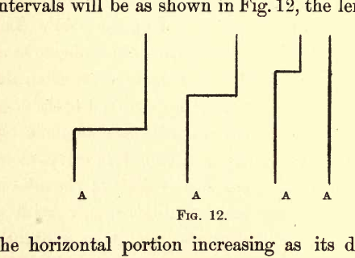
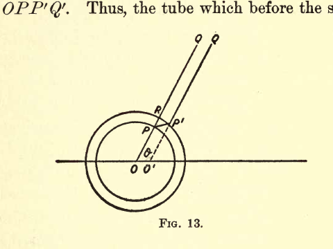
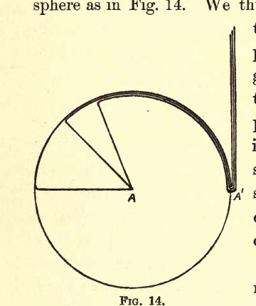

# ELECTRICITY AND MATTER

## CHAPTER III: EFFECTS DUE TO ACCELERATION OF THE FARADAY TUBES

### Röntgen Rays and Light

We have considered the behavior of the lines of force when at rest and when moving uniformly, we shall in this chapter consider the phenomena which result when the state of motion of the lines is changing.

Let us begin with the case of a moving charged point, moving so slowly that the lines of force are uniformly distributed around it, and consider what must happen if we suddenly stop the point. The Faraday tubes associated with the sphere have inertia; they are also in a state of tension, the tension at any point being proportional to the mass per unit length. Any disturbance communicated to one end of the tube will therefore travel along it with a constant and finite velocity; the tube in fact having very considerable analogy with a stretched string. Suppose we have a tightly stretched vertical string moving uniformly, from right to left, and that we suddenly stop one end, $A$, what will happen to the string? The end $A$ will come to rest at once, but the forces called into play travel at a finite rate, and each part of the string will in virtue of its inertia continue to move as if nothing had happened to the end $A$ until the disturbance starting from $A$ reaches it. Thus, if $V$ is the velocity with which a disturbance travels along the string, then when a time, $t$, has elapsed after the stoppage of $A$, the parts of the string at a greater distance than $Vt$ from $A$ will be unaffected by the stoppage, and will have the position and velocity they would have had if the string had continued to move uniformly forward. The shape of the string at successive intervals will be as shown in Fig. 12, the length of the horizontal portion increasing as its distance from the fixed end increases.

> This figure shows a series of snapshots of a vertical string configuration at different times after the end A is fixed. The left side shows the string at different stages as the disturbance propagates downward along its length, with the unaffected portion remaining at the moving position and the affected portion becoming stationary.

Let us now return to the case of the moving charged particle which we shall suppose suddenly brought to rest, the time occupied by the stoppage being $\tau$. To find the configuration of the Faraday tubes after a time $t$ has elapsed since the beginning of the process of bringing the charged particle to rest, describe with the charged particle as centre two spheres, one having the radius $Vt$, the other the radius $V(t - \tau)$, then, since no disturbance can have reached the Faraday tubes situated outside the outer sphere, these tubes will be in the position they would have occupied if they had moved forward with the velocity they possessed at the moment the particle was stopped, while inside the inner sphere, since the disturbance has passed over the tubes, they will be in their final positions. Thus, consider a tube which, when the particle was stopped was along the line $OPQ$ (Fig. 13); this will be the final position of the tube; hence at the time $t$ the portion of this tube inside the inner sphere will occupy the position $OP$, while the portion $P'Q'$ outside the outer sphere will be in the position it would have occupied if the particle had not been reduced to rest, i.e., if $O'$ is the position the particle would have occupied if it had not been stopped, $P'Q'$ will be a straight line passing through $O'$. Thus, to preserve its continuity the tube must bend round in the shell between the two spheres, and thus be distorted into the shape $OPP'Q'$. Thus, the tube which before the stoppage of the particle was radial, has now in the shell a tangential component, and this tangential component implies a tangential electric force.

> The figure displays two concentric circles centered at point O with an additional point O' showing where the particle would have been if unstopped. Faraday tubes are shown as radial lines that bend at the shell between the spheres, with tube segments PQ and P'Q' marking the distorted path of a single tube through the transition zone.

The stoppage of the particle thus produces a radical change in the electric field due to the particle, and gives rise, as the following calculation will show, to electric and magnetic forces much greater than those existing in the field when the particle was moving steadily.

If we suppose that the thickness $\delta$ of the shell is so small that the portion of the Faraday tube inside it may be regarded as straight, then if $T$ is the tangential electric force inside the pulse, $R$ the radial force, we have

$$
\frac{T}{R} = \frac{P'R}{PR} = \frac{OO' \sin \theta}{\delta} = \frac{vt \sin \theta}{\delta}. \quad (1)
$$

Where $v$ is the velocity with which the particle was moving before it was stopped, $\theta$ the angle $OP$ makes with the direction of motion of the particle, $t$ the time which has elapsed since the particle was stopped; since $R = \frac{e}{OP^2}$ and $OP = Vt$ where $V$ is the velocity of light, we have, if $r = OP$,

$$
T = \frac{ev \sin \theta}{V \cdot r \delta}. \quad (2)
$$

The tangential Faraday tubes moving forward with the velocity $V$ will produce at $P$ a magnetic force $H$ equal to $VT$, this force will be at right angles to the plane of the paper and in the opposite direction to the magnetic force existing at $P$ before the stoppage of the particle; since its magnitude is given by the equation,

$$
H = \frac{ev \sin \theta}{r \delta},
$$

it exceeds the magnetic force $\frac{ev \sin \theta}{r^2}$ previously existing in the proportion of $r$ to $\delta$. Thus, the pulse produced by the stoppage of the particle is the seat of intense electric and magnetic forces which diminish inversely as the distance from the charged particle, whereas the forces before the particle was stopped diminished inversely as the square of the distance; this pulse travelling outward with the velocity of light constitutes in my opinion the Röntgen rays which are produced when the negatively electrified particles which form the cathode rays are suddenly stopped by striking against a solid obstacle.

The energy in the pulse can easily be shown to be equal to

$$
\frac{2}{3} \frac{e^2v^2}{\delta},
$$

this energy is radiated outward into space. The amount of energy thus radiated depends upon $\delta$, the thickness of the pulse, i.e., upon the abruptness with which the particle is stopped; if the particle is stopped instantaneously the whole energy in the field will be absorbed in the pulse and radiated away, if it is stopped gradually only a fraction of the energy will be radiated into space, the remainder will appear as heat at the place where the cathode rays were stopped.

It is easy to show that the momentum in the pulse produced by the stoppage of the particle is equal and opposite to the momentum in the field outside the pulse; as there is no momentum in the space through which the pulse has passed, the whole momentum in the field after the particle is stopped is zero. The preceding investigation only applies to the case when the particle was moving so slowly that the Faraday tubes before the stoppage of the pulse were uniformly distributed; the same principles, however, will give us the effect of stopping a charged particle whenever the distribution of the Faraday tubes in the state of steady motion has been determined.

Let us take, for example, the case when the particle was initially moving with the velocity of light; the rule stated on page 43 shows that before the stoppage the Faraday tubes were all congregated in the equatorial plane of the moving particle. To find the configuration of the Faraday tubes after a time $t$ we proceed as before by finding the configuration at that time of the tubes, if the particle had not been stopped. The tubes would in that case have been in a plane at a distance $Vt$ in front of the particle. Draw two spheres having their centres at the particle and having radii respectively equal to $Vt$ and $V(t - \tau)$, where $\tau$ is the time occupied in stopping the particle; outside the outer sphere the configuration of the tubes will be the same as if the particle had not been stopped, i.e., the tubes will be the plane at the distance $Vt$ in front of the particle, and this plane will touch the outer sphere. Inside the inner sphere the Faraday tubes will be uniformly distributed, hence to preserve continuity these tubes must run round in the shell to join the sphere as in Fig. 14. We thus have in this case two pulses, one a plane pulse propagated in the direction in which the particle was moving before it was stopped, the other a spherical pulse travelling outward in all directions.

> This figure shows the configuration at two stages: (left) a sphere with concentric inner and outer boundaries marking the affected region, with a vertical line on the right representing the plane pulse; (right) the geometry illustrating the two-pulse structure with a spherical shell and a plane wavefront propagating forward, labeled with point A on the left arc.

The preceding method can be applied to the case when the charged particle, instead of being stopped, has its velocity altered in any way; thus, if the velocity $v$ of the particle instead of being reduced to zero is merely diminished by $\Delta v$, we can show, as on page 57, that it will give rise to a pulse in which the magnetic force $H$ is given by the equation

$$
H = \frac{e\Delta v \sin \theta}{r \delta},
$$

and the tangential electric force $T$ by

$$
T = \frac{e \cdot \Delta v \sin \theta}{V r \cdot \delta}.
$$

Now the thickness $\delta$ of the pulse is the space passed over by a wave of light during the time the velocity of the particle is changing, hence if $\delta t$ is the time required to produce the change $\Delta v$ in the velocity $\delta = V\delta t$, hence we have

$$
H = \frac{e \Delta v \sin \theta}{V \delta t \cdot r}; \quad T = \frac{e \Delta v \sin \theta}{V^2 \delta t \cdot r},
$$

but $\frac{\Delta v}{\delta t}$ is equal to $-f$, where $f$ is the acceleration of the particle, hence we have

$$
H = -\frac{ef \sin \theta}{V r}; \quad T = -\frac{ef \sin \theta}{V^2 r}.
$$

These equations show that a charged particle whose motion is being accelerated produces a pulse of electric and magnetic forces in which the forces vary inversely as the distance from the particle. Thus, if a charged body were made to vibrate in such a way that its acceleration went through periodic changes, periodic waves of electric and magnetic force would travel out from the charged body. These waves would, on the Electromagnetic Theory of Light, be light waves, provided the periodic changes in the acceleration of the charged body took place with sufficient rapidity.

The method we have been investigating, in which we consider the effect produced on the configuration of the Faraday tubes by changes in the motion of the body, affords a very simple way of picturing to ourselves the processes going on during the propagation of a wave of light through the ether. We have regarded these as arising from the propagation of transverse tremors along the tightly stretched Faraday tubes; in fact, we are led to take the same view of the propagation of light as the following extracts from the paper, "Thoughts on Ray Vibrations," show to have been taken by Faraday himself. Faraday says, "The view which I am so bold to put forward considers therefore radiations as a high species of vibration in the lines of force which are known to connect particles and also masses together."

This view of light as due to the tremors in tightly stretched Faraday tubes raises a question which I have not seen noticed. The Faraday tubes stretching through the ether cannot be regarded as entirely filling it. They are rather to be looked upon as discrete threads embedded in a continuous ether, giving to the latter a fibrous structure; but if this is the case, then on the view we have taken of a wave of light the wave itself must have a structure, and the front of the wave, instead of being, as it were, uniformly illuminated, will be represented by a series of bright specks on a dark ground, the bright specks corresponding to the places where the Faraday tubes cut the wave front.

Such a view of the constitution of a light wave would explain a phenomenon which has always struck me as being very remarkable and difficult to reconcile with the view that a light wave, or rather in this case a Röntgen ray, does not possess a structure. We have seen that the method of propagation and constitution of a Röntgen ray is the same as in a light wave, so that any general consideration about structure in Röntgen rays will apply also to light waves. The phenomenon in question is this: Röntgen rays are able to pass very long distances through gases, and as they pass through the gas they ionize it, splitting up the molecules into positive and negative ions; the number of molecules so split up is, however, an exceedingly small fraction, less than one-billionth, even for strong rays, of the number of molecules in the gas. Now, if the conditions in the front of the wave are uniform, all the molecules of the gas are exposed to the same conditions; how is it then that so small a proportion of them are split up? It might be argued that those split up are in some special condition—that they possess, for example, an amount of kinetic energy so much exceeding the average kinetic energy of the molecules of the gas that, in accordance with Maxwell's Law of Distribution of Kinetic energy, their number would be exceedingly small in comparison with the whole number of molecules of the gas; but if this were the case the same law of distribution shows that the number in this abnormal condition would increase very rapidly with the temperature, so that the ionization produced by the Röntgen rays ought to increase very rapidly as the temperature increases. Recent experiments made by Mr. McClung in the Cavendish Laboratory show that no appreciable increase in the ionization is produced by raising the temperature of a gas from 15° C. to 200° C., whereas the number of molecules possessing an abnormal amount of kinetic energy would be enormously increased by this rise in temperature.

The difficulty in explaining the small ionization is removed if, instead of supposing the front of the Röntgen ray to be uniform, we suppose that it consists of specks of great intensity separated by considerable intervals where the intensity is very small, for in this case all the molecules in the field, and probably even different parts of the same molecule, are not exposed to the same conditions, and the case becomes analogous to a swarm of cathode rays passing through the gas, in which case the number of molecules which get into collision with the rays may be a very small fraction of the whole number of molecules.

To return, however, to the case of the charged particle whose motion is accelerated, we have seen that from the particle electric and magnetic forces start and travel out radially with the velocity of light, both the radial and magnetic forces being at right angles to the direction in which they are travelling; but since (see page 25) each unit volume of the electro-magnetic field has an amount of momentum equal to the product of the density of the Faraday tube and the magnetic force, the direction of the momentum being at right angles to both these quantities, there will be in the wave due to the acceleration of the charged particle, and indeed in any electric or light wave momentum in the direction of propagation of the wave. Thus, if any such wave, for example a wave of light, is absorbed by the substance through which it is passing, the momentum in the wave will be communicated to the absorbing substance, which will, therefore, experience a force tending to push it in the direction the light is travelling. Thus, when light falls normally on a blackened absorbing substance, it will repel that substance.

This repulsion resulting from radiation was shown by Maxwell to be a consequence of the Electromagnetic Theory of Light; it has lately been detected and measured by Lebedew by some most beautiful experiments, which have been confirmed and extended by Nichols and Hull.

The pressure experienced by the absorbing substance will be proportional to its area, while the weight of the substance is proportional to its volume. Thus, if we halve the linear dimensions we reduce the weight to one-eighth while we only reduce the pressure of radiation to one-quarter; thus, by sufficiently reducing the size of the absorbing body we must arrive at a stage when the forces due to radiation exceed those which, like weight, are proportional to the volume of the substance. On this principle, knowing the intensity of the radiation from the sun, Arrhenius has shown that for an opaque sphere of unit density $10^{-6}$ cm. in diameter the repulsion due to the radiation from the sun would just balance the sun's attraction, while all bodies smaller than this would be repelled from the sun, and he has applied this principle to explain the phenomena connected with the tails of comets. Poynting has recently shown that if two spheres of unit density about 39 cm. in diameter are at the temperature of 27° C. and protected from all external radiation, the repulsion due to the radiation emitted from the spheres will overpower their gravitational attraction so that the spheres will repel each other.

Again, when light is refracted and reflected at a transparent surface, the course of the light and therefore the direction of momentum is changed, so that the refracting substance must have momentum communicated to it. It is easy to show that even when the incidence of the light is oblique the momentum communicated to the substance is normal to the refracting surface. There are many interesting problems connected with the forces experienced by refracting prisms when light is passing through them which will suggest themselves to you if you consider the changes in momentum experienced by the light wave in its course through the prism. Tangential forces due to light have not, so far as I know, been detected experimentally. These, however, must exist in certain cases; such, for example, as when light incident obliquely is imperfectly reflected from a metallic surface.

The waves of electric and magnetic force which radiate from an accelerated charge particle carry energy with them. This energy is radiated into space, so that the particle is constantly losing energy. The rate at which energy is radiating from the particle can easily be shown to be $\frac{1}{3}\frac{e^2f^2}{V}$ where $e$ is the charge on the particle, $f$ its acceleration, and $V$ the velocity of light. If we take into account this loss of energy by the particle when its motion is being accelerated, we find some interesting results. Thus, for example, if a particle of mass $m$ and charge $e$ starting from rest is acted upon by a constant electric force, $X$, the particle does not at once attain the acceleration $\frac{Xe}{m}$ as it would if there were no loss of energy by radiation; on the contrary, the acceleration of the particle is initially zero, and it is not until after the lapse of a time comparable with $\frac{e^2}{Vm}$ that the particle acquires even an appreciable fraction of its final acceleration. Thus, the rate at which the particle loses energy is during the time $\frac{e^2}{Vm}$ very small compared with the ultimate rate. Thus, if the particle were acted on by a wave of electric force which only took a time comparable with $\frac{e^2}{Vm}$ to pass over the particle, the amount of energy radiated by the particle would be a very much smaller fraction of the energy in the wave than it would be if the particle took a time equal to a considerable multiple of $\frac{e^2}{Vm}$ to pass over the particle. This has an important application in explaining the greater penetrating power of "hard" Röntgen rays than of "soft" ones. The "hard" rays correspond to thin pulses, the "soft" ones to thick ones; so that a smaller proportion of the energy in the "hard" rays will be radiated away by the charged particles over which they pass than in the case of the "soft" rays.

By applying the law that the rate at which energy is radiating is equal to $\frac{1}{3}\frac{e^2f^2}{V}$ to the case of a charged particle revolving in a circular orbit under an attractive force varying inversely as the square of the distance, we find that in this case the rate of radiation is proportional to the eighth power of the velocity, or to the fourth power of the energy. Thus, the rate of loss of energy by radiation increases very much more rapidly than the energy of the moving body.
