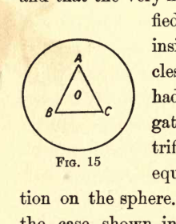
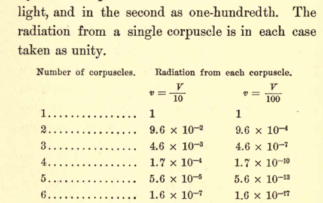
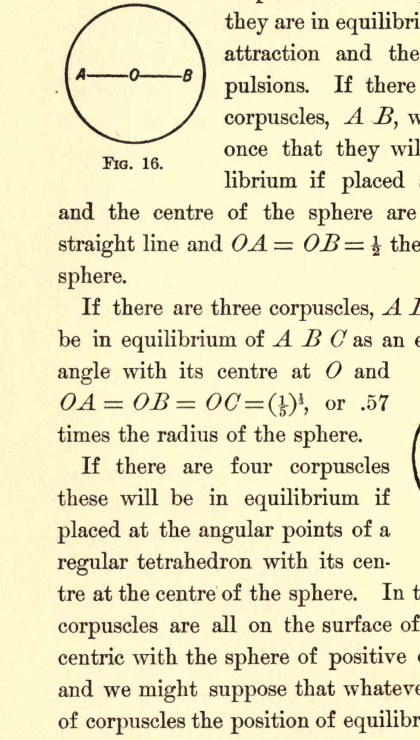
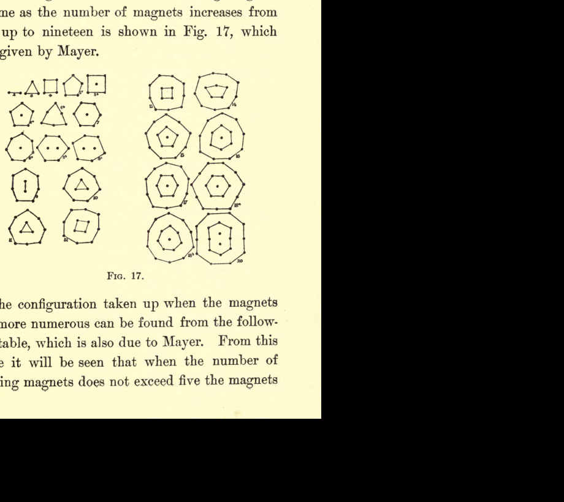
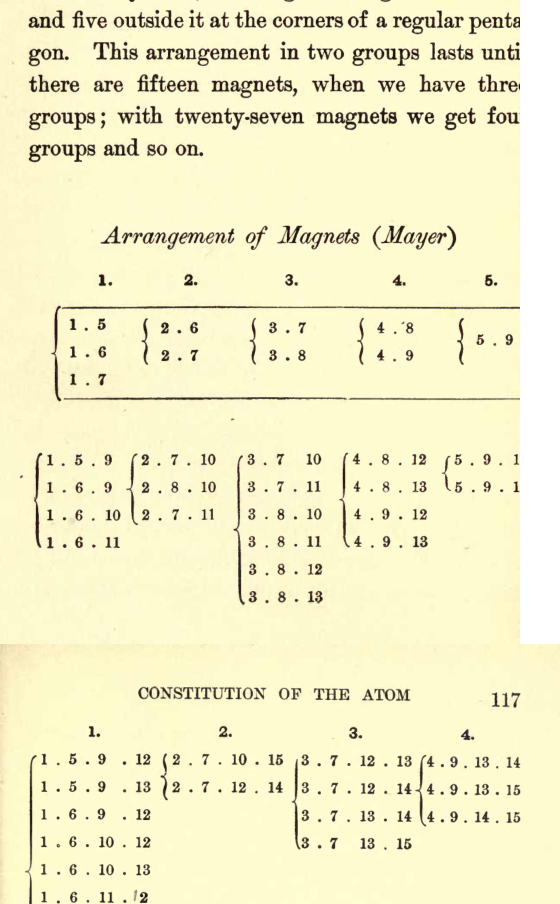
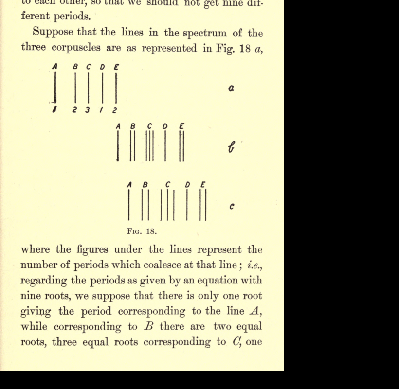
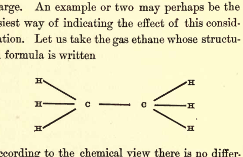
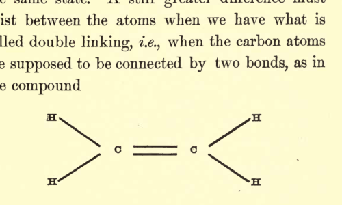

# Chapter V

# Constitution of the Atom

We have seen that whether we produce the corpuscles by cathode rays, by ultra-violet light, or from incandescent metals, and whatever may be the metals or gases present we always get the same kind of corpuscles. Since corpuscles similar in all respects may be obtained from very different agents and materials, and since the mass of the corpuscles is less than that of any known atom, we see that the corpuscle must be a constituent of the atom of many different substances. That in fact the atoms of these substances have something in common.

We are thus confronted with the idea that the atoms of the chemical elements are built up of simpler systems; an idea which in various forms has been advanced by more than one chemist. Thus Prout, in 1815, put forward the view that the atoms of all the chemical elements are built up of atoms of hydrogen; if this were so the combining weights of all the elements would, on the assumption that there was no loss of weight when the atoms of hydrogen combined to form the atom of some other element, be integers; a result not in accordance with observation. To avoid this discrepancy Dumas suggested that the primordial atom might not be the hydrogen atom, but a smaller atom having only one-half or one-quarter of the mass of the hydrogen atom. Further support was given to the idea of the complex nature of the atom by the discovery by Newlands and Mendeleeff of what is known as the periodic law, which shows that there is a periodicity in the properties of the elements when they are arranged in the order of increasing atomic weights. The simple relations which exist between the combining weights of several of the elements having similar chemical properties, for example, the fact that the combining weight of sodium is the arithmetic mean of those of lithium and potassium, all point to the conclusion that the atoms of the different elements have something in common. Further evidence in the same direction is afforded by the similarity in the structure of the spectra of elements in the same group in the periodic series, a similarity which recent work on the existence in spectra of series of lines whose frequencies are connected by definite numerical relations has done much to emphasize and establish; indeed spectroscopic evidence alone has led Sir Norman Lockyer for a long time to advocate the view that the elements are really compounds which can be dissociated when the circumstances are suitable. The phenomenon of radio-activity, of which I shall have to speak later, carries the argument still further, for there seems good reasons for believing that radio-activity is due to changes going on within the atoms of the radio-active substances. If this is so then we must face the problem of the constitution of the atom, and see if we can imagine a model which has in it the potentiality of explaining the remarkable properties shown by radio-active substances. It may thus not be superfluous to consider the bearing of the existence of corpuscles on the problem of the constitution of the atom; and although the model of the atom to which we are led by these considerations is very crude and imperfect, it may perhaps be of service by suggesting lines of investigations likely to furnish us with further information about the constitution of the atom.

## The Nature of the Unit from which the Atoms are Built Up

Starting from the hypothesis that the atom is an aggregation of a number of simpler systems, let us consider what is the nature of one of these systems. We have seen that the corpuscle, whose mass is so much less than that of the atom, is a constituent of the atom, it is natural to regard the corpuscle as a constituent of the primordial system. The corpuscle, however, carries a definite charge of negative electricity, and since with any charge of electricity we always associate an equal charge of the opposite kind, we should expect the negative charge on the corpuscle to be associated with an equal charge of positive electricity. Let us then take as our primordial system an electrical doublet, with a negative corpuscle at one end and an equal positive charge at the other, the two ends being connected by lines of electric force which we suppose to have a material existence. For reasons which will appear later on, we shall suppose that the volume over which the positive electricity is spread is very much larger than the volume of the corpuscle. The lines of force will therefore be very much more condensed near the corpuscle than at any other part of the system, and therefore the quantity of ether bound by the lines of force, the mass of which we regard as the mass of the system, will be very much greater near the corpuscle than elsewhere. If, as we have supposed, the size of the corpuscle is very small compared with the size of the volume occupied by the positive electrification, the mass of the system will practically arise from the mass of bound ether close to the corpuscle; thus the mass of the system will be practically independent of the position of its positive end, and will be very approximately the mass of the corpuscles if alone in the field. This mass (see page 21) is for each corpuscle equal to $\dfrac{2 e^2}{3 a}$, where $e$ is the charge on the corpuscle and $a$ its radius-$a$, as we have seen, being about $10^{-13}$ cm.

Now suppose we had a universe consisting of an immense number of these electrical doublets, which we regard as our primordial system; if these were at rest their mutual attraction would draw them together, just as the attractions of a lot of little magnets would draw them together if they were free to move, and aggregations of more than one system would be formed.

If, however, the individual systems were originally moving with considerable velocities, the relative velocity of two systems, when they came near enough to exercise appreciable attraction on each other, might be sufficient to carry the systems apart in spite of their mutual attraction. In this case the formation of aggregates would be postponed, until the kinetic energy of the units had fallen so low that when they came into collision, the tendency to separate due to their relative motion was not sufficient to prevent them remaining together under their mutual attraction.

Let us consider for a moment the way in which the kinetic energy of such an assemblage of units would diminish. We have seen (p. 68) that whenever the velocity of a charged body is changing the body is losing energy, since it generates electrical waves which radiate through space, carrying energy with them. Thus, whenever the units come into collision, i.e., whenever they come so close together that they sensibly accelerate or retard each other's motion, energy will be radiated away, the whole of which will not be absorbed by the surrounding units. There will thus be a steady loss of kinetic energy, and after a time, although it may be a very long time, the kinetic energy will fall to the value at which aggregation of the units into groups of two will begin; these will later on be followed by the formation of aggregates containing a larger number of units.

In considering the question of the further aggregation of these complex groups, we must remember that the possibility of aggregation will depend not merely upon the velocity of the aggregate as a whole, i.e., upon the velocity of the centre of gravity, but also upon the relative velocities of the corpuscles within the aggregate.

Let us picture to ourselves the aggregate as, like the AEpinus atom of Lord Kelvin, consisting of a sphere of uniform positive electrification, and exerting therefore a radial electric force proportional at an internal point to the distance from the centre, and that the very much smaller negatively electrified corpuscles are moving about inside it. The number of corpuscles is the number of units which had gone to make up the aggregate, and the total negative electrification on the corpuscles is equal to the positive electrification on the sphere. To fix our ideas let us take the case shown in Fig. 15 of three corpuscles $A, B, C$, arranged within the sphere at the corners of an equilateral triangle, the centre of the triangle coinciding with the centre of the sphere.

> A circular boundary represents a sphere of uniform positive electrification. Inside it, three corpuscles form an equilateral triangle with the vertices labeled $A$, $B$, and $C$, and the center labeled $O$. The arrangement illustrates three negatively electrified corpuscles symmetrically placed within the positively electrified sphere.

First suppose the corpuscles are at rest; they will be in equilibrium when they are at such a distance from the centre of the sphere that the repulsion between the corpuscles, which will evidently be radial, just balances the radial attraction excited on the corpuscles by the positive electrification of the sphere. A simple calculation shows that this will be the case when the distance of the corpuscle from the centre is equal to $.57$ times the radius of the sphere. Next suppose that the corpuscles, instead of being at rest, are describing circular orbits round the centre of the sphere. Their centrifugal force will carry them farther away from the centre by an amount depending upon the speed with which they are rotating in their orbits. As we increase this speed the distance of the corpuscles from the centre of the sphere will increase until at a certain speed the corpuscles will reach the surface of the sphere; further increases in speed will cause them first to rotate outside the sphere and finally leave the sphere altogether, when the atom will break up.

In this way we see that the constitution of the aggregate will not be permanent, if the kinetic energy due to the velocity of the corpuscles inside the sphere relative to the centre of the sphere exceeds a certain value. We shall, for the sake of brevity, speak of this kinetic energy of the corpuscles within the atom as the corpuscular temperature of the atom, and we may express the preceding result by saying that the atom will not be stable unless its corpuscular temperature is below a certain value.

We must be careful to distinguish between corpuscular temperature, which is the mean kinetic energy of the corpuscles inside the atom, and the molecular temperature, which is the mean kinetic energy due to the motion of the centre of gravity of the atom. These temperatures are probably not in any very close relationship with each other. They would be proportional to each other if the law known as the law of equipartition of energy among the various degrees of freedom of the atom were to apply. This law is, however, inconsistent with the physical properties of gases, and in the proof given of it in the kinetic theory of gases, no estimate is given of the time required to establish the state contemplated by the law; it may be that this time is so long that gases are never able to get into this state.

Let us now take the case of two aggregations, $A$ and $B$, whose corpuscular temperatures are high, though not so high, of course, as to make $A$ and $B$ unstable when apart, and suppose, in order to give them the best possible chance of combining, that the centres of gravity of $A$ and $B$ when quite close to each other are at rest, will $A$ and $B$ unite to form a more complex aggregate as they would if the corpuscles in them were at rest? We can easily, I think, see that they will not necessarily do so. For as $A$ and $B$ approach each other, under their mutual attractions, the potential energy due to the separation of $A$ and $B$ will diminish and their kinetic energy will increase. This increase in the kinetic energy of the corpuscles in $A$ and $B$ will increase the tendency of the corpuscles to leave their atoms, and if the increase in the kinetic energy is considerable $A$ and $B$ may each lose one or more corpuscles. The departure of a corpuscle will leave $A$ and $B$ positively charged, and they will tend to separate under the repulsion of these charges. When separated they will have each a positive charge; but as there are now free corpuscles with negative charges moving about in the region in which $A$ and $B$ are situated, these positive charges will ultimately be neutralized by corpuscles striking against $A$ and $B$ and remaining in combination with them.

We thus conclude that unless the corpuscular temperature after union is less than a certain limiting value, the union cannot be permanent, the complex formed being unstable, and incapable of a permanent existence. Now, the corpuscular temperature of the aggregate formed by $A$ and $B$ will depend upon the corpuscular temperatures of $A$ and $B$ before union, and also upon the diminution in the potential energy of the system occasioned by the union of $A$ and $B$. If the corpuscular temperatures of $A$ and $B$ before union were very high, the corpuscular temperature after union would be high also; if they were above a certain limit, the corpuscular temperature after union would be too high for stability, and the aggregate $A B$ would not be formed. Thus, one condition for the formation of complex aggregates is that the corpuscular temperature of their constituents before combination should be sufficiently low.

If the molecular temperature of the gas in which $A$ and $B$ are molecules is very high, combination may be prevented by the high relative velocity of $A$ and $B$ carrying them apart in spite of their mutual attraction. The point, however, which I wish to emphasize is, that we cannot secure the union merely by lowering the molecular temperature, i.e., by cooling the gas; union will be impossible unless the corpuscular temperature, i.e., the kinetic energy due to the motion of the corpuscles inside the atom, is reduced below a certain value. We may prevent union by raising the molecular temperature of a gas, but we cannot ensure union by lowering it.

Thus, to take a specific example, the reason, on this view, why the atoms of hydrogen present on the earth do not combine to form some other element, even at the exceedingly low temperature at which hydrogen becomes liquid, is that even at this temperature the kinetic energy of the corpuscles inside the atom, i.e., the corpuscular temperature, is too great. It may be useful to repeat here what we stated before, that there is no very intimate connection between the corpuscular and molecular temperatures, and that we may reduce the latter almost to the absolute zero without greatly affecting the former.

We shall now proceed to discuss the bearing of these results on the theory that the different chemical elements have been gradually evolved by the aggregation of primordial units.

## The way the Corpuscles in the Atom Lose or Gain Kinetic Energy

If the kinetic energy arising from the motion of the corpuscles relatively to the centre of gravity of the atom could by collisions be transformed into kinetic energy due to the motion of the atom as a whole, i.e., into molecular temperature, it would follow from the kinetic theory of gases, since the number of corpuscles in the atom is exceedingly large, that the specific heat of a gas at constant pressure would be very nearly equal to the specific heat at constant volume; whereas, as a matter of fact, in no gas is there any approach to equality in these specific heats. We conclude, therefore, that it is not by collisions that the kinetic energy of the corpuscles is diminished.

We have seen, however (page 68), that a moving electrified particle radiates energy whenever its velocity is changing either in magnitude or direction. The corpuscles in the atom will thus emit electric waves, radiating energy and so losing kinetic energy.

The rate at which energy is lost in this way by the corpuscles varies very greatly with the number of the corpuscles and the way in which they are moving. Thus, if we have a single corpuscle describing a circular orbit of radius $a$ with uniform velocity $v$, the loss of energy due to radiation per second is

$$
\frac{2 e^2 v^4}{3 V^3 a^2},
$$

where $e$ is the charge on the corpuscle and $V$ the velocity of light. If instead of a single corpuscle we had two corpuscles at opposite ends of a diameter moving round the same orbit with the same velocity as the single corpuscle, the loss of energy per second from the two would be very much less than from the single corpuscle, and the smaller the velocity of the corpuscle the greater would be the diminution in the loss of energy produced by increasing the number of corpuscles. The effect produced by increasing the number of corpuscles is shown in the following table, which gives the rate of radiation for each corpuscle for various numbers of corpuscles arranged at equal angular intervals round the circular orbit.

> A three-column table compares the radiation from each corpuscle for different numbers of corpuscles arranged uniformly around a circular orbit. The left column lists the number of corpuscles from 1 to 6. The other two columns show the radiation from each corpuscle when $v = V/10$ and when $v = V/100$, with the values dropping sharply as the number of corpuscles increases.

The table applies to two cases; in one the velocity of the corpuscles is taken as one-tenth that of light, and in the second as one-hundredth. The radiation from a single corpuscle is in each case taken as unity.

Thus, we see that the radiation from each of a group of six corpuscles moving with one-tenth the velocity of light is less than one-five-millionth part of the radiation from a single corpuscle, describing the same orbit with the same velocity, while, when the velocity of the corpuscles is only one-hundredth of that of light, the reduction in the radiation is very much greater.

If the corpuscles are displaced from the symmetrical position in which they are situated at equal intervals round a circle whose centre is at rest, the rate of radiation will be very much increased. In the case of an atom containing a large number of corpuscles the variation in the rate at which energy is radiated will vary very rapidly with the way the corpuscles are moving about in the atom. Thus, for example, if we had a large number of corpuscles following close on one another's heels round a circular orbit the radiation would be exceedingly small; it would vanish altogether if the corpuscles were so close together that they formed a continuous ring of negative electrification. If the same number of particles were moving about irregularly in the atom, then though the kinetic energy possessed by the corpuscles in the second case might be no greater than in the first, the rate of radiation, i.e., of corpuscular cooling, would be immensely greater.

Thus, we see that in the radiation of energy from corpuscles whose velocity is not uniform we have a process going on which will gradually cool the corpuscular temperature of the atom, and so, if the view we have been discussing is correct, enable the atom to form further aggregations and thus tend to the formation of new chemical elements.

This cooling process must be an exceedingly slow one, for although the corpuscular temperature when the atom of a new element is formed is likely to be exceedingly high, and the lowering in that temperature required before the atom can enter again into fresh aggregations very large, yet we have evidence that some of the elements must have existed unchanged for many thousands, nay, millions of years; we have, indeed, no direct evidence of any change at all in the atom. I think, however, that some of the phenomena of radio-activity to which I shall have to allude later, afford, I will not say a proof of, but a very strong presumption in favor of some such secular changes taking place in the atom.

We must remember, too, that the corpuscles in any atom are receiving and absorbing radiation from other atoms. This will tend to raise the corpuscular temperature of the atom and thus help to lengthen the time required for that temperature to fall to the point where fresh aggregations of the atom may be formed.

The fact that the rate of radiation depends so much upon the way the corpuscles are moving about in the atom indicates that the lives of the different atoms of any particular element will not be equal; some of these atoms will be ready to enter upon fresh changes long before the others. It is important to realize how large are the amounts of energy involved in the formation of a complex atom or in any rearrangement of the configuration of the corpuscles inside it. If we have an atom containing $n$ corpuscles each with a charge $e$ measured in electrostatic units, the total quantity of negative electricity in the atom is $n e$ and there is an equal quantity of positive electricity distributed through the sphere of positive electrification; hence, the work required to separate the atom into its constituent units will be comparable with $\frac{(n e)^2}{a}$, $a$ being the radius of the sphere containing the corpuscles. Thus, as the atom has been formed by the aggregation of these units $\frac{(n e)^2}{a}$ will be of the same order of magnitude as the kinetic energy imparted to those constituents during their whole history, from the time they started as separate units, down to the time they became members of the atom under consideration. They will in this period have radiated away a large quantity of this energy, but the following calculation will show what an enormous amount of kinetic energy the corpuscles in the atom must possess even if they have only retained an exceedingly small fraction of that communicated to them. Let us calculate the value of $\frac{(n e)^2}{a}$ for all the atoms in a gram of the substance; let $N$ be the number of these atoms in a gram, then $N \frac{(n e)^2}{a}$ is the value of the energy acquired by these atoms. If $M$ is the mass of an atom $N M = 1$, thus:

$$
N \frac{(n e)^2}{a} = \frac{1}{M} \cdot \frac{(n e)^2}{a};
$$

but if $m$ is the mass of a corpuscle

$$
n m = M,
$$

and therefore

$$
N \frac{(n e)^2}{a} = \frac{e}{m} \cdot \frac{n e}{a};
$$

now when $e$ is measured in electrostatic units

$$
\frac{e}{m} = 3 \times 10^{17} \text{ and } e = 3.4 \times 10^{-10};
$$

and therefore

$$
N \frac{(n e)^2}{a} = 10.2 \times 10^7 \times \frac{n}{a}. \tag{1}
$$

Let us take the case of the hydrogen atom for which $n = 1000$, and take for $a$ the value usually assumed in the kinetic theory of gases for the radius of the atom, i.e., $10^{-8}$ cm. then

$$
N \frac{(n e)^2}{a} = 1.02 \times 10^{19} \text{ ergs};
$$

this amount of energy would be sufficient to lift a million tons through a height considerably exceeding one hundred yards. We see, too, from (1) that this energy is proportional to the number of corpuscles, so that the greater the molecular weight of an element, the greater will be the amount of energy stored up in the atoms in each gram.

We shall return to the subject of the internal changes in the atom when we discuss some of the phenomena of radio-activity, but before doing so it is desirable to consider more closely the way the corpuscles arrange themselves in the atom. We shall begin with the case where the corpuscles are at rest. The corpuscles are supposed to be in a sphere of uniform positive electrification which produces a radial attractive force on each corpuscle proportional to its distance from the centre of the sphere, and the problem is to arrange the corpuscles in the sphere so that they are in equilibrium under this attraction and their mutual repulsions. If there are only two corpuscles, $A B$, we can see at once that they will be in equilibrium if placed so that $A B$ and the centre of the sphere are in the same straight line and $O A = O B = \frac{1}{2}$ the radius of the sphere.

> A circular outline represents the positively electrified sphere. A straight horizontal line passes through the center, with a corpuscle labeled $A$ on the left, the center marked $O$, and a corpuscle labeled $B$ on the right. The diagram shows the two-corpuscle equilibrium configuration lying on a common diameter.

If there are three corpuscles, $A B C$, they will be in equilibrium of $A B C$ as an equilateral triangle with its centre at $O$ and $O A = O B = O C = .57$ times the radius of the sphere. If there are four corpuscles these will be in equilibrium if placed at the angular points of a regular tetrahedron with its centre at the centre of the sphere. In these cases the corpuscles are all on the surface of a sphere concentric with the sphere of positive electrification, and we might suppose that whatever the number of corpuscles the position of equilibrium would be one of symmetrical distribution over the surface of a sphere. Such a distribution would indeed technically be one of equilibrium, but a mathematical calculation shows that unless the number of corpuscles is quite small, say seven or eight at the most, this arrangement is unstable and so can never persist. When the number of corpuscles is greater than this limiting number, the corpuscles break up into two groups. One group containing the smaller number of corpuscles is on the surface of a small body concentric with the sphere; the remainder are on the surface of a larger concentric body. When the number of corpuscles is still further increased there comes a stage when the equilibrium cannot be stable even with two groups, and the corpuscles now divide themselves into three groups, arranged on the surfaces of concentric shells; and as we go on increasing the number we pass through stages in which more and more groups are necessary for equilibrium. With any considerable number of corpuscles the problem of finding the distribution when in equilibrium becomes too complex for calculation; and we have to turn to experiment and see if we can make a model in which the forces producing equilibrium are similar to those we have supposed to be at work in the corpuscle. Such a model is afforded by a very simple and beautiful experiment first made, I think, by Professor Mayer. In this experiment a number of little magnets are floated in a vessel of water. The magnets are steel needles magnetized to equal strengths and are floated by being thrust through small disks of cork. The magnets are placed so that the positive poles are either all above or all below the surface of the water. These positive poles, like the corpuscles, repel each other with forces varying inversely as the distance between them. The attractive force is provided by a negative pole (if the little magnets have their positive poles above the water) suspended some distance above the surface of the water. This pole will exert on the positive poles of the little floating magnets an attractive force the component of which, parallel to the surface of the water, will be radial, directed to $O$, the projection of the negative pole on the surface of the water, and if the negative pole is some distance above the surface the component of the force to $O$ will be very approximately proportional to the distance from $O$. Thus the forces on the poles of the floating magnets will be very similar to those acting on the corpuscle in our hypothetical atom; the chief difference being that the corpuscles are free to move about in all directions in space, while the poles of the floating magnets are constrained to move in a plane parallel to the surface of the water.

The configurations which the floating magnets assume as the number of magnets increases from two up to nineteen is shown in Fig. 17, which was given by Mayer.

> This plate shows many small polygonal arrangements of floating magnets for increasing magnet counts. The simplest cases place magnets at the vertices of triangles, squares, pentagons, and hexagons; larger cases show concentric rings with one or more interior magnets, illustrating how the stable configuration changes as the total number increases.

The configuration taken up when the magnets are more numerous can be found from the following table, which is also due to Mayer. From this table it will be seen that when the number of floating magnets does not exceed five the magnets arrange themselves at the corners of a regular polygon, five at the corners of a pentagon, four at the corners of a square and so on. When the number is greater than five this arrangement no longer holds. Thus, six magnets do not arrange themselves at the corners of a hexagon, but divide into two systems, one magnet being at the centre and five outside it at the corners of a regular pentagon. This arrangement in two groups lasts until there are fifteen magnets, when we have three groups; with twenty-seven magnets we get four groups and so on.

> A tabulated layout titled "Arrangement of Magnets (Mayer)" lists stable groupings by concentric rings. Each entry records how many magnets lie in successive inner and outer rings, showing the transition from single-ring patterns to multi-ring arrangements as the total number of magnets grows.

Where, for example, $3.\ 7.\ 12.\ 13$ means that thirty-five magnets arrange themselves so that there is a ring of three magnets inside, then a ring of seven, then one of twelve, and one of thirteen outside.

I think this table affords many suggestions toward the explanation of some of the properties possessed by atoms. Let us take, for example, the chemical law called the Periodic Law; according to this law if we arrange the elements in order of increasing atomic weights, then taking an element of low atomic weight, say lithium, we find certain properties associated with it. These properties are not possessed by the elements immediately following it in the series of increasing atomic weight; but they appear again when we come to sodium, then they disappear again for a time, but reappear when we reach potassium, and so on. Let us now consider the arrangements of the floating magnets, and suppose that the number of magnets is proportional to the combining weight of an element. Then, if any property were associated with the triangular arrangement of magnets, it would be possessed by the elements whose combining weight was on this scale three, but would not appear again until we reached the combining weight ten, when it reappears, as for ten magnets we have the triangular arrangement in the middle and a ring of seven magnets outside. When the number of magnets is increased the triangular arrangement disappears for a time, but reappears with twenty magnets, and again with thirty-five, the triangular arrangement appearing and disappearing in a way analogous to the behavior of the properties of the elements in the Periodic Law.

As an example of a property that might very well be associated with a particular grouping of the corpuscles, let us take the times of vibration of the system, as shown by the position of the lines in the spectrum of the element. First let us take the case of three corpuscles by themselves in the positively electrified sphere. The three corpuscles have nine degrees of freedom, so that there are nine possible periods. Some of these periods in this case would be infinitely long, and several of the possible periods would be equal to each other, so that we should not get nine different periods.

Suppose that the lines in the spectrum of the three corpuscles are as represented in Fig. 18 $a$,

> Three schematic spectra are labeled $a$, $b$, and $c$. Each consists of vertical spectral lines marked $A$ through $E$. In pattern $a$, the lines are mostly single with small integers beneath them; in $b$ and $c$, some lines split into doublets and triplets, illustrating how previously coincident spectral periods separate as surrounding groups disturb the motion.

where the figures under the lines represent the number of periods which coalesce at that line; i.e., regarding the periods as given by an equation with nine roots, we suppose that there is only one root giving the period corresponding to the line $A$, while corresponding to $B$ there are two equal roots, three equal roots corresponding to $C$, one root to $D$, and two to $E$. These periods would have certain numerical relations to each other, independent of the charge on the corpuscle, the size of the sphere in which they are placed, or their distance from the centre of the sphere. Each of these quantities, although it does not affect the ratio of the periods, will have a great effect upon the absolute value of any one of them. Now, suppose that these three corpuscles, instead of being alone in the sphere, form but one out of several groups in it, just as the triangle of magnets forms a constituent of the grouping of $3$, $10$, $20$, and $35$ magnets. Let us consider how the presence of the other groups would affect the periods of vibration of the three corpuscles. The absolute values of the periods would generally be entirely different, but the relationship existing between the various periods would be much more persistent, and although it might be modified it would not be destroyed. Using the phraseology of the Planetary Theory, we may regard the motion of the three corpuscles as "disturbed" by the other groups.

When the group of three corpuscles was by itself there were several displacements which gave the same period of vibration; for example, corresponding to the line $C$ there were three displacements, all giving the same period. When, however, there are other groups present, then these different displacements will no longer be symmetrical with respect to these groups, so that the three periods will no longer be quite equal. They would, however, be very nearly equal unless the effect of the other groups is very large. Thus, in the spectrum, $C$, instead of being a single line, would become a triplet, while $B$ and $E$ would become doublets. $A D$ would remain single lines.

Thus, the spectrum would now resemble Fig. 18 $b$; the more groups there are surrounding the group of three the more will the motion of the latter be disturbed and the greater the separation of the constituents of the triplets and doublets. The appearance as the number of groups increases is shown in Fig. 18 $b$, $c$. Thus, if we regarded the element which contain this particular grouping of corpuscles as being in the same group in the classification of elements according to the Periodic Law, we should get in the spectra of these elements homologous series of lines, the distances between the components of the doublets and triplets increasing with the atomic weight of the elements. The investigations of Rydberg, Runge and Paschen and Keyser have shown the existence in the spectra of elements of the same group series of lines having properties in many respects analogous to those we have described.

Another point of interest given by Mayer's experiments is that there is more than one stable configuration for the same number of magnets; these configurations correspond to different amounts of potential energy, so that the passage from the configuration of greater potential energy to that of less would give kinetic energy to the corpuscle. From the values of the potential energy stored in the atom, of which we gave an estimate on page 111, we infer that a change by even a small fraction in that potential energy would develop an amount of kinetic energy which if converted into heat would greatly transcend the amount of heat developed when the atoms undergo any known chemical combination.

An inspection of the table shows that there are certain places in it where the nature of the configuration changes very rapidly with the number of magnets; thus, five magnets form one group, while six magnets form two; fourteen magnets form two groups, fifteen three; twenty-seven magnets form three groups, twenty-eight four, and so on. If we arrange the chemical elements in the order of their atomic weights we find there are certain places where the difference in properties of consecutive elements is exceptionally great; thus, for example, we have extreme differences in properties between fluorine and sodium. Then there is more or less continuity in the properties until we get to chlorine, which is followed by potassium; the next break occurs at bromine and rubidium and so on. This effect seems analogous to that due to the regrouping of the magnets.

So far we have supposed the corpuscles to be at rest; if, however, they are in a state of steady motion and describing circular orbits round the centre of the sphere, the effect of the centrifugal force arising from this motion will be to drive the corpuscles farther away from the centre of the sphere, without, in many cases, destroying the character of the configuration. Thus, for example, if we have three corpuscles in the sphere, they will, in the state of steady motion, as when they are at rest, be situated at the corners of an equiangular triangle; this triangle will, however, be rotating round the centre of the sphere, and the distance of the corpuscles from the centre will be greater than when they are at rest and will increase with the velocity of the corpuscles.

There are, however, many cases in which rotation is essential for the stability of the configuration. Thus, take the case of four corpuscles. These, if rotating rapidly, are in stable steady motion when at the corners of a square, the plane of the square being at right angles to the axis of rotation; when, however, the velocity of rotation of the corpuscles falls below a certain value, the arrangement of four corpuscles in one plane becomes unstable, and the corpuscles tend to place themselves at the corners of a regular tetrahedron, which is the stable arrangement when the corpuscles are at rest. The system of four corpuscles at the corners of a square may be compared with a spinning top, the top like the corpuscles being unstable unless its velocity of rotation exceeds a certain critical value. Let us suppose that initially the velocity of the corpuscles exceeds this value, but that in some way or another the corpuscles gradually lose their kinetic energy; the square arrangement will persist until the velocity of the corpuscles is reduced to the critical value. The arrangement will then become unstable, and there will be a convulsion in the system accompanied by a great evolution of kinetic energy.

Similar considerations will apply to many assemblages of corpuscles. In such cases the configuration when the corpuscles are rotating with great rapidity will (as in the case of the four corpuscles) be essentially different from the configuration of the same number of corpuscles when at rest. Hence there must be some critical velocity of the corpuscles, such that, for velocities greater than the critical one, a configuration is stable, which becomes unstable when the velocity is reduced below the critical value. When the velocity sinks below the critical value, instability sets in, and there is a kind of convulsion or explosion, accompanied by a great diminution in the potential energy and a corresponding increase in the kinetic energy of the corpuscles. This increase in the kinetic energy of the corpuscles may be sufficient to detach considerable numbers of them from the original assemblage.

These considerations have a very direct bearing on the view of the constitution of the atoms which we have taken in this chapter, for they show that with atoms of a special kind, i.e., with special atomic weights, the corpuscular cooling caused by the radiation from the moving corpuscles which we have supposed to be slowly going on, might, when it reached a certain stage, produce instability inside the atom, and produce such an increase in the kinetic energy of the corpuscles as to give rise to greatly increased radiation, and it might be detachment of a portion of the atom. It would cause the atom to emit energy; this energy being derived from the potential energy due to the arrangement of the corpuscles in the atom. We shall see when we consider the phenomenon of radio-activity that there is a class of bodies which show phenomena analogous to those just described.

On the view that the lighter elements are formed first by the aggregation of the unit doublet, the negative element of which is the corpuscle, and that it is by the combination of the atoms of the lighter elements that the atoms of the heavier elements are produced, we should expect the corpuscles in the heavy atoms to be arranged as it were in bundles, the arrangement of the corpuscles in each bundle being similar to the arrangement in the atom of some lighter element. In the heavier atom these bundles would act as subsidiary units, each bundle corresponding to one of the magnets in the model formed by the floating magnets, while inside the bundle themselves the corpuscle would be the analogue of the magnet.

We must now go on to see whether an atom built up in the way we have supposed could possess any of the properties of the real atom. Is there, for example, in this model of an atom any scope for the electro-chemical properties of the real atom; such properties, for example, as those illustrated by the division of the chemical elements into two classes, electro-positive and electro-negative. Why, for example, if this is the constitution of the atom, does an atom of sodium or potassium tend to acquire a positive, the atom of chlorine a negative charge of electricity? Again, is there anything in the model of the atom to suggest the possession of such a property as that called by the chemists valency; i.e., the property which enables us to divide the elements into groups, called monads, dyads, triads, such that in a compound formed by any two elements of the first group the molecule of the compound will contain the same number of atoms of each element, while in a compound formed by an element $A$ in the first group with one $B$ in the second, the molecule of the compound contains twice as many atoms of $A$ as of $B$, and so on?

Let us now turn to the properties of the model atom. It contains a very large number of corpuscles in rapid motion. We have evidence from the phenomena connected with the conduction of electricity through gases that one or more of these corpuscles can be detached from the atom. These may escape owing to their high velocity enabling them to travel beyond the attraction of the atom. They may be detached also by collision of the atom with other rapidly moving atoms or free corpuscles. When once a corpuscle has escaped from an atom the latter will have a positive charge. This will make it more difficult for a second negatively electrified corpuscle to escape, for in consequence of the positive charge on the atom the latter will attract the second corpuscle more strongly than it did the first. Now we can readily conceive that the ease with which a particle will escape from, or be knocked out of, an atom may vary very much in the atoms of the different elements. In some atoms the velocities of the corpuscles may be so great that a corpuscle escapes at once from the atom. It may even be that after one has escaped, the attraction of the positive electrification thus left on the atom is not sufficient to restrain a second, or even a third, corpuscle from escaping. Such atoms would acquire positive charges of one, two, or three units, according as they lost one, two, or three corpuscles. On the other hand, there may be atoms in which the velocities of the corpuscles are so small that few, if any, corpuscles escape of their own accord, nay, they may even be able to receive one or even more than one corpuscle before the repulsion exerted by the negative electrification on these foreign corpuscles forces any of the original corpuscles out. Atoms of this kind if placed in a region where corpuscles were present would by aggregation with these corpuscles receive a negative charge. The magnitude of the negative charge would depend upon the firmness with which the atom held its corpuscles. If a negative charge of one corpuscle were not sufficient to expel a corpuscle while the negative charge of two corpuscles could do so, the maximum negative charge on the atom would be one unit. If two corpuscles were not sufficient to expel a corpuscle, but three were, the maximum negative charge would be two units, and so on. Thus, the atoms of this class tend to get charged with negative electricity and correspond to the electro-negative chemical elements, while the atoms of the class we first considered, and which readily lose corpuscles, acquire a positive charge and correspond to the atoms of the electro-positive elements. We might conceive atoms in which the equilibrium of the corpuscles was so nicely balanced that though they do not of themselves lose a corpuscle, and so do not acquire a positive charge, the repulsion exerted by a foreign corpuscle coming on to the atom would be sufficient to drive out a corpuscle. Such an atom would be incapable of receiving a charge either of positive or negative electricity.

Suppose we have a number of the atoms that readily lose their corpuscles mixed with a number of those that can retain a foreign corpuscle. Let us call an atom of the first class $A$, one of the second $B$, and suppose that the $A$ atoms are of the kind that lose one corpuscle while the $B$ atoms are of the kind that can retain one, but not more than one; then the corpuscles which escape from the $A$ atoms will ultimately find a home on the $B$ atoms, and if there are an equal number of the two kinds of atoms present we shall get ultimately all the $A$ atoms with the unit positive charge, all the $B$ atoms with the unit negative charge. These oppositely electrified atoms will attract each other, and we shall get the compound $A B$ formed. If the $A$ atoms had been of the kind that lost two corpuscles, and the $B$ atoms the same as before, then the $A$ atoms would get the charge of two positive units, the $B$ atoms a charge of one unit of negative electricity. Thus, to form a neutral system two of the $B$ atoms must combine with one of the $A$'s and thus the compound $A B_2$ would be formed.

Thus, from this point of view a univalent electro-positive atom is one which, under the circumstances prevailing when combination is taking place, has to lose one and only one corpuscle before stability is attained; a univalent electro-negative atom is one which can receive one but not more than one corpuscle without driving off other corpuscles from the atom; a divalent electro-positive atom is one that loses two corpuscles and no more, and so on. The valency of the atom thus depends upon the ease with which corpuscles can escape from or be received by the atom; this may be influenced by the circumstances existing when combination is taking place. Thus, it would be easier for a corpuscle, when once it had got outside the atom, to escape being pulled back again into it by the attraction of its positive electrification, if the atom were surrounded by good conductors than if it were isolated in space. We can understand, then, why the valency of an atom may in some degree be influenced by the physical conditions under which combination is taking place.

On the view that the attraction between the atoms in a chemical compound is electrical in its origin, the ability of an element to enter into chemical combination depends upon its atom having the power of acquiring a charge of electricity. This, on the preceding view, implies either that the uncharged atom is unstable and has to lose one or more corpuscles before it can get into a steady state, or else that it is so stable that it can retain one or more additional corpuscles without any of the original corpuscles being driven out. If the range of stability is such that the atom, though stable when uncharged, becomes unstable when it receives an additional corpuscle, the atom will not be able to receive a charge either of positive or negative electricity, and will therefore not be able to enter into chemical combination. Such an atom would have the properties of the atoms of such elements as argon or helium.

The view that the forces which bind together the atoms in the molecules of chemical compounds are electrical in their origin, was first proposed by Berzelius; it was also the view of Davy and of Faraday. Helmholtz, too, declared that the mightiest of the chemical forces are electrical in their origin. Chemists in general seem, however, to have made but little use of this idea, having apparently found the conception of "bonds of affinity" more fruitful. This doctrine of bonds is, however, when regarded in one aspect almost identical with the electrical theory. The theory of bonds when represented graphically supposes that from each univalent atom a straight line (the symbol of a bond) proceeds; a divalent atom is at the end of two such lines, a trivalent atom at the end of three, and so on; and that when the chemical compound is represented by a graphic formula in this way, each atom must be at the end of the proper number of the lines which represent the bonds. Now, on the electrical view of chemical combination, a univalent atom has one unit charge, if we take as our unit of charge the charge on the corpuscle; the atom is therefore the beginning or end of one unit Faraday tube: the beginning if the charge on the atom is positive, the end if the charge is negative. A divalent atom has two units of charge and therefore it is the origin or termination of two unit Faraday tubes. Thus, if we interpret the "bond" of the chemist as indicating a unit Faraday tube, connecting charged atoms in the molecule, the structural formula of the chemist can be at once translated into the electrical theory.

There is, however, one point of difference which deserves a little consideration: the symbol indicating a bond on the chemical theory is not regarded as having direction; no difference is made on this theory between one end of a bond and the other. On the electrical theory, however, there is a difference between the ends, as one end corresponds to a positive, the other to a negative charge. An example or two may perhaps be the easiest way of indicating the effect of this consideration. Let us take the gas ethane whose structural formula is written

> Two carbon atoms are connected by a single central bond. Each carbon is also joined to three hydrogen atoms, arranged like three spokes spreading above, horizontal, and below, giving the familiar six-hydrogen ethane structure.

According to the chemical view there is no difference between the two carbon atoms in this compound; there would, however, be a difference on the electrical view. For let us suppose that the hydrogen atoms are all negatively electrified; the three Faraday tubes going from the hydrogen atoms to each carbon atom give a positive charge of three units on each carbon atom. But in addition to the Faraday tubes coming from the hydrogen atoms, there is one tube which goes from one carbon atom to the other. This means an additional positive charge on one carbon atom and a negative charge on the other. Thus, one of the carbon atoms will have a charge of four positive units, while the other will have a charge of three positive and one negative unit, i.e., two positive units; so that on this view the two carbon atoms are not in the same state. A still greater difference must exist between the atoms when we have what is called double linking, i.e., when the carbon atoms are supposed to be connected by two bonds, as in the compound

> Two carbon atoms are connected by a double bond shown as two parallel horizontal lines. Each carbon is attached to two hydrogen atoms, one above and one below, giving the four-hydrogen arrangement of ethylene.

Here, if one carbon atom had a charge of four positive units, the other would have a charge of two positive and two negative units.

We might expect to discover such differences as are indicated by these considerations by the investigation of which are known as additive properties, i.e., properties which can be calculated when the chemical constitution of the molecule is known. Thus, let $A B C$ represent the atoms of three chemical elements, then if $p$ is the value of some physical constant for the molecule of $A_2$, $q$ the value for $B_2$, and $r$ for $C_2$, then if this constant obeys the additive law, its value for a molecule of the substance whose chemical composition is represented by the formula $A_x B_y C_z$ is

$$
\frac{1}{2} p x + \frac{1}{2} q y + \frac{1}{2} r z.
$$

We can only expect relations like this to hold when the atoms which occur in the different compounds corresponding to different values of $x\ y\ z$ are the same. If the atom $A$ occurs in different states in different compounds we should have to use different values of $p$ for these compounds.

A well-known instance of the additive property is the refractive power of different substances for light, and in this case chemists find it necessary to use different values for the refraction due a carbon atom according as the atom is doubly or singly linked. They use, however, the same value for the refraction of the carbon atom when singly linked with another atom as when, as in the compound $C H_4$, it is not linked with another carbon atom at all.

It may be urged that although we can conceive that one atom in a compound should be positively and the other negatively electrified when the atoms are of different kinds, it is not easy to do so when the atoms are of the same kind, as they are in the molecules of the elementary gases $H_2$, $O_2$, $N_2$ and so on. With reference to this point we may remark that the electrical state of an atom, depending as it does on the power of the atom to emit or retain corpuscles, may be very largely influenced by circumstances external to the atom. Thus, for an example, an atom in a gas when surrounded by rapidly moving atoms or corpuscles which keep striking against it may have corpuscles driven out of it by these collisions and thus become positively electrified. On the other hand, we should expect that, ceteris paribus, the atom would be less likely to lose a corpuscle when it is in a gas than when in a solid or a liquid. For when in a gas after a corpuscle has just left the atom it has nothing beyond its own velocity to rely upon to escape from the attraction of the positively electrified atom, since the other atoms are too far away to exert any forces upon it. When, however, the atom is in a liquid or a solid, the attractions of the other atoms which crowd round this atom may, when once a corpuscle has left its atom, help it to avoid falling back again into atom. As an instance of this effect we may take the case of mercury in the liquid and gaseous states. In the liquid state mercury is a good conductor of electricity. One way of regarding this electrical conductivity is to suppose that corpuscles leave the atoms of the mercury and wander about through the interstices between the atoms. These charged corpuscles when acted upon by an electric force are set in motion and constitute an electric current, the conductivity of the liquid mercury indicating the presence of a large number of corpuscles. When, however, mercury is in the gaseous state, its electrical conductivity has been shown by Strutt to be an exceedingly small fraction of the conductivity possessed by the same number of molecules when gaseous. We have thus indications that the atoms even of an electro-positive substance like mercury may only lose comparatively few corpuscles when in the gaseous state.

Suppose then that we had a great number of atoms all of one kind in the gaseous state and thus moving about and coming into collision with each other; the more rapidly moving ones, since they would make the most violent collisions, would be more likely to lose corpuscles than the slower ones. The faster ones would thus by the loss of their corpuscles become positively electrified, while the corpuscles driven off would, if the atoms were not too electro-positive to be able to retain a negative charge even when in the gaseous state, tend to find a home on the more slowly moving atoms. Thus, some of the atoms would get positively, others negatively electrified, and those with charges of opposite signs would combine to form a diatomic molecule. This argument would not apply to very electro-positive gases. These we should not expect to form molecules, but since there would be many free corpuscles in the gas we should expect them to possess considerable electrical conductivity.
