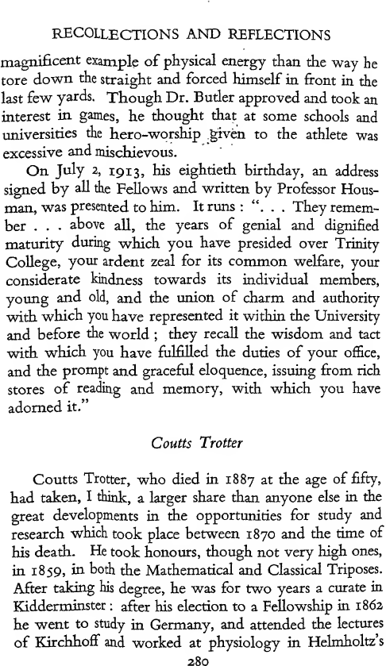
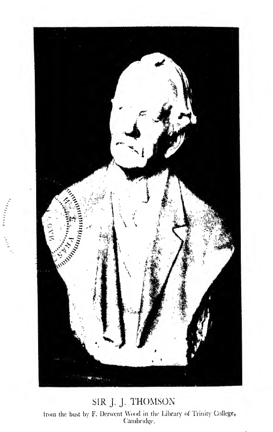

# CHAPTER X

## Some Trinity Men

## W. H. Thompson

WILLIAM HEPWORTH THOMPSON, who had been Master of Trinity since 1866, died in 1886. Before his election to the Mastership he had been a lecturer and tutor of the College, Regius Professor of Greek and Canon of Ely. His lectures as College Lecturer, and also as Regius Professor, on Ancient Philosophy, were exceptionally brilliant and attracted very large classes. His published work, however, was small, and in this respect, and indeed in almost every other, he was a great contrast to his predecessor William Whewell, who was a very voluminous writer, very energetic and somewhat overbearing. Whewell was, however, instrumental in introducing many reforms which have proved very beneficial. He was also a great benefactor to the College and erected at his own cost WhewelTs Court, the part of the College to the east of Trinity Street. Though he made no discoveries himself, by writing The History of the Inductive Sciences, and The Philosophy of the Inductive Sciences, he rendered good service to science. Faraday consulted him about the nomenclature he should use in describing his discoveries, and it is to him that we owe the terms electrode, cathode and anode. He was much more successful as an author than as College Tutor ; he seems to have known very little about his pupils. In his time the Scholars of

the College were elected by the three tutors. One of these, it was said, always voted for his own pupils; another was so conscientious that he always voted against them for fear of being unduly biassed; while of Whewell it was said that he was quite impartial, for he did not know who were his pupils. He was extremely punctilious about the behaviour of undergraduates when in his presence. If an undergraduate sat down at one of his evening parties, a servant came up and said, “ Undergraduates are not allowed to sit in the presence of the Master”. I can vouch for the truth of this, because I have met a man who was present when this was said to a friend of his who had gone with him to a party at the Lodge. This made him unpopular with the undergraduates, but on the death of his second wife, Lady Affleck, they showed so much sympathy that he was greatly touched, and his relations with them became much more cordial. He was killed by a fall when riding : he was a heavy man and the fall proved fatal. I think he must have been in the habit of falling, for one day I noticed in my tailor’s shop a medallion of Dr. Whewell. I asked whether he had been a customer of theirs. “ Oh yes, sir, he was the best customer we ever had.” I said I did not know he was a dressy man. “Well, sir, he was not what you might call a dressy gende- man, but he was one who took to riding late in life.” There can have been few, if any, periods in the history of the College when it had more undergraduates destined to attain outstanding distinction as men of letters than that between 1829, when Thompson came up as a Freshman, and 1832, when he took his degree. Among his contemporaries were Alfred Tennyson, Arthur Hallam, W. M. Thackeray, Lushington, “ wearing all that weight of learning lighdy as a flower ”, FitzGerald, the translator of

Omar, Monckton-Milnes (Lord Houghton), Spedding (the Baconian scholar), W. H. Brookfield,1 who became a very popular preacher, and who had a great fund of good stories. Thompson, in a letter which has been published, says that on one occasion his hearers were in such convulsions with laughter that they could not sit in their chairs and had to take refuge on the floor. During his Mastership the statutes of the College were twice revised and gready changed. New statutes were proposed in 1872 and in 1882. The changes proposed by the College in 1872 never came into force as they were disallowed by the Privy Council. The changes proposed in 1882 were in force until 1926, when they were replaced by statutes made by the Cambridge University Commissioners. The changes in the statutes involved weekly meetings of the whole body of Fellows during term time, over which he had to preside. The meetings about each of these changes lasted over a period of more than a year and a half, and some of them were very long ; one, with two short adjournments, went on from 11 a.m. to 12 p.m. This entailed a very heavy strain on the chairman, especially as the Fellows were very much divided on the best course to pursue. Henry Jackson, who attended both sets of 1 I once had a very curious experience with which both Thackeray and Brookfield were concerned. Not long after I became a Fellow, at the end of a busy term, I went to Brighton for a few days to get freshened up. At dinner on the first evening I sat next a middle-aged lady I had never seen before, and had not the faintest idea who she was. After the usual commonplaces, she said, “ Now I want you to tell me who is your favourite heroine in fiction ”. One does not expose one’s deepest feelings to strangers, so, on the spur of the moment, I said Thackeray’s Amelia, and was going on to say that I thought her a very well-behaved and good-natured girl. Fortunately before I could do this, she exclaimed, “ I’m so glad to hear you say so, because I’m the original Amelia. I’m Mrs Brookfield and both my husband and I were great friends of Thackeray.” I sat next her at dinner during my short stay at Brighton, and she told me many interesting things about Thackeray and his domestic troubles.

College meetings, said the passing of the statutes owed much to Thompson s initiative and resolution. I never saw Thompson until he was an old man, and he was one of the handsomest old men I ever saw : he had silvery-white hair, sharply cut features and a very dignified presence. There is a portrait of him by Herkomer in the Hall of Trinity College. It somewhat accentuates his severity and he looks rather bored. This, I think, was because he and the artist may not have had many interests in common. Herkomer was, however, very well satisfied with his performance, for he told me that he thought two at least of his pictures would keep his memory green. One was this portrait, and the other the portrait of Miss Grant, a tall lady in white satin. The Master is seated in an armchair with his hands gripping the ends of the arms, and this was the cause of a curious incident. Some time after I became Master, I was showing a distinguished physician the pictures in the Hall, and when we came to this one he said, “ That man must have had a stroke ”. I had been up at Trinity during ten years of Thompson's Mastership and never heard any rumour of such a thing, and said so. The doctor said he was sure he was right, for no one ever gripped a chair like that who had not had a stroke. On enquiry I found the doctor was right, but the matter had been very carefully hushed up. Though he had a sharp tongue he had a kind heart, and in spite of his glacial exterior he was very human. I did not find this out until some time after taking my degree. When I was an undergraduate I had often been to breakfast parties, which he and Mrs Thompson gave on Saturday mornings in term time, and had thought him so formidable that I tried to get to the other end of the table near Mrs Thompson, who was a very kind-hearted and

friendly lady. She must have found it hard work to make these parties successful. Most of the undergraduates were very shy ; many of them she had never seen or heard of before, and did not know what they were interested in, so she had to turn the conversation on to very neutral topics. There was a tale current in my time, that some years before, when among the scholars there was one named Lamb, who became Sir Horace Lamb and a very famous mathematician, and another named Butcher, who became a very distinguished classic and M.P. for the University, she invited both to breakfast and sat between them. In the course of breakfast she said she supposed she ought to feel very nervous, because it must be dangerous to be between the butcher and the lamb. The story went on to say that as soon as she had said this the Master broke in with, 44 Personal remarks are in the worst possible taste *\ I once asked Sir Horace Lamb, who ought to have known, if there were any truth in this, and he said, 44 Not a word. The tale was concocted at the time by one of the College wits.” I think even the shyest of us were very glad to go to these breakfasts, and looked on an invitation as a mark of distinction. I discovered how human the Master was when, one dreary afternoon in November, after I had taken my degree, I had to go to him to get his signature to a certificate of residence. After he had signed it he asked me to stay, and began telling me stories, some of them very frank, about past and present Fellows of the College, and went on until the bell for dinner in Hall began to ring. He evidently enjoyed chatting in this way, for he asked me to come again any afternoon when I had an hour or two to spare. ^One of the stories he told me was about Thackeray, who was in his year. The undergraduates at

that time were examined at the end of the May Term, and the places in the examination room were arranged alphabetically. This brought Thackeray and Thompson next each other. In the morning the paper was on Elementary Algebra, and Thompson, for a classical man, was a fair mathematician. At any rate, he was good enough to find something to do on this paper, and wrote sheet after sheet. Thackeray whispered to him, “ It would be a great help to me if you would turn your papers round so that I could read them ”, and Thompson did so. (No emolument of any kind depended on the result of this examination.) The paper in the afternoon was Greek verse. Thackeray, who fancied himself as a classic, went off at a great pace and finished well before the allotted time. As he was going out he handed a copy of his verses to Thompson and said, “ You were very kind to me about the Algebra paper this morning ; if these verses are of any use to you they are quite at your service ”, The Master, when he told me the story, said, “ I had the curiosity to read them, and there wasn’t a line without a gross blunder He was remarkably imperturbable. I remember a sermon of his in Chapel, when for once he was ending with what was, for him, quite a fervid exhortation. Just before the end, he lost his place and it took him quite an appreciable time to find it. When he did, he started in exacdy the same high tone as he had left off. The effect of this syncopated earnestness was quite startling. To the outside world he was perhaps best known as the sayer of witty things. When Seeley succeeded Kingsley in the Professorship of Modem History, Thompson, when coming away from his inaugural lecture, said, “ I never thought we should have missed Kingsley so much He said when he was Canon of Ely, “ Ely is a very damp

place ; even my sermons won’t keep dry there ”. He could even descend to puns. When the valet Courvoisier was hanged for murdering his master, he said it was the fulfilment of the prophecy,4'Every valley shall be exalted”. The most widely known of his sayings, 44 We are none of us infallible, not even the youngest ”, was made at a meeting of the Fellows for the discussion of proposed changes in the statutes of the College. Some have thought that it was levelled at a particular Fellow, and there have been several claimants for this distinction. I was not then a Fellow and did not hear it, but it was much talked about in the College at the time, and I think most people thought that it was impersonal. It was said at the end of a long discussion in which most of the talking had been done by the younger Fellows, and the Master may have thought that his remark embodied a principle which was pertinent to the occasion.

## Dr. Butler

Dr. Thompson, whose health had been failing for some time, died in 1886. The Master of Trinity is appointed by the Crown, whereas with one exception the Masters of other Cambridge Colleges are appointed by the Fellows. Proposals have from time to time been made in Trinity that the College should endeavour to have the statutes altered so that the election to the Mastership should be made by the Fellows as at the other Colleges. These have not met with much support. Though it may not be democratic, there are advantages in the present method. When the election is in the hands of the Fellows, and opinion is nearly equally divided, there may be a keen fight. It is possible, indeed it has happened both at

Oxford and Cambridge in a few cases, that this may leave behind embers of bitterness which may destroy the harmony of the College. This, in 1886, was the first vacancy at Trinity since the new statutes came into force, which permitted the election of a layman. At this time there were only two laymen who were heads of Colleges ; now there are only two clerical heads. There was naturally a good deal of speculation in the College about who would he the new Master. I think that perhaps the majority of the resident Fellows hoped it would be a layman, and the names of Lord Rayleigh and Henry Sidgwick were mentioned. It was, however, offered to and accepted by Henry Montagu Butler, the Dean of Gloucester, who had had an exceptionally brilliant career. When he was at Cambridge he was regarded as the most brilliant undergraduate in residence. He was Senior Classic, had won a University Scholarship for Classics, had been one of the “ Apostles ” and was elected to a Fellowship at his first try. In 1859, when he was only twenty-six, he was elected Head Master of Harrow in succession to his father, and filled this post with brilliant success for twenty-six years. He was made Dean of Gloucester by Mr Gladstone in 1885, and Master of Trinity by Lord Salisbury in 1886, and was admitted as Master on December 3, 1886. After dinner that evening his health was proposed by the Vice- Master, Coutts Trotter, an old Harrovian. The Master’s reply made a very favourable impression. It showed warm affection for the College, paid tribute to the merits of the late Master and of Dr. Whewell, spoke very modestly about himself and said that the College must not look to him for originality or research. Any gifts he had were of a lighter kind, but such as they were they were

all at the disposal of the College. The task the new Master had undertaken was no light one. The University and the College were very different from what they were when he left Cambridge twenty-seven years before. The College under the statutes of 1882 was governed as far as its normal business was concerned by a Council consisting of 8 members elected by the Fellows, and 4 ex- officio members, with the Master as Chairman. He had a casting vote and on some occasions his vote counted for two, otherwise he had no powers beyond those of a chairman of a Governing Body. Under the statutes in force when Dr. Butler left Cambridge, the Master had much greater powers and the Fellows less, for then membership of the Governing Body went by seniority and not by election. I am afraid that at first Dr. Butler did not find presiding at the meetings of the Council very pleasant. The members of a body which, like the Council, meets very frequently, easily get into the habit, like the members of a large family, of saying what they think without taking much trouble to put it into the most polite forms, and to one who came in from the outside they might be thought rude. This did not, however, affect their friendship. Those who had been squabbling at the Council Meeting would; at the lunch after the meeting, be the best of triends. To Dr. Buder, however, who was the most courteous of men, these outbursts were very distressing. This, I think, was soon realised by other members of the Council, and they were careful to carry on their discussions in a way at which no one could take offence, a practice which has been the custom up to the present time. Another thing which caused him some uneasiness was the reserve, which is often supposed to be characteristic of

Fellows of Trinity, in the expression of their feelings, especially those of approval. It may be that some things go without saying, but it is also true that many of these are the better for being said. If a friend has had a success it is better to send him your congratulations than to leave him to take them as read. Dr. Butler was most scrupulous about this : anyone he knew who received some distinction was sure to have his pleasure enhanced by the receipt from him of a letter such as no one but he could have written, full of charm, grace and kindliness. He was as unrivalled as a letter-writer as he was as a speaker. The number of letters of this kind he wrote must have been very large, for any Trinity undergraduate who won any distinction, either in the College or in the University, was sure to have the pleasure of receiving one. It seemed to him to be so natural to write to his friends to express his appreciation of what they had done that, if he did not receive any such expression, he concluded that what he had done was not appreciated. The Fellows of Trinity were very reticent about expressing their feelings, and the Master felt as if he were surrounded by chilling indifference, and indeed a meeting of the whole body of Fellows is about the most difficult audience to address I know. It is as difficult and depressing as broadcasting a speech or speaking in the dark. I think, however, the Master realised, as the years went on, that he had gained not only the admiration and respect of the Fellows but also their affection. Dr. Buder’s Mastership was characterised by almost boundless hospitality and generosity. In a letter to Dr. Westcott dated May 9, 1887, he writes: “ When I accepted my very peculiar post it seemed to me clear that hospitality on a large scale, righdy understood, was one of my plain

duties. It seemed to me that the Lodge as time went on ought to bring together the leading members of the University, the Fellows and Scholars, friends from a distance, leaders in good causes, whether here or away. ... I determined that parties at the Lodge should be very numerous and very various. ... As some little test of variety I may just say to-day, as on Saturday, I have large parties to meet Sir George Trevelyan, our Honorary Fellow ; on Friday I have a meeting of perhaps eighty or one hundred to work for the Toynbee Hall Settlement; on the 14th the Roundells, Godley, Sir M. Ridley and Charles Dalrymple come. On the 17th we have a large party with which I think you will sympathise. I hope it will begin a yearly institution. I am inviting the newly elected scholars to meet the Vice-Master, the Tutors and some of the older Fellows. . . . On the 21st the George Hamiltons, Fowell Buxtons and others come. . . . Last Saturday we had forty of the Colonial Delegates.” In addition to his own hospitality he increased that of the College, for it was largely due to him that the College instituted in 1889 the “ Old Boys ” dinner, to which members of the College who had kept their names on the College books were invited in groups to dine and sleep at the College. Efforts are made that as far as possible they shall be given the rooms they had when they lived in College. These dinners have proved a very great success ; the guests welcome the opportunity of meeting old friends, and of keeping in touch with the changes and progress of the College. At these dinners Dr. Butler’s speech was one of the greatest attractions, for on occasions like these he was unrivalled as a speaker. He always said the right thing in the right way. He had a marvellous memory and had read very widely. Whatever might be the day

on which he had to make a speech, he would always remember some interesting event of which it was the anniversary. He could enliven and drive home the point he wished to make by a happy quotation from some great statesman, orator or poet. The manner in which his speeches were delivered added greatly to their effect. He had a very agreeable voice and until near the end of his life it was easy to hear him. The dignity of his presence and manner were an important factor in the success of his speeches, and never more so than at the “ Old Boys ” dinner when, “ Erect in his scarlet robes at the centre of the High Table, the three great circles of silver plate gleaming on the panelled wall behind him, he seemed worthily to represent before the world the majesty of the College The Master preached several times a term in the College Chapel. His sermons had the felicity in phrasing and wealth of illustration of his speeches. Added to this there was an earnestness and reverence which made them very impressive. They were very simple and practical and seemed to me just the right kind for an audience of undergraduates. He made die sermons in Chapel much more attractive than they were before he became Master. Then, sometimes, we had sermons from a preacher who was so determined to be impartial that, when preaching on some article of Christian belief, he would spend so much time over the arguments that might be advanced against it that he had very litde time to give those in its favour. Another preacher was so oblivious of worldly affairs that, when Gilbert and Sullivan’s opera H.M.S. Pinafore wras at the height of its popularity, he began a sermon by saying with great solemnity, “ Never or hardly ever ”. The undergraduates, to suppress their emotions, had hurriedly to bury their heads in their hands. The eloquence and

charm of the Master’s speeches led to his being besieged with invitations to preach, to address meetings for the promotion of all kinds of objects, educational, philanthropic and missionary. He was, too, a Governor of six public schools. This made his name and fame better known to the educated classes of this country than that of any other Master of Trinity. There had been Masters who had been as well or even better known to the class which haunts the Athenaeum Club, but none whose name was known to so many men of widely different activities. He was interested in all these, and while he sympathised warmly with the efforts of the College to promote learning and research, since only a small fraction of the undergraduates who passed through the College could aspire to write great books or make important discoveries, he felt that another and no less important function of the College was to train the great majority of the undergraduates so that they should be well fitted to carry on the work of the country, whether this was in politics, in the law courts, in the Church, as proconsuls or ambassadors, in the Civil Service, in teaching, in engineering or commerce. When they obtained distinction in their respective spheres, he rejoiced as much as he did in the distinction obtained by those who were working at more academic subjects. He took a keen interest in games, as was natural for one who had been captain of the Harrow Eleven and was the father and grandfather of captains. His eldest son, E. M. Butler, played twice in the Oxford and Cambridge Cricket Match and twice represented Cambridge in the Racquets Match. His grandson, Mr Guy Butler, ran the quarter-mile three times for Cambridge in the Oxford and Cambridge sports and was never beaten : he was the best quarter-miler of his time. I never saw a more

magnificent example of physical energy than the way he tore down the straight and forced himself in front in the last few yards. Though Dr. Buder approved and took an interest in games, he thought that at some schools and universities the hero-worship given to the athlete was excessive and mischievous. On July 2, 1913, his eightieth birthday, an address signed by all the Fellows and written by Professor Hous- man, was presented to him. It runs : “. . . They remember . . . above all, the years of genial and dignified maturity during which you have presided over Trinity College, your ardent zeal for its common welfare, your considerate kindness towards its individual members, young and old, and the union of charm and authority with which you have represented it within the University and before the world ; they recall the wisdom and tact with which you have fulfilled the duties of your office, and the prompt and graceful eloquence, issuing from rich stores of reading and memory, with which you have adorned it.”

## Coutts Trotter

Coutts Trotter, who died in 1887 at the age of fifty, had taken, I think, a larger share than anyone else in the great developments in the opportunities for study and research which took place between 1870 and the time of his death. He took honours, though not very high ones, in 1859, in both the Mathematical and Classical Triposes. After taking his degree, he was for two years a curate in Kidderminster : after his election to a Fellowship in 1862 he went to study in Germany, and attended the lectures of Kirchhoff and worked at physiology in Helmholtz’s

laboratory. He was elected to a lectureship in Science in Trinity College in 1869, to a tutorship in 1871, and was Vice-Master at the time of his death. He was not, however, particularly successful either as lecturer or tutor, and he did very little original research. His real work was the help and sympathy he gave to all schemes which seemed to him likely to promote the study of science either in the College or in the University. He had great influence in both ; he took a very prominent part in the affairs of the College, while in the University he was a Member of the Council of the Senate continuously from 1874 until his death, and also a member of every syndicate that was concerned in any way with science. I think he must have spent a large fraction of his time in attending the meetings of these bodies. He was a most useful man on a committee : he knew his own mind and could express his ideas clearly and was exceptionally skilful in drafting resolutions. He was invariably courteous, even when, as was sometimes the case, his proposals met with fierce opposition, which was not always very politely expressed. One who worked with him on many committees, said that it was always he who formed the first plan and drafted the final report. His services to science were not limited to his work on committees ; he took a great interest in the planning and erection of the many laboratories which were built in his time. When the plans of the Cavendish Laboratory were under consideration, he went with Clerk Maxwell on visits to many physical laboratories, so that the new laboratory might be brought abreast of recent progress. Michael Foster has testified to the interest he took in the construction of the new Physiological Laboratory and the laboratories for Botany and Zoology, and the value of his suggestions. One very

important service he rendered, both to Trinity College and to the University, was the part he took in bringing Michael Foster to Cambridge. The first step in this is generally believed to have been taken by George Eliot and George Henry Lewes, who were friends of W. G. Clark, the well-known Shakespearian scholar, who was a Fellow of Trinity. They asked him if some post could not be found in Trinity for Foster. This suggestion was warmly supported by Trotter, with the result that the College established a new post, Praelector in Physiology. Foster came to Cambridge as Praelector in 1870 and remained in it until he was made Professor of Physiology in the University in 1883. The establishment of this Praelectorship enabled physiology to be studied in the University much sooner than it would have been if it had had to wait until the University was in a position to found a Professorship in this subject. Trinity College did the same thing for biochemistry by appointing Gowland Hopkins to a Praelectorship in this subject in 1910, and for geodesy by appointing Sir Gerald Lenox- Conyngham to one in 1921.

> A monochrome architectural plate of Trinity College focused on the Master's Lodge. The composition is taken from an elevated, slightly oblique viewpoint that frames the lodge and adjoining court buildings with strong vertical window rhythms and chimney stacks. The lawn in front appears as a pale open foreground, while the masonry facades and rooflines recede in layers toward the background, emphasizing the scale and formal symmetry of the college setting.

## Fellowships

A very fundamental change in the method of election to Fellowships in Trinity College was to a very large extent due to the influence of Trotter. Until 1874 the election was determined solely by the performance of the candidates in a written examination, but in that year the College decided that candidates could gain credit not only by their performance in the examination, but also by the merits of a dissertation containing an account of original research carried out by them, which they were allowed to submit to the Electors. This has proved so successful that the paper work in special subjects has been abandoned, and the awards decided on the merits

of the dissertations. The importance Coutts Trotter attached to research is perhaps even more strongly emphasised by the regulations for the Coutts Trotter Studentship, for which he bequeathed to the College a legacy of about -£7000, “ for a studentship for the promotion of original research in Natural Science, more especially physiology and experimental physics. The studentship is not to be awarded by examination, and in the election more regard is to be paid to the promise of power to carry on original work than to the amount of work already done.” Among former Coutts Trotter students are Lord Rutherford, Lord Rayleigh and Professor O. W. Richardson. In my opinion, research has great educational value and can be made a good test of a man’s mental power. I have often observed very striking mental development in students after they have spent a year or two on research : they gain independence of thought, maturity of judgment, increased critical power and self-reliance, in fact they are carried from mental adolescence to manhood. It is essential, however, that when using the dissertation as a test of mental power, other things should be taken into account besides the scientific importance of the results it contains. This may be due to his teacher having suggested to the candidate a problem which led to perhaps unexpectedly interesting results, and to having helped him out of his difficulties almost as soon as he got into them. In such a case the dissertation may not prove more than that the candidate is industrious and a careful experimenter ; it does not prove that he is capable of making discoveries without guidance. I think when once the research has been started, the student should be encouraged to try to overcome his difficulties by his own efforts, and that the assistance given by the teacher should not be

more than is necessary to keep him from being disheartened by failure, and to prevent the work getting on lines which cannot lead to success. Again, the candidates for Fellowships are allowed to send in dissertations on any subject they please, and the Electors to the Fellowship are faced with the difficulty of comparing the merits of dissertations on subjects as varied, say, as Stieljes Integrals, Byzantine Art, Radio-activity, the Political Life of Sir Robert Peel, and the Flora of a Tropical Forest. Again, the dissertations are reported upon by Referees, and to estimate the value of the report it is necessary to know something of the temperament of the Referee. Some Referees are prodigal in their use of superlatives, others very sparing. Reporting on the same paper, one may say, “ that this paper is the most important contribution to the subject made in the century ” ; the other that “ it is quite a creditable piece of work”. Those who know the Referees know that the difference in their reports is due to the difference in their way of expressing their views, and not to any real difference in the views themselves. If the predictions of all the Referees had been realised, then at the elections I have myself attended we should have added to the roll of our Fellows four Newtons and three Bentleys. On paper our method of electing Fellows seems hopeless, but, like many things in this country, methods which seem hopeless on paper, work fairly well in practice, and it has been so in this case. We have made mistakes, but they have been surprisingly few. Until the statutes of 1926 came into force, anyone elected to a Fellowship held it, and received its emoluments unconditionally, for six years. He was not even required to reside in College. If he wished to go to the Bar, the Fellowship would enable him to tide over the lean years

before he had built up a practice. Some who have held high legal offices have been enabled to do so by a Trinity Fellowship. Some, too, went into the Civil Service, some into politics. The system gave each Fellow an opportunity of taking up the work in wThich he felt his strength to lie and in which he was most interested. It also brought the College into touch with the work of the nation, and helped the College to fulfil its duty to the nation by supplying for its service able men who without it might not have been available. Under the system which came into force in 1926 the tenure of the Fellowship is only four years, and for at least three of these the candidate, before he receives any emolument, must produce evidence that he has been engaged in research. This practically compels him to take up an academic career. He would be too old at the end of four years to enter any other profession, and if he did he would not receive any emolument from the College.

## Dew-Smith

A. G. Dew-Smith, who for many years lived in rooms in College and was a member of the Pfigh Table, was a prominent figure in our Society in the eighties. He was not a Fellow, nor did he hold any University appointment, so that by our statutes he had no legal claim to rooms in College : he was granted these because he rendered important assistance to the School of Physiology by relieving Michael Foster, who was a great friend of his, of much financial and administrative business. He was of a type not often found in our Society, familiar with life in London and especially with Club life. Robert Louis Stevenson, who sometimes stayed in Trinity for the week-end on

visits to Sidney Colvin, is supposed to have represented him in Attwater in The Ebb-Tide. To my mind he was more like Prince Florizel in The Dynamiters. He was a man of fine presence and distinguished manners, and, if he had kept the tobacconist shop in Rupert Street, he would have handed a packet of cigarettes over the counter with the air of a monarch presenting the insignia of a Knight of the Garter to one of his subjects. Dew-Smith, too, was one of the best photographers of his day, and photographed many distinguished people : his portrait of Professor Cayley was a great success. His most important work, however, was starting a workshop in Cambridge for making scientific instruments. It is of the first importance that a laboratory where research is carried on should have a workshop connected with it. Each new piece of research generally requires apparatus which cannot be bought ready-made from the instrument- makers, but has to be made to order. This leads to delay, checks the progress of the research and increases the expense. At first the Physiological Laboratory had no workshop and no funds to equip one, or pay the wages of a skilled mechanic. Dew-Smith, at his own charge, took a small house in St. Tibbs Row not far from the Laboratory, fitted it up as a workshop, and engaged a very skilful mechanic named Pye, while he himself devoted a good deal of his time to the business side of the workshop and its superintendence. Pye himself was a bit of a “character ” as well as a good workman ; he held very decided views about most things, including the merits of those for whom he was making apparatus. He expressed these views quite freely, to the great delight and amusement of his master. The workshop was very successful. It began by

making comparatively simple apparatus. The laboratory, however, soon required much more elaborate pieces. The construction of these required greater knowledge of science and of mechanical engineering than either Dew-Smith or Pye possessed. These were supplied by Mr (later Sir) Horace Darwin. By his aid the magnitude and scope of the work increased until the workshop in Tibbs Row developed into the Cambridge Scientific Instrument Company, which has done much to increase the advance of science by the accuracy of their workmanship, and their enterprise in producing new types of instruments as soon as the progress of science requires them.

## Joseph Prior

Joseph Prior was a very prominent figure in the social life of the College for nearly sixty years and had, I think, been the tutor of more undergraduates than anyone in the history of the College. He was Tutor for sixteen years while the normal tenure is not more than ten. His was the longest tenure since the end of the eighteenth century, and though some tutors before that time had a longer one -for example, Thomas Jones was Tutor from 1787 to 1807 -the number of undergraduates in the College was then very much smaller than it is now. Prior had, I should think, about 750 pupils in his sixteen years and Jones about 600 in his twenty. Prior was a Cambridge man and was educated at the Perse School in that town. He matriculated in 1854 at the age of twenty, became a Scholar in 1856, was twelfth Wrangler in 1858, elected Fellow in i860. Assistant Tutor in i86r, Tutor from 1870 to 1886.

He was not a profound mathematician or an ardent reformer, but no one perhaps did more to increase the gaiety of the High Table. It is very difficult to describe how this was done. His talk was quite spontaneous, he rattled away and now and then burst out with something quite unexpected and often very funny. It emptied From unsuspected ambuscade The very Urns of Mirth.

A very characteristic example was once when Mr Oscar Browning was complaining that he did not know what to do with his books, they were growing so fast; Prior suggested to him that he should try reading them. Mr Thomely, in his delightful Cambridge Memories, ascribes this to Dr. Thompson, Master of Trinity, but I have heard the story told from time to time in Trinity for forty years and it has always been assigned to Prior. The style, too, is Prior’s and not the Master’s. (He had a very quick wit, which sometimes extricated him from difficulties which he had got into in his lectures on mathematics, ^n one occasion, when lecturing on statics, he attacked a problem on finding what the tension in a string would be under certain conditions. He began it some time before the end of the hour, but had not finished it by then. He put the blackboard carefully away, brought it out at the beginning of the next lecture and went on with the problem. After some litde time he said to the class, 44 At last we have got to the equation which will give us T, the tension in die string ”. When he had worked at it a little longer, the equation he had found turned out to be

This would have disconcerted many lecturers, but Prior

rose to the occasion and said, “ Well, gentlemen, this at any rate shows that my arithmetic was correct.” ) In his rooms in the Old Court, which had been at one time the College library, he had some good pictures, and fine pieces of old furniture and one of Chantrey’s busts of Sir Walter Scott. Towards the end of his life he lived in the house in Trumpington Road, on the outskirts of the town, which has since developed into the Evelyn Nursing Home. He still, however, kept on his rooms, but made very little use of them. He was a good judge of wine and a very useful member of the committee which has to select the wine to be bought by the College. Sampling these is by no means as pleasant as might be expected. The College buys the wine soon after it has been bottled and lays it down to mature Some of these young wines, especially the champagnes and clarets, were very nasty, and the better the vintage the nastier they were. I remember that some Chateau Latour 1874 was so astringent that it was undrinkable for many years, but in the end became the finest claret I ever drank Prior died at his house on the Trumpington Road in October 1918. He left his estate (subject to a life interest) to the College, unhampered by any conditions. This bequest has proved very useful as it has enabled the College to support some desirable objects which it could not owing to limitations imposed by the College statutes* have done out of Corporate Revenue.

## Henry Jackson

No one was more associated with Trinity College in the minds of many generations of its leading men than Henry

Jackson. If two of these met after leaving Cambridge his name was more likely to crop up than that of any other Don, and he was the one they were most likely to call upon if they came to Cambridge. It was he who made a very important addition to the proceedings connected with our Commemoration of Benefactors, by giving a party which began after the dinner in Hall and the speeches were over. To this, which was held in two large lecture-rooms thrown into one for the occasion, he invited all the guests at the dinner, and in addition to these a large number of undergraduates. The guests at the dinner included some undergraduates, scholars, prizemen and a few others asked for special reasons, but it was not possible to find room in the Hall for more than a fraction of those we should like to have had with us. Jackson went round the College a day or two before Commemoration leaving cards of invitation to his party on very many undergraduates who had not been invited to the dinner. At the party there was smoking, whist, speeches, songs and whisky. He generally managed to get speeches out of some of the distinguished guests, and I have heard there Cabinet Ministers singing comic songs. There were clay pipes on the tables, and Jackson flitted about the room with a cigar-box in his hand. The party lasted until the small hours of the morning, and sometimes, I believe, he took the few who were left at 2 or 3 o'clock over to his rooms, and kept the proceedings up for another hour or two. Jackson came to live in College in 1890, when his wife, who was in bad health, had been advised to live in a milder climate than that of Cambridge. His rooms were in Nevile’s Court on the North Side, and on the staircase nearest the Library. They were the ones I had just vacated

on my marriage in 1890. Here in a sense he kept open house, for he never sported the oak when he was in 3ns rooms. It was his custom to invite those who went to the Combination Room to take wine after dinner, to adjourn to his rooms to smoke and talk ; and very interesting the talk often was. He was an academic Dr. Johnson, quite as emphatic, though perhaps not so epigrammatic, as the “ Great Lexicographer His hospitality was not confined to the older members of the College, and he welcomed the Bachelors of Arts and the undergraduates, and did much to establish friendly relations between the reading undergraduates and the older members of the College. His lectures on ancient philosophy were an outstanding feature in the teaching given in the College. After 1871, and until 1882, all candidates for the Classical Tripos were expected to show some knowledge of ancient philosophy. In this period Jackson's lectures were attended by some seventy or eighty students. Two large lecture-rooms were, for these as for his party, thrown into one, and he lectured with his back against the niche which divided the two rooms. His lectures were attended not only by Trinity men, but by the great majority of the classical students in the University. When in 1882 the Classical Tripos was altered by the addition of a second part, in which candidates could specialise in literature and criticism, philosophy, history, archaeology or philology, candidates could get a First Class by obtaining distinction in anyone of these subjects. As philosophy was no longer compulsory, the number attending his lectures naturally went down, but he still attracted the most able classics in the University. His influence was shown by the fact that the number of Trinity men who obtained distinction in philosophy in Part II

was, in the ten years following the change, greater than the number who obtained distinction in all the other subjects put together. He was a great teacher ; though he produced no magnum opus himself, he trained pupils who did, and these will probably be his most permanent memorial. He gave unstinted assistance to his pupils and his friends in the preparation of their books. Dr. Parry, in his Life of Jackson, gives a list of twenty-seven volumes which were dedicated to Jackson by pupils and friends, with warm acknowledgments of the great assistance he had given them. He took a great interest in University and College politics, and was a member of the Council of the Senate of the University, and also of the Council of Trinity College, for many years. He had, soon after getting his Fellowship, been most active in attempts at reform, spent a good deal of time in support of abolition of religious tests for Fellowships, the abolition of compulsory Greek, the admission of women to the University and many other reforms. He took a prominent part in debates, both in the Senate House and at College meetings ; he was vigorous and outspoken in these, and sometimes ruffled the temper of those who did not agree with him. He succeeded Jebb as Regius Professor of Greek in 1906, but continuous bad health and the war interfered seriously with his professorial work. He received the Order of Merit in 1908. Perhaps the best expression of the feelings with which he was regarded in Trinity are to be found in an address, written by Professor Housman, and presented along with a copy of Porson’s tobacco-jar, by the Master and Fellows to him on his eightieth birthday. “ In Trinity, in Cambridge, in the whole academic world and far beyond it,

you have earned a name on the lips of men and a place in their hearts to which few or none in the present or the past can make pretension. And this eminence you owe not only or chiefly to the fame of your learning and the influence of your teaching, nor even to that abounding and proverbial hospitality which for many a long year has made your rooms the hearthstone of the Society, and a guest-house in Cambridge for pilgrims from the ends of the earth, but to the broad and true humanity of your nature, endearing you alike to old and young, responsive to all varieties of character or pursuit, and remote from nothing that concerns mankind.”

## Henry Sidgwick

Henry Sidgwick was a very outstanding member of the College from 1855, when he came up as a Freshman, until his death in 1900. As an undergraduate he had a very distinguished career ; he won the Craven Scholarship for Classics (the blue riband of University scholarships) in his second year. In 1859 he was Senior Classic, first Chancellor's Medallist and 33 rd Wrangler in the Mathematical Tripos. He was an “ Apostle ” 1 and President of the Union. He was elected to a Fellowship at his first try in 1859, and appointed Assistant Tutor in the same year. At first he lectured on Classics, but after a short time, at the request of the College, he lectured on Moral Sciences. In 1869 he resigned his Fellowship and Assistant Tutorship, as his religious opinions had changed since he had signed the

1 For an accomit of die society called die Aposdes, see Henry Sidgwick: A Memoir, by Arthur Sidgwick and Eleanor Mildred Sidgwick. Macmillan, 1906.

declaration that he believed the doctrines of the Church of England, on his admission to a Fellowship ten years before. As he did not do so now, he thought it was his duty to resign his Fellowship. This action hastened the abolition of religious tests in the College, for in the following year the motion “ That the Master and Seniors take such action as may be necessary in order to repeal all religious restrictions on the election and conditions of tenure of fellowships at present contained in the Statutes ”, was passed by the requisite two-thirds majority of the Fellows. The College did all in its power to retain him at Trinity : they elected him to a Lectureship in Moral and Political Science and also to an Honorary Fellowship. After the passing of new Statutes in 1882 he was re-elected to an ordinary Fellowship. He was one of the most brilliant talkers of his time. Lord Bryce said his talk “ was like the sparkling of a brook whose ripples seem to give out sunshine”.1 I should think he was, in the opinion of most people, the most brilliant in Cambridge, and Leslie Stephen brackets him with the very eminent mathematician H. J. S. Smith, who was a Professor of that subject at Oxford, and whose epigrams for many years delighted many people. One of them was about an editor of the scientific journal, Nature, who was sometimes accused of being cocksure about many things : it was, 44 X fails to recognise the difference between the Author and Editor of Nature Sidgwick had a slight stutter which, whether by accident or design, became much more pronounced just before the point he was about to make ; this brought the point out, as it were, with a bang and made it much more effective. He often took part in discussions at meetings of the Fellows 1 Henry Sidgwick, p. 319.

when suggested changes came under consideration. His speeches were a very enjoyable intellectual treat, but they did not, I think, have much effect on the division. He was sometimes accused of sitting on the fence, but it was rather that he kept vaulting over it from one side to the other, giving arguments at one time in favour of the proposal, and following them with others against. Thus, whatever a man’s opinion might be, he got new arguments in its favour and voted as he had intended.

The relation between the University and Colleges was profoundly changed in 1882 by the recommendations of the University Commission, which came into force in that year. They required the Colleges to pay annually a certain proportion of their incomes, to be fixed by the Commissioners, to the University. The percentage was graduated according to the wealth of the College : it could not be less than four nor greater than twenty-one per cent. A great deal of trouble had been taken over fixing this, and though it demanded substantial sacrifices from the Colleges it was not by most people regarded as unreasonable, considering the urgent need of the University for money. It brought, however, into conflict more clearly than had ever been done before, the claims of the University and College. To most members of the University the College made by far the stronger appeal. At that time the majority of the members of the University had made very few contacts with it. When they matriculated they had to pay a fee to the Registrary, and at the various University examinations for their degree they might catch sight of their Examiners, or they might come into contact with the University Proctors, but tax-collectors, Proctors and Examiners are not promising material for exciting ardent

affection. On the other hand, they owed to their Colleges a delightful home, their salaries, pleasant society, in many cases their teaching, for the lectures on classics and mathematics were at that time given by College Lecturers in College lecture-rooms. Again, in not a few cases it was a scholarship given by the College that had made it possible for them to come to Cambridge at all. All these things made their affection for the College much warmer than that for the University, and made them opponents to any changes which would seriously affect the prosperity of the College. It was not very long, too, before it became apparent that the great and rapid increase in the number of the new subjects for which the University, if it were to maintain its efficiency, would have to provide new Professorships and new laboratories, would make its income even when supplemented by the amounts contributed by the Colleges still quite inadequate. The most obvious way to increase the income of the University was to demand more from the Colleges, and many were afraid that it would not be very long before an attempt was made to do this. As Sidgwick was probably the most conspicuous of those who put the needs of the University before those of the Colleges, there were a good number who thought that everything he proposed had something lurking inside it, which would make it easier to extract money from the Colleges, and they voted against it. Fortunately, however, soon after the beginning of this century the University began to receive a succession of very handsome bequests and donations, and these, aided by a liberal grant from the Government, have put the finances of the University in such a good position that it has been quite unnecessary to ask for any increase in the contribution from the Colleges. The income of the University

from all sources has increased from about £60,000 in 1900 to -£212,000 in 1930. It is not a very wild hypothesis to suppose that this has been to a large extent due to the important and very interesting discoveries which have been made in the University, and Cambridge may be quoted as an example of the practical results which come from Research for its own sake. The University now takes an enormously greater share in the teaching of undergraduates than it did thirty years ago. Now practically all the lectures to Honours students are given by University Lecturers in University buildings. It now, to its great advantage, plays in the student’s life a part comparable with that played by his College. Sidgwick himself was a very generous benefactor of the University, and his gifts were all the more valuable since they were often given on occasions when without them some important work done by the University would have had to be given up, or the opportunity of securing the services of some especially qualified teacher missed. Thus he gave money to continue the teaching of Indian Civil servants which was in danger of being given up, for securing the services of F. M. Maitland as a Reader in Law, for establishing a Professorship of Mental Philosophy, and for the erection of the Physiological Laboratory. Thus they were spread over all departments of University work. He gave work as well as money to the University. He served for some years on its Council and on the General Board. What was perhaps the most important work of his life (apart from that done as a Professor and writer on Philosophy) was that done in connection with Women’s Education. This is not the place to go into detail; suffice it to say that he was the leader and most energetic worker in the movement which, starting in 1870

with lectures to students living near Cambridge, had by 1880 grown to Newnham College with a Hall of Residence, now Sidgwick Hall, in fine grounds and with eighty-five students, and that in 1881 it was granted the privilege that its students should be admitted to the Honours Examinations, and the places they took in the examinations indicated in the class list; and that after 1880 he and Mrs Sidgwick carried on the work with unabated activity and success. This work will secure him a prominent place in the list of pioneers in Education. Another subject on which he spent an immense amount of time and work was Psychical Research. He began taking an interest in such subjects when an undergraduate, for then he joined a society called the Ghost Society, founded by Archbishop Benson when he was at Cambridge, and of which it is believed Dr. Westcott was Secretary, for the investigation of ghost stories. Accounts of abnormal experiences such as hallucinations, premonitions, phantasms of the dead and living and those occurring at spiritualistic seances were published from time to time, but no one troubled to test the evidence in support of them. By 1882 two eminent men of science, Sir William Crookes and A. R. Wallace, had expressed their belief in Spiritualism, but by scientific men in general such subjects were regarded as “ untouchables ” ; anyone touching them would lose caste. This was most unsatisfactory, for if even a very minute fraction of the things reported were true, the results were of transcendental importance and would revolutionise our ideas about physical as well as spiritual things. The Psychical Society was founded largely through the zeal and energy of Professor W. F, Barrett in 1882 to investigate questions of this kind; and Sidgwick consented

to be its first president. He was an ideal president for such a society, absolutely fair and unbiassed and critical. The Society welcomed the communication of accounts of abnormal occurrences and then proceeded to test their evidential value. This involved an immense amount of correspondence. Sidgwick says in his diary that Mrs Sidgwick had gone away on a visit taking with her 1000 scripts on phantasms of the dead. It also led to many bitter disappointments. One night he writes in high spirits in his diary about the joy of discovery, as he thinks he has got conclusive evidence that afternoon of the reality of thought transference at a sitting he has had with a medium in Liverpool. .Another sitting the next morning proved that he had been deceived and that the results were worthless. This work has not been wasted. To put its claims at the very lowest it is surely a great thing to have created an organisation for collecting and testing these abnormal phenomena and thereby to go far to ensure that no genuine ones will escape discovery. I never heard anything more impressive than the speeches made at a meeting held at Trinity Lodge on November 26, 1900, for the purpose of establishing a memorial to him. There were many speeches, all of them good and all remarkable for the depth of the feelings they expressed. James Bryce and Professor Dicey spoke of the esteem in which he was held at Oxford, and said that there was no one in Cambridge who had had such intimate relations with that university ; his old pupils, F. M. Maitland and James Ward, spoke of what they owed to his teaching and the influence he had had upon their lives ; the Bishop of Bristol (G. F. Browne), who was for a long time the leader of the Conservative party in the University and therefore

generally opposed to his policy, spoke of the good work Sidgwick had done in the development of Local Lectures and Examinations ; old friends like Dr. Butler, Leslie Stephen and Sir Richard Jebb told us of his triumphs as an undergraduate. What impressed me more than anything else was a sentence in the speech made by Canon Gore, who, balanced precariously on the kerb of the fireplace and apparently oblivious of all the surroundings, said, “We talk in a familiar way about the World, the Flesh and the Devil; one could not know him without thinking that neither the World, the Flesh nor the Devil had any place in him or about him.”

## James Ward

James Ward, who succeeded Henry Sidgwick as Lecturer in Moral Science at Trinity College, had had a very varied experience before joining the College. He had been articled when very young to an architect in Liverpool. He soon gave that up and went for six years to Spring Hill College, a college for the training of Congregational ministers. He then became the minister at the Congregational Chapel in Cambridge, but resigned after twelve months in consequence of a change in his religious opinions. He was elected to a Trinity Scholarship in 1873, and when in 1875 Trinity offered a Fellowship in Moral Science, he was the successful candidate in an exceptionally strong field. The other candidates were F. M. Maitland, who became Downing Professor of the Laws of England; Arthur Lyttelton, who became Master of Selwyn; and William Cunningham, who became a well-known authority on Political Economy, and advocated, with great

ability, views which were then heretical but which resembled in many respects those which are now prevalent. He became later Vicar of Great St. Mary’s and Archdeacon of Ely. All the candidates had been at the top of the list in one year or another of the Moral Sciences Tripos. Ward was the only one in that class in his year. He was elected to a Lectureship in Moral Science in Trinity College in 1881, and to the Professorship of Mental Philosophy and Logic in 1893. He was a Tutor of Trinity from 1896 to 1897. This was a post for which he was not well fitted. He had not become an undergraduate himself until he was thirty, and knew very little about, and perhaps had but little sympathy with, the views and pursuits of the normal undergraduate. After his election to a Fellowship he worked in the Physiological Laboratory under Michael Foster, who thought so well of him that he said a good physiologist was lost when he devoted himself to philosophy. Ward even published a paper in the Journal of Physiology. He was a severe critic of his own work as well as that of other people. He was never satisfied with what he had done and kept putting off publication in the hope of making it better. His best work was done on commission. Thus Robertson Smith, the editor of the Encyclopaedia Britannica, persuaded him to write the article on Psychology, which at once established his reputation as a psychologist of the very first rank.Again, his Naturalism and Agnosticism and The Realm of Ends, which won for him the same position in other branches of philosophy, were the result of his undertaking to give the Gifford Lectures in the Universities of Aberdeen and St. Andrews respectively. His conversation, though it did not sparkle with epigrams and paradoxes like that of some of his contemporaries, was quite as

impressive. One could not talk with him on a serious subject without recognising that he had a mind of quite exceptional acuteness and had thought deeply on everything he spoke about. He was an excellent field naturalist, and a walk with him in the country was most interesting and instructive, for he recognised and had something new to tell one about nearly every bird or flower that came in the way. Though he was rather an austere man he had many warm friends in Cambridge, and the admiration and respect which was felt for him was expressed by the presentation to him on his eightieth birthday of his portrait by McEvoy.

## J. McT. E. McTaggart

John McTaggart Ellis McTaggart came up to Trinity from Clifton in 1885. He was alone in the first class of the Moral Science Tripos in 1888, and was elected to a Fellowship at Trinity in 1891. He then paid a long visit to New Zealand, where in 1894 he did the wisest thing he ever did in his life by marrying Miss Margaret Bird. As an undergraduate he was prominent among the “ intellectuals ” of his year. He was an 84 Apostle ” and a successful speaker at the Union, where he was President in 1890. In 1897 he was made Lecturer in Moral Science at Trinity College, and held this post until he retired after twenty-five years’ service in 1923. In addition to his lectures to students of Moral Science, he gave a course of one lecture a week intended for those who were not specialising in philosophy but who wished to get a general idea of what it was about. This course was extraordinarily successful; it was attended by large audiences and he repeated it year after year. These

J. McT. E. McTAGGART

lectures probably made many take some interest in philosophy who without them would never have thought about it. His lectures and writings were exceptionally clear : he never left you in doubt as to what he meant. His witticisms and paradoxes made them sparkling and exciting ; they were very pleasant to listen to or to read. Mr H. G. Wells in The New Machiavelli introduces him under the name of Codger, and describes very graphically and accurately his appearance, his gait and other characteristics, but for all this the Codger of the novel is not McTaggart. Codger is like one of Mr Wells’ Martians, all brain and no heart, one who does not love or hate or grieve, whose interests are confined to unravelling the secrets of Hegel. This is not McTaggart. He, besides being a Hegelian, was an excellent man of business and affairs, and enjoyed this kind of work. His love for his old school, his college and his country was intense. I never knew anyone who had a greater love or veneration for Trinity, or one more anxious to keep up its old customs. He never missed a meeting of the Fellows and always took an active part in the discussion. He served on the Council of the College and on numerous committees ; he dined regularly in Hall, and kept up the old custom of going after Hall to the Combination Room, even when, as sometimes happened, he was the only one who did so. When the war came McTaggart grasped at every opportunity of helping England to win. To save Cambridge from being bombarded by Zeppelins it was desirable to keep it as dark as possible, so a corps was formed to patrol the streets at night and see that all lights were dimmed. No one was more zealous or persistent in this work than McTaggart, and no one, as I know to my cost, had such a severe standard of dimness. The efforts of

himself and his colleagues were successful, for Cambridge was never hit by a bomb though many fell not far away. He felt very strongly that it was everyone’s duty to do all they could to help to win the war, and he had no toleration for those who shirked this work, or still worse, thought it their duty by their speeches and writings to incite others to do so. This led to his breaking off friendly relations with some of his oldest friends. McTaggart was a man who made up his own mind on political matters and was not in the pocket of any political party. In University matters he was a reformer ; he supported the abolition of compulsory Greek, and was strongly in favour of the admission of women to the University. In politics he found it difficult to know who to vote for. The old-fashioned Whigs seemed to represent his views, but where are the Whigs to be found? He was a very strong Free Trader. His views on this were much like those of the “ Manchester School ” of Cobden and Bright-no interference with trade either by tariffs or by regulations about wages : but now there are no Free Traders who do not hold opinions which he detested more than he did tariffs. He managed to hold opinions which are not usually reconciled. He was not a Christian, and yet for metaphysical reasons a firm believer in Immortality. He was also a strong supporter of an Established Church, because it excited the antagonism of Dissenters and so weakened the influence of religion on the policy of the country, which in his opinion was a very desirable thing. McTaggart was a lover of ceremonial and ritual; he seized every opportunity of wearing the scarlet gown of a D.Litt., and took a great interest in drawing up the list of occasions on which Trinity should exercise its privilege of flying the

J. McT. E. McTAGGART

Royal Standard. He was the least athletic able-bodied man I ever met. He detested games, and when at Clifton, where games were compulsory, had frustrated the attempt to make him play football by lying flat on the ground and refusing to get up.

## W. W. Rouse Ball

W. W. Rouse Ball, who for nearly fifty years did excellent work for the College both in administration and in teaching, and who bequeathed to it one of the largest legacies it has ever received, was bom in London in 1850. He came up from University College, London, to Trinity as a Minor Scholar in 1870, and was Second Wrangler and 1st Smith's Prizeman in 1874. He was made a Fellow of the College in 1875, and after a short career at the Bar he returned to Trinity as Lecturer in 1878, and lived in Cambridge for the rest of his life. He held the Lectureship until 1905, and was a Tutor of the College from 1893 to 1905. Rouse Ball took a deep and very genuine interest in his pupils, and did much to establish social as well as official relations with them. He often asked them to dinner, and built a billiard-room and a squash-racquets court for their amusement. He also took pains to keep in touch with them after they left Cambridge. He had supported warmly the scheme for “ Old Boys' " dinners, which was put into force in 18 89. He took an interest in their sports : he was treasurer of the 1st Trinity Boat Club and wrote its history, and gave a challenge cup to be held by the winners of the Inter-Collegiate Athletic Sports. Ball was a good chess player, and had represented Cambridge in the first Oxford and Cambridge Chess Match in 1873. His

Mathematical Recreations, of which ten editions have been published, discusses arithmetical and geometrical puzzles, magic squares, the problem of the 15 schoolgirls, squaring the circle, trisecting an angle, mazes (he had a maze in his garden), cryptograms, ciphers, etc. Anything of the nature of a puzzle or an ingenious toy had a great fascination for him. He had a large collection of those applications of science to frivolous purposes which can be bought for a few pence from the trays of hawkers in London and Paris. To encourage conjuring he founded the “ Pentacle Club ” in Cambridge, which gives annual performances of an ambitious kind. He was also interested in cat’s cradles, which have an ethnological importance, and gave a lecture on them at the Royal Institution. His Short History of Mathematics, which had a very large circulation, is a most interesting book. It is very well written, and the mathematics is leavened by accounts of the idiosyncrasies and escapades of the mathematicians. For a long time he had the intention of writing a biography of Sir Isaac Newton, and had collected a considerable amount of material for it. He was prevented by the pressure of other work from completing this, but he embodied part of it in his very able and interesting Essay on the Genesis and History of Newtons £ ‘ Principia ”. He had formed a very fine collection of portraits of mathematicians. Rouse Ball was interested in the history of Trinity College as well as of mathematics : he knew not only its official history as expressed in minutes of its Governing Body, but, better than anyone else of his time, its more intimate history, the gossip of the Combination Room, epigrams and verses like those of Porson and Mansel, and the ephemeral literature, such as is contained in the fly-sheets which had been issued when some burning question was dividing the College.

He published a very short History of Trinity College in Dent’s series of histories of Cambridge Colleges. In collaboration with Mr Venn (now President of Queens’ College, Cambridge) he edited four volumes containing the names of those admitted to the College between 1546 and 1900. Air Ball did a great amount of administrative work for the College: he served on its Council, with only four years’ interval, from 1888 to 1925, and was its Secretary from 1891 to 1894. Besides this, he was a member of many other important Committees of the College. He was an excellent man of business, had very sound judgment, never wasted any time at a meeting, stated a case very clearly and fairly, and nothing could ruffle his courtesy. This was a great help in soothing down acrimonious discussions. A Vice-Chancellor, who had to preside at the meetings of the University Finance Committee at a time when it contained three pugnacious Bursars as well as Ball, told me that it was only Ball’s efforts which prevented the Committee becoming a bear-garden. The funds of Trinity College and also of the University owe much to Air Ball’s ability in financial matters. When his father died he inherited a considerable sum of money : he determined to make it the nucleus of a fund for the promotion of education and research, and for this purpose he made it into a trust, the trustee being an important financial house in New York. According to the provision of the Trust, Ball was to have the control of the investments and the power to withdraw money from the Trust, provided the sum withdrawn was devoted to education or research. He devoted, he told me, unremitting attention and much labour to the investment of the funds of the Trust, and was so successful that, at the time of his death,

the Trust had increased to many times its original value, even to many times what its value would have been if the interest had just been allowed to accumulate without change of investments. There had been no great coup, but just a steady flow of small increments. By his will he established new Professorships in Mathematics and in Law at both Cambridge and Oxford, and left substantial sums to the Cambridge University Library and also to the Library of Trinity College. The residue, which was the major part of the estate, went to Trinity College. The sum received from this legacy has only been exceeded once, and that by a relatively small amount, in the history of the College. It is unique in that it was due largely to his working for many years with the set purpose of increasing the power of the College to fulfil one of its most important functions-the promotion of research. He had in his lifetime made gifts to the College, one for a fund to enable students to meet medical expenses, and another for a travelling studentship in mathematics, and had founded in the University the Rouse Ball Lectureship in Mathematics. He was a good friend of mine for nearly fifty years, and I am grateful to him for many kindnesses, much help and wise counsel.

## Reginald St. John Parry

Reginald St. John Parry came up to Trinity with a Minor Scholarship in 1876. He was 2nd Classic in 1880, was elected to a Fellowship in 1881 and to an Assistant Lectureship in Classics in the same year. The College was his home until he died, as he never married. His life was spent in the service of the College : he had held every major College appointment, and was Vice-Master

from 1919 until his death in 1935. He took a large part in the administration of the College, he served many years on the College Council and on innumerable Committees. For a long time he was Secretary of the Livings Committee and took a leading part in the very difficult business of finding suitable men to fill vacant College livings. He was a Canon of Southwell Cathedral. Perhaps the most important work he did for the College was through the “At Homes” he held on Sunday evenings in Term time. He was very catholic in his invitations to these; he was especially anxious to include undergraduates who had not many friends in Trinity before they came up. He was an excellent host, and managed to get his guests to speak freely to each other, and many men owe to these At Homes friendships which they regard as among the best of the good things they got at Trinity. Meetings of this kind help to minimise one of the disadvantages of a large College where men may not meet each other so frequently as they do in a smaller one. Parry knew a large number of the undergraduates in residence and kept in touch with many of them after they went down. One of the attractions to our guests at the Old Members’ dinner was the chance it gave them of meeting him again. When Henry Jackson’s health failed, he took on “Jackson’s ” party after Commemoration. Parry was a prominent supporter of Reform in both College and University questions ; in fact his opinion on these was generally much the same as Jackson’s. He took a share in University as well as College Administration, served for several years on its Council, and was for a time Chairman of the University Press Syndicate. He took a great interest in “ Adult Education”, and in 1930 received an address signed by Mr Stanley Baldwin and a large number of distin-

guished people, expressing their profound sense of the invaluable services which he had rendered for over thirty years to the cause of Adult Education.

## Srinivasa Ramanujan

Few, if any, Fellows of Trinity can have had a more romantic career than Ramanujan. His parents were Brahmins, living in the Madras Presidency and in poor circumstances. When he was seven years old he went to the High School at Kumbakonam and remained there until he was sixteen. He showed quite remarkable mathematical ability, and in his last year, after he had access to Carr’s Synopsis of Pure Mathematics, which contains a list of mathematical formulae without any proofs, he revelled in finding the proofs for himself. He matriculated at the University of Madras and studied at the Government College at Kumbakonam, gaining a scholarship awarded for proficiency in mathematics and English. His University career was a failure. He spent all his time on mathematics, even that in the lecture-room when he was supposed to be listening to lectures on other subjects. Naturally he failed to pass in an examination which included these subjects. Another attempt resulted in another failure. He kept on, however, working at mathematics and entering the results he obtained in his note-books. In 1909 he got married, and it was necessary for him to obtain some post to provide a livelihood. Owing to his failure to get a degree this was difficult, but he finally obtained a subordinate post, with a salary of 30 rupees a month, in the Madras Port Trust Office. Though the salary was so small, it was, as things turned

out, the turning-point in his career, for the manager of the Company was a mathematician and took a great interest in Ramanujan. On the advice of his friends, Ramanujan wrote to Mr G. H. Hardy, a mathematical Lecturer and Fellow of Trinity College, giving a list of a number of theorems he had discovered. Some of these were not new, a few were not true, but there were some so important that Mr Hardy was convinced that Ramanujan had mathematical abilities of the highest order, and he started enquires to see if steps could not be taken to enable him to come to Cambridge. Ramanujan was asked if he would go to England, but since he would lose caste by doing so, he said no. Another Fellow of Trinity, Mr (now Sir) Gilbert Walker, who was the head of the Indian Meteorological Office, happened to visit Madras and was shown some of Ramanujan’s work. He wrote to the University of Madras suggesting that steps should be taken to enable Ramanujan to devote the whole of his time to mathematics. In consequence of this the University, with the consent of the Government, gave Ramanujan a special scholarship of 75 rupees per month. Soon after this another Fellow of Trinity appeared on the scene, in Mr Neville, who was invited to give,a course of lectures on mathematics at Madras University. When Mr Neville got to Madras he set to work to persuade Ramanujan to alter his decision about coming to England. He found that he himself was not unwilling to do so-the difficulty was with his mother, who would not give her consent, and he would not come without it. One morning, however, she said she had had a dream in which she saw her son in a big hall in the midst of a group of Europeans, and that the goddess Namigiri had commanded her not to stand in his way. After this, all was easy. The

University of Madras granted him a scholarship of -£250 a year for two years, tenable in England, and Ramanujan, having arranged that his mother should receive 60 rupees per month out of this, sailed for England in March 1914, reached Cambridge in April, was admitted to Trinity College, and given an exhibition of ^60 per annum to supplement his scholarship from Madras. When he arrived in Cambridge it was found, as might have been expected from his training, that, while he had a profound knowledge of some part of mathematics, there were many parts of which he was quite ignorant, and some of these were important in connection with the parts of mathematics in which he was interested. He was said also to have a very vague idea of what constituted a mathematical proof. After a few years’ teaching by Mr Hardy, these defects were remedied without checking the flow of his original work. Ramanujan published a number of important papers which led to his election to the Royal Society in the spring of 1918, when he was barely thirty. He was the first Indian to be elected and he was elected the first time his name was in the list of candidates, which is somewhat unusual. In the same year he was elected to a Fellowship at Trinity College, which entitled him to an income of about £250 for six years unconditionally. His health broke down early in 1917, and he went into a nursing home, first in Cambridge, and afterwards in Wells, Matlock and London. Late in 1918 he got dis- tincdy better, and as it was thought that his illness might have been due to the difference between the climate and food of Cambridge and India, he returned to India early in 1919. This was, however, of no avail, for he died on April 20, 1920. A volume containing his collected papers, edited by

G. H. Hardy, P. V. Seshu Aiyat and B. M. Wilson, was published by the Cambridge University Press in 1927. In addition to this there were in his note-books statements without proofs of a large number of theorems. These have been worked over by several eminent mathematicians, who have succeeded in proving the correctness of a good many of them, and thereby greatly strengthened the verdict of Professor Hardy that in his own field he was unrivalled in his day. His method, however, was not the normal one in which the theorem arises out of the proof; no proof, no theorem. It is possible, however, to imagine other ways of proving theorems. Suppose, for example, a mathematician dreamt that he had discovered a new theorem, if he remembered it when he awoke he might test it by seeing if it gave the right result in a great number of special cases. This is the method of “ trial and error ” ; the great difficulty in this method is to get something to try ; there are an infinite number of things which might be tried, and unless we had something to guide us the chance of choosing the right one would be infinitesimal. It need not require a dream to act as a guide. One who, like Ramanujan, had made a long and intense study of a particular branch of mathematics might almost unconsciously have been led to recognise certain features, such as the absence or presence of certain arrangements of the symbols in the theorems known to be true, and would instinctively reject a theorem in which these did not occur. He would, by long experience, have acquired an instinct by which he could distinguish between theorems which were possible and those which were impossible. Then, if he had the imagination to think of a theorem which would satisfy the test, and the industry and power of calculation required to verify it, he might arrive at theorems which he 3i3

could not prove. There are several instances of mathematical theorems which are believed to be true but have never been proved. Perhaps the most famous is the formula given by Gauss for the number of prime numbers (i.e. numbers which, like 2, 3, 5, 7,11 . . are not divisible by any other number), which are less than a given number N ; Gauss’ formula was tested for integral values of N up to a thousand millions, and was found to give the right result. This was universally accepted as overwhelming evidence of its truth, though no formal proof had been discovered. Professor Littlewood has shown, however, that it must ultimately fail when N is greater than a certain number. This number, however, is so prodigious that it would be beyond the power of human effort to count by trial the number of primes. Thus Gauss’s rule may console itself by thinking that though it may lapse from rectitude it never does so when it can be found out.

## A. E. Housman

A. E. Housman became a Fellow of Trinity in 1911, soon after he had been elected to the Professorship of Latin in Cambridge University. After his election to a Fellowship he made the College his home, living in rooms in College and dining regularly in the College Hall. His rooms were for many years on Staircase K, WhewelTs Court, up many flights of stairs. To avoid these he moved into ground-floor rooms on Staircase B, Old Court, a few months before he died. He joined, in 1919, a dining-club of resident Cambridge graduates which met once a fortnight in term time, and of which I was a member, and he was very seldom absent 3i4

from their dinners. I had thus for nearly twenty-five years many opportunities of meeting him, and after this long experience I think that his silence and aloofness were very much exaggerated in some of his obituary notices. It is true that from time to time he had fits of silence and depression ; but these were rare, surprisingly so, in view of the pessimism of much of his poetry. He usually, in my experience, talked freely and, as might be expected, incisively. He held strong opinions on many subjects and expressed them strongly, and he was not fond of strangers. I always found him excellent company, and was very glad when I could sit next to him. His appearance and his tastes were very different from those popularly attributed to poets; he had nothing of the poet about him, except the poetry. He was careful about his dress, which was not marked by any eccentricity, his hair was short. He looked much younger than his years. I was much perturbed one morning when reading The Times to see that it was his seventieth birthday, for I had not sent him, as I should have liked to do, my good wishes on such an important event. He took my excuses in very good part, and said that I was not the only one who had misjudged him, for a few days before, when he was walking along a country lane, a farm hand who was driving a cart, coming up from behind, had called out “ Hey, you lad, get out of the way ”, He liked good food and good wine and was a connoisseur in both ; in fact he was for many years a member of the committee which chooses the wine for the College. Housman took much interest both in wild flowers and in gardening : he was a member of the Garden Committee for many years, and for a part of the time its Secretary. This is a post of considerable responsibility, as the secretary is responsible for

the supervision of the garden and the gardeners, and for seeing that the recommendations of the committee are carried out. He was a very active and useful member of the committee. He held very decided views, which in general seemed to me quite sound, about the desirability or otherwise of changes which might be suggested. He liked flowers to have bright and definite colours, and was very contemptuous of what are called in florists’ catalogues “ art shades ”, and which he called muddles. Though he was quite indifferent to distinctions and had refused one which many regard as the greatest which could be conferred upon them, there was one which I think he did appreciate : it was to have had a dish, Barbue Housman, which is a speciality of a famous Paris restaurant, named after him. The dinners which he gave as a member of the Dining Club had, like everything he did, the air of distinction. There was always some dish which few, if any, of his guests bad met with before, and over which he had taken a good deal of trouble to instruct the College cook in all the details of its preparation. All the wine was good, and there was pretty sure to be some of special interest or rarity. He recognised, too, the virtues of beer. Has it ever been exalted to such a height of dignity as in Malt does more than Milton can To justify God’s ways to man ? In the Leslie Stephen lecture, “ The Name and Nature of Poetry ”, he describes the way his poems had been made : in this, beer plays a part. They were not made by a sad mechanic exercise, but “ there would flow into my mind, with sudden and unaccountable emotion, sometimes a line or two of verse, sometimes a whole stanza at once, accompanied, not preceded, by a vague notion of the poem

which they were destined to form part of”. He found that this flow was helped if he had a pint of beer at luncheon : this acted as a sedative to the brain, and made it more likely to respond to abnormal influences (we may compare it to the trance which precedes hypnotic phenomena). To Housman, poetry was something which excited certain emotions ; it seemed to him more physical than intellectual, and its production differed from that of prose by being passive and involuntary rather than active. It came as it were of itself and not by conscious thought. I remember asking him once if he thought it was possible that Tennyson's “ Crossing the Bar ” could, with its exquisite phrasing, have been composed, as has often been stated, in its final form in the forty minutes or so while the poet was crossing from the mainland to the Isle of Wight. He said he thought it was quite possible, for if the poet had one of these fits of inspiration the right words would come of themselves. Though he could write dignified and vigorous prose such as few could equal, he disliked doing so ; it did not, like his poems, come spontaneously, and he had to spend much work and time before he got it into a form which satisfied him. It required a great deal to do this, as he was very fastidious. He was never satisfied with a thing that was good only in parts. In his lecture, Housman quoted passages from Shakespeare as examples of supreme poetry, but I have heard him say that it gave him no pleasure to read a play of Shakespeare’s from beginning to end, for though some parts were magnificent, there were others so slovenly that the effect of the whole was disagreeable. Housman was not only a poet, he was also Professor of Latin, and at the conclusion of his lecture on poetry he said that was his proper job. I am quite incompetent to 3i7

form any opinion of his merits as a classical scholar, but 1 know that many high authorities regard him as the greatest England has produced since Bentley ; even laymen can verify that he was as vigorous as that great man in his criticism of those who differed from him. Housman did once wander into a subject which is at any rate closely akin to mathematics. He studied astrology when he was preparing his edition of Manilius, and learned how to cast horoscopes. Astrology is closely connected with the motion of the planets, and thus involves ideas which are sufficiently mathematical to scare off the great majority of classical scholars. His lectures were, I am told, confined to the text of the author he was considering and he did not discuss its literary merits. The one exception, I believe, was when he lectured on Horace, when he gave a translation of Odes, iv. 7, into English verse, and was so much moved by it that his eyes filled with tears. He continued to give his lectures even after his health broke down, sometimes coming from the nursing-home to the lecture-room, and going back there as soon as the lecture was over. I saw him on the day he gave his last lecture. He was terribly ill and must have had invincible determination to lecture in such a state. He was taken to the nursing-home the next day, and died there on April 30, 1936. The funeral was in the College chapel, and the hymn was one he had written himself and sent a year before to the Dean of Chapel, asking that it might be sung at his funeral.

I have not space enough to give an account of more than a minute fraction of the number of Trinity men I have known during my sixty years’ residence in Cambridge. The few I have given have been in the main

## Trinity Men

those who had very long connections with the College and were known to many generations of Trinity men, or were connected with events of exceptional interest. I feel, however, that I should be underrating my debt to the College if I left without mention, however brief, some others whose friendship I owed to my connection with Trinity. G. F. Cobb, who had been alone in the First Class of the Moral Sciences Tripos in 1861, became Junior Bursar in 1869. He was a good musician and his settings to music of several of Kipling’s Barrack-Room Ballads became very popular. When he was a young man he was what would now be called an Anglo-Catholic, and wrote a book called the Kiss of Peace, advocating closer union with the Roman Church. This aroused the ire of another Fellow of the College, Sedley Taylor, who was in the same year as Cobb and was also a good musician, but he was also a mathematician and could not forgive the treatment of Galileo, so he wrote a reply called the Kick of War. He wrote also an excellent book, Sound and Music, and invented an instrument called a phoneidoscope, in which soap films showed beautifully coloured patterns when musical notes fell upon them. He was an excellent teller of good stories and no one enjoyed them more than himself; after telling the story he rubbed the palms of his hands vigorously together and beamed on all around him. He was interested in social questions and found the money for providing periodic inspection of the eyes of children in Cambridge schools. He left a large bequest to the College, and an important road in Cambridge is called the Sedley Taylor Road. His namesake, H. M. Taylor, who had been Mathematical Lecturer and Tutor, was remarkable for the resolution and success with which he fought against the

disabilities imposed by blindness -which came upon him when he was middle-aged. He continued to take an active interest in municipal affairs. He became Mayor and fulfilled efficiently all the duties of that office. He even, after he was blind, brought out for the Pitt Press an edition of Euclid. It is remarkable that R. D. Hicks, a very learned Greek scholar and a Fellow and Lecturer of the College, also became blind, from the same cause, “ detachment of the retina ”, as Taylor, and only a few months afterwards. A. W. Verrall, a lecturer in Classics and at one time Tutor, was a very brilliant and stimulating lecturer, and delighted large audiences by his ingenuity in suggesting emendations to obscure passages in classical authors. His colleagues were not always convinced of the soundness of some of these, but it is certain that he was exceptionally successful in arousing the interest of his hearers, which is one of the most important things a lecturer can do. He held the Clark lectureship in English Literature for one year, and the lectures he gave were exceptionally successful. F. J. H. Jenkinson, also at one time a lecturer in Classics and later the University Librarian, and in addition an excellent field naturalist, was one of the best beloved Trinity men of his generation. There is an admirably vivid and intimate biography of him by his brother-in-law, Dr. H. F. Stewart. J. P. Postgate, a distinguished Latin Scholar, was also a Classical Lecturer in Trinity from 1884 to 1909. He was one of the pioneers in introducing what was then the new pronunciation of Latin. I was once a victim of this. When I was admitted to the Professorship, I had by the regulations to make a declaration in Latin before the Vice- Chancellor. Postgate, who was a great friend of mine,

## Trinity Men

asked me to use the new pronunciation. I said I had no prejudices one way or the other, and if he would teach it me I would use the new. I began doing so, but I had not gone very far before the Vice-Chancellor, who was a mathematician, stopped me, and said that by the regulations of the University I must make the declaration in Latin. So I had to begin again, and pronounce it as I should have done if I had been left to myself. James Stuart, who played a very prominent part in University affairs between 1870 and 1890 and was the originator of important developments of University activities, became a Fellow in 1867 and was a Lecturer in Mathematics from 1868 to 1875, when he became Professor of Mechanism. He was a pioneer in the establishment and organisation of lectures and classes outside Cambridge, and it was his enthusiasm and persistence which induced the University to undertake this work. It was very successful; in 1913 lectures were given in forty-nine places outside Cambridge. When he was elected to the Professorship of Mechanism, he began by taking steps to obtain a workshop and drawing office for the instruction of his students, and these, on a very- modest scale, were established by the end of 1881. Mr J. A. Fleming, now Sir Ambrose Fleming, F.R.S., was appointed Demonstrator. The number of engineering students rapidly increased, and when he resigned the Professorship in 1890 and was succeeded by Professor Ewing, they were numerous enough to justify the establishment of an Engineering Tripos. Thus it was Stuart who started the Engineering School in Cambridge. George Howard Darwin, the son of Charles Darwin, was elected Fellow of Trinity in 1868 ; his Fellowship expired in 1878, but he was re-elected in 1883 when he

became Plumian Professor. Except for a short time after his first election to a Fellowship, he worked uninterruptedly in Cambridge on questions such as the genesis of the moon, the theory of tides, periodic orbits, all alike involving mathematical investigations which were not only difficult but very lengthy, and required great patience as well as great skill. This may be regarded as the apotheosis of arithmetic, as so much of it consisted of arithmetical calculations. Lord Kelvin quickly recognised the importance of his work, encouraged him to go on with it, and a warm friendship sprang up between them. Darwin himself was very generous in the encouragement he gave to young men, as I can testify by personal experience. His work was recognised by many scientific societies both at home and abroad. He was President of the Astronomical Society and received their Gold Medal. He was President of the British Association when it met in South Africa. He received the Royal and the Copley Medals from the Royal Society and it is an open secret that he would have been invited to accept the Presidency in succession to Sir Archibald Geikie, who would retire on December i, 1913. His unfailing courtesy and his interest in many branches of science would have made him an ideal President. But it was not to be. His health had been bad from the spring of 1912, and in the autumn it was found that he was suffering from a malignant disease from which he died at the age of sixty-seven on December 7, 1912. John Willis Clark, who was a Fellow from 1858 to 1868, was a very conspicuous figure in University life for more than fifty years. He was a native of Cambridge, where his father was Professor of Anatomy. He had so many and such varied activities, and had held so many offices, including that of Registrary of the University, that

## Trinity Men

it is impossible in a short notice to give any adequate account of them. Fortunately this is not necessary, for there is a most entertaining, interesting, sympathetic and intimate biography written by his close friend, the late Sir Arthur Shipley, F.R.S., Master of Christ’s College. John Newport Langley, F.R.S., graduated from St. John’s College but was elected to a Trinity Fellowship in 1877, and was a Lecturer from 1884 to 1903, when he succeeded Michael Foster as Professor of Physiology. By his own fundamental discoveries on the nervous system and also by the good work done by his pupil, he increased the already great reputation of the Cambridge Physiological School, and it was under his active supervision that the new Laboratory was erected. He was also for long a most efficient Editor of the Journal of Physiology. He had many interests and accomplishments; among other things he was one of the best skaters in England in the old style, which was more 44 swanlike ” than that now in vogue, though not so acrobatic. He was a good man of affairs, a good man on a committee and a good companion. Walter Morley Fletcher, who became a Fellow in 1897, a Lecturer in 1899 and was Tutor horn 1905 to 1915, was a pupil of Langley’s, and there were points of resemblance between them, especially in the width of their activities. Thus Fletcher, while an undergraduate, got First Classes in both parts of the Natural Sciences Tripos, and also his 44 Blue ” for athletics. Besides his scientific activities, Fletcher took an interest in art. He was very active and helpful in regard to schemes involving alterations in the structure or appearance of the College. He helped Langley in the design of the new Physiological Laboratory, and the undergraduates in planning extensive alterations to the Pitt Club. Throughout his life he took

a great interest in athletics and, indeed, in sport of all kinds. His most important work was done after he ceased to be Tutor in 1915. In that year he was appointed Secretary to the Medical Research Council, a body with a large grant from Government which had just been formed for the promotion of medical research in this country. The members of this Council had to develop the methods by which this could best be done, and in such a case as this a great deal depends on the energy and powers of organisation of the Secretary. Fletcher was eminently successful, and by the time of his death in 1934, the Medical Research Council was stated by an authority as high as that of the President of the Royal Society to have brought medical research in this country to a level comparable to that in any other. He had a wide circle of warm friends of all sorts and conditions ; he was a Fellow of the Royal Society and was made a knight in 1918. Anthony Ashley Bevan was elected a Fellow in 1890. He remained a Fellow until his death, but refused to receive any dividends. He was made a Lecturer in Hebrew and Oriental Languages in 1887, and Lord Almoner’s Professor of Arabic in 1893. Hebrew and Arabic were not the only languages in which he was proficient. He had been educated in Lausanne and spoke French and German as fluently as he did English. Whenever there was a guest in Hall who could not speak any English we tried to arrange that he should sit next Bevan. He had charming manners, tinged with a courtliness which was almost French. Though there were but few students taking Hebrew or Arabic, he managed to make contact with many undergraduates, and often invited them to his rooms after Hall and gave them very hot chocolate to drink. He was a very generous man and a liberal benefactor of the College.

> A high-contrast black-and-white plate showing a sculpted bust of Sir J. J. Thomson set against a dark backdrop. The figure is turned slightly to one side, with the facial planes and drapery picked out by stark lighting that produces deep shadows and bright highlights. The pedestal and lower inscription identify the subject as a bust by F. Derwent Wood in the Library of Trinity College, Cambridge.
