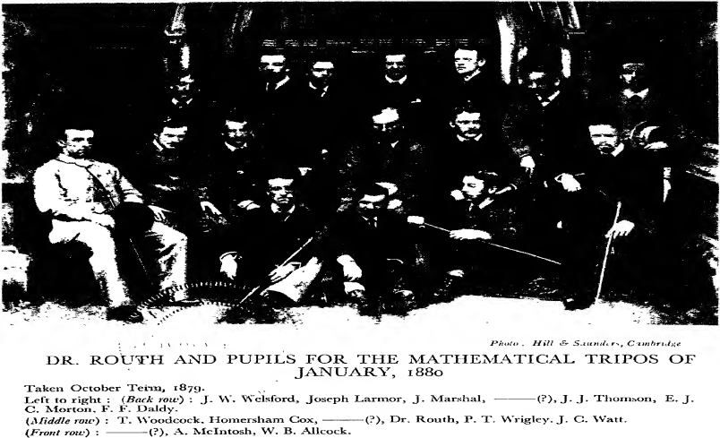

# CHAPTER II

## Undergraduate Days: Cambridge Then and Now

I CAME up to Trinity College in October 1876 and have "kept" every term since then, and been in residence for some part of each Long Vacation. As there was at the time no room in College when I came up, I went into lodgings at 16 Malcolm Street, intending to come into College when rooms were available. I found, however, the lodgings so comfortable and my landlady-Mrs Kemp, the widow of a Manciple at Trinity-so attentive, that I stayed in them for four years and did not come into College until I became a Fellow. I have never been able to remember, while I was working, to attend to a fire, nor work to any advantage when the room got cold, so I got on much better in lodgings where there was always someone about to look after the fire, than in rooms in College where the bedmaker would be away for the greater part of the day.

My tutor was Mr J. M. Image: he was a classic, and I found this an advantage, for he let me choose the mathematical lectures I attended, whereas if he had been a mathematician he would have made me go to his own lectures. He was very helpful in other matters in which I required his assistance. The Master was Dr. W. H. Thompson, about whom I shall have something to say later, and the four tutors were Joseph Prior, H. M. Taylor, Coutts Trotter and Image. They were linked together in the song:

If little Joe Prior  
Would only grow higher,  
Not Trotter, nor Taylor, nor Image Esquire  
Would be half such a man as little Joe Prior.

The point of "Image Esquire" was that Image, when he met the freshmen at the beginning of the term in his classroom, informed them that he would not open letters addressed-Image, Esq.; we must write-and here he wrote on the blackboard-J. M. Image, Esq.

At that time it was not possible to take the Little-Go before the end of the first term, and Greek was compulsory. I had not done any Greek, so I went to my tutor's lectures on the Greek for the Little-Go. By the aid of these, Bohn's translation of the set book, and a Greek Grammar specially written for the Little-Go, and which contained a long list of words which were irregular to the point of impropriety in their behaviour, not one half of which my classical friends had ever come across, I got through. I did not spend much time over Greek, not more than two hours a day for less than two months, but the time so spent was utterly wasted: it was not the slightest training in literature nor anything but a useless strain on one's memory.

Besides attending lectures on Greek I also, like the great majority of those aspiring to obtain a good place in the Mathematical Tripos, "coached" with Routh, the most famous of mathematical teachers. Routh's teaching was not in the least like what is ordinarily understood by "coaching", it was in reality a series of exceedingly clear and admirably arranged lectures, given to an audience larger than that attending the lectures of many of the mathematical Professors or College Lecturers. I had heard so much of Routh's teaching that I went to his class with great expectations. I confess at first I was somewhat disappointed: his lecture was quite clear, but there was nothing particularly novel or striking about what he said, and, taking any particular lecture, I had heard as good a one from other teachers. After a short time, however, I began to appreciate their merits, but to do this one must take into account what these lectures had to do. The mathematical tripos at the time I read with him included practically all the branches of pure and applied mathematics known at that time, and the examination was competitive-leaving out a subject would involve the risk of losing marks. The marks assigned to any subject might be a small fraction of the whole, so that several subjects might be omitted without altering the class in which the candidate was placed; but it would alter materially his position in the class, and for men who hoped to be near the top of the tripos this was all-important. The best candidates read by far the greater part of the subjects, and they had to do this in three years and a term. A course of instruction which would give an adequate knowledge of such a large number of subjects in so short a time required a time-table that had been most carefully thought out and thoroughly tested, and everyone knew that he would get this if he went to Routh. He took his pupils in classes, and there were usually about ten in a class, and two such classes for each year. You were placed in one class or another at the beginning, according to the amount you had read and how you had done in the entrance scholarship examination before coming up, and the great majority of his pupils had taken this examination. Most of us remained throughout our reading with him in the class he had put us in at first.

In his lectures he took us through the best textbook on the subject, the parts which the author had treated satisfactorily he just told us to read: when the book was obscure he made it plain; when the proof of a theorem was longer than need be he gave us the shortest one; when the author had put in something that was not important he told us not to read it; when he had omitted something that was important he supplied the omissions. These diversions made the lectures more interesting and more easily remembered. His lectures on Rigid Dynamics, on which he had written the standard textbook which had been translated into several languages and which is still the standard work on the subject, were not so interesting as those on other subjects. He naturally had not so many opportunities for criticism.

The lectures were supplemented by manuscripts in his own handwriting on parts of the subjects which had not yet got into the textbooks and on which questions might possibly, though not probably, be set in the tripos. He did not touch on these in his lectures but referred us to the manuscripts, which were placed in a room next to his lecture-room at Peterhouse and which was open to all his pupils. Some copied them out, but as they were generally of considerable length and took a long time to copy, I contented myself with reading them. Another important part of his system of teaching was the weekly problem paper, which contained about a dozen problems taken from the different subjects set in the tripos; one week we could take as much time as we pleased in solving the problems, the next we were expected to do them in three hours, the time allowed for such a paper in the tripos. We sent the papers in at the end of the week, and on the next Monday morning a complete solution of the paper in Routh's handwriting was placed in the pupils' room, together with a list of the marks each pupil had obtained. This introduced a sporting element, and made us take more trouble over them than we should otherwise have done.

Routh's system, certainly succeeded in the object for which it was designed, that of training men to take high places in the tripos; for in the thirty-three years from 1855 to 1888 in which it was in force, he had 27 Senior Wranglers and he taught 24 in 24 consecutive years. Results like these could not have been obtained unless he had been a born teacher, as he was, and had spent, as he had, time and labour in keeping his technique up to the mark. His lectures were given in a conversational way: he was never eloquent, never humorous, but always clear. I do not think he would create enthusiasm for mathematics in those who had not it already, but he could better than anyone else give to students during their stay at Cambridge a sound and substantial knowledge in all the important branches of mathematics pure and applied. Until quite near the time when he gave up "coaching", candidates for the Mathematical Tripos were expected to be acquainted with the whole of the wide range of pure and applied mathematics included in the examination. The range of reading was much wider and there was much less specialisation under this system than in the ones which since 1882 have succeeded it, where the tripos is divided into two or more parts. The more elementary subjects are grouped in one part, and candidates are allowed to select a small number of the more advanced subjects for the other parts.

There is naturally, when we look back on our early days, a kind of glamour over many of our experiences and they look more attractive than they did at the time or than they would to an unbiased judgment, but examinations are about the last things to which sentiment would cling, and I do not think it is prejudice which makes me prefer the system in vogue when I took my degree to those which succeeded it. I am glad that I came under the older system, for I probably read much more pure mathematics than I should have done if I had taken my degree a few years later. I have found this of great value (c'est le premier pas qui coute), and it is a much less formidable task for the physicist, who finds that his researches require a knowledge of the highest parts of some branch of pure mathematics, to get this if he has already broken the ice, than if he has to start ab initio.

Routh was such an interesting figure in the history of mathematics that I hope to be pardoned if I say a few more words about him. Example is better than precept, so he who teaches would-be Senior Wranglers ought to have been one himself. Routh fulfilled this condition, for he was Senior Wrangler in the year when Clerk Maxwell was second. Perhaps no other man has ever exerted so much influence on the teaching of mathematics; for about half a century the vast majority of professors of mathematics in English, Scotch, Welsh and Colonial universities, and also the teachers of mathematics in the larger schools, had been pupils of his, and to a very large extent adopted his methods. In the textbooks of the time old pupils of Routh's would be continually meeting with passages which they recognised as echoes of what they had heard in his classroom or seen in his manuscripts.

He was the son of Sir Randolph Routh, K.C.B., and was born at Quebec. He came to England and studied mathematics under De Morgan at University College, London; he entered at Peterhouse, Cambridge, in 1850. Clerk Maxwell also came up to that College in this year, but after one term migrated to Trinity. Routh, like Maxwell, studied mathematics under Hopkins, the great "coach" at that time, who had taught Stokes and William Thomson, and scored 17 Senior Wranglers before he retired. Routh was Senior Wrangler and bracketed with Clerk Maxwell for the Smith Prize. He began taking pupils soon after taking his degree, and it was not long before practically all the best men came to him for tuition. He found time, in spite of all his private teaching, to write a good many papers containing original researches in mathematics. These were all of high quality; his most important work was, however, in the essay, "A Treatise on the Stability of Motion, particularly Steady Motion", with which he won the Adams Prize in 1877. In this he introduced what he called "a modified Lagrangean Function" which increased greatly the scope and power of Lagrange's method, the most general and powerful of all dynamical methods. Routh's work has been of fundamental importance in the application of dynamics to problems in physics. He anticipated Sir William Thomson and von Helmholtz, who had independently discovered the same theorem. He was elected a Fellow of the Royal Society for his contribution to mathematics.

The regularity of Routh's life was almost incredible; his occupation during term time could be expressed as a mathematical function of the time which had only one solution. I believe one who had attended his lectures could have told what he had been lecturing upon at a particular hour, and on a particular day, over a period of twenty-five years. The fact that year after year he gave the same lectures at the same time did not make him stale as it would most people. He might, as far as one could judge from his manner, have been delivering each lecture for the first time.

His way of taking exercise was as regular as his lectures: every fine afternoon he started at the same time for a walk along the Trumpington Road; went the same distance out, turned and came back. His regularity was not, as might perhaps have been expected, accompanied by formal and stereotyped manners; these were very simple and kindly and we were all very fond of him. This was shown very markedly when in 1888 he gave up private tuition. His old pupils presented to Mrs Routh his portrait by Herkomer, and took the opportunity of expressing either by letter or by their presence at the meeting in Peterhouse, where the presentation was made by the late Lord Rayleigh, their gratitude to him for his teaching. I share to the full this feeling. It was a long-established custom for Routh's pupils to be photographed in a group in the term before the examination for the tripos. A collection of these would show what the great majority of the mathematicians of the last fifty years, and many other people who obtained eminence in other walks of life, looked like when they were undergraduates. My class at Routh's contained Joseph Larmor, Senior Wrangler and First Smith's Prizeman, who subsequently, like Newton and Stokes, became Lucasian Professor and representative of Cambridge University in Parliament, and was also, like Stokes, Secretary of the Royal Society; W. B. Allcock, who was Third Wrangler and became a Fellow of Emmanuel, and a most efficient and devoted teacher of mathematics in the College; and Homersham Cox, who was Fourth Wrangler and later a Fellow of Trinity College. Cox was one of the clearest-headed men I ever met but remarkably absent-minded. He became for a time a medical student: he did not take this very seriously. On one occasion, when in for one of the parts of the M.B. Examination, he found himself confronted with a paper on a subject which he had forgotten was included in the examination. He went to India as Professor of Mathematics in the University of Allahabad and was very successful in gaining the affections of his Indian students; he had a very genuine sympathy with many of their opinions. Another member of Routh's class was E. J. C. Morton of St. John's College, who was President of the Union, an "Apostle", and subsequently Member of Parliament. Martin Conway of Trinity, now Lord Conway, who has won great distinction in art, in politics and mountaineering, was a member for one year and then deserted mathematics for art. Very striking evidence of the importance attached to Routh's teaching is that so many undergraduates, many of them, like myself, poor men, were willing to pay his fees, amounting to £36 a year, to get it. This made mathematics a more expensive subject than classics or history, where private tuition was not nearly so general, and students were content with the lectures given by the Professors and College Lecturers. Though no doubt most of us went to Routh because we thought that we should get a higher place in the tripos by doing so, the teaching itself was well worth the extra expense.

Besides going to Routh, I went to lectures in Trinity College given by W. D. Niven on mathematical physics, mainly on Maxwell's treatise on Electricity and Magnetism which had then lately been published, and also lectures by J. W. L. Glaisher on pure mathematics. From both these I derived great benefit. Niven was not a fluent lecturer nor was his meaning always clear, but he was profoundly convinced of the importance of Maxwell's views and enthusiastic about them; he managed to impart his enthusiasm to the class, and if we could not quite understand what he said about certain points, we were sure that these were important and that we must in some way or other get to understand them. This set us thinking about them and reading and re-reading Maxwell's book, which itself was not always clear. This was an excellent education and we got a much better grip of the subject, and greater interest in it, than we should have got if the question had seemed so clear to us in the lecture that we need not think further about it. The best teacher is not always the clearest lecturer but the one who is most successful in making his pupils think for themselves, and this Niven by his enthusiasm certainly did. After Maxwell's death Niven published for the University Press his collected papers, and prefaced them by an admirable biographical notice.

Niven was one of the best and kindest friends I ever had; he was very kind to me from the time I came up as a freshman. He often asked me to go walks with him. I went very often to his rooms and, through him, I got to know many of the Fellows of the College.

He was an Aberdonian. He was bracketed with James Stuart as Third Wrangler in 1866; his brother Charles was Senior Wrangler in 1867 and afterwards Fellow of Trinity, and Professor of Natural Philosophy at Aberdeen and Fellow of the Royal Society; and his brother James was bracketed Eighth Wrangler in 1874, afterwards Fellow of Queens' and Medical Officer of Health for Manchester. Sir William Niven was a Fellow of the Royal Society, and President of the Mathematical Society 1908-1909. He left Cambridge in 1882 and became Director of Studies at the Royal Naval College, Greenwich. He held this post until 1903, when he retired at the age of sixty, and received the K.C.B. for his official services. He died at Sidcup in 1917.

The lectures given by J. W. L. Glaisher on pure mathematics were the most interesting I ever attended on that subject; indeed he made me at one time quite enthusiastic about elliptic functions. The lectures were very clear and he covered a good deal of ground; above all, they were never dull and were very human. If he was talking about a theorem discovered by X he would break out with "X was a great mathematician but he was a queer fish. Whenever he was introduced to a pretty girl he would, when he went home, write a sonnet about her and send it to her"; or of Y, "He once stabbed a man and there was the dickens of a row". This gave a certain liveliness to his lectures which was not conspicuous in those of some of his contemporaries. The dullness of some of these can hardly be imagined. One of them adopted a method which I have never seen before or since. He hardly spoke a word but wrote steadily on the blackboard; when he had filled it he said, "Copy that!" While we were doing this he was filling another board, and so the lecture went on. Glaisher's father was a well-known meteorologist who had gained great celebrity by making balloon ascents of record heights to take meteorological observations. Like his son he revelled in scientific societies, and his present to his son when he came of age was to pay the fees for life membership to the British Association, and to practically all the mathematical and astronomical societies whose membership could be obtained in this simple way. Glaisher was Second Wrangler in 1871, when John Hopkinson was Senior. He was then twenty-three years old. He was elected Fellow and Lecturer at Trinity College in the same year. Before he took his degree he had had a paper published in the Transactions of the Royal Society, a most unusual thing for one so young. In 1871 he was put on a Committee of the British Association to report on mathematical tables. The other members of the Committee were Cayley, Stokes, William Thomson and H. J. S. Smith. This is very strong evidence of the high opinion which the leading mathematicians of the day held of his ability. He knew all the mathematicians of his time and had heard what they said about their predecessors, so that he knew a good deal more about mathematicians than their achievements in mathematics. During the seventies and eighties he was the most active promoter of research in pure mathematics in Cambridge; he was the editor of the Quarterly Journal of Mathematics, in which much of this appeared. The conspicuous success in recent years of the Cambridge School of Pure Mathematics is due in no small degree to the spadework done by Glaisher more than fifty years ago.

In 1883 he accepted the offer of a tutorship in Trinity College. This was a most unfortunate decision. As a tutor he was subject to continual interruption which very seriously interfered with his mathematical work, and when on Cayley's death in 1895 the Sadlerian Professorship in Pure Mathematics became vacant he was not elected. As his lectureship in mathematics at the College also ran out at about the same time, he badly wanted some other work to fill the gap and took to collecting china and pottery, and this became the chief interest of the last thirty years of his life. His original idea was to make a collection which would illustrate by early specimens the introduction of each step in the improvement of the technique of the potter's art. In this I understand he succeeded, but in doing this he had got bitten with the collector's mania, and became specially interested in "slip ware" and was anxious that his collection of this should be the best in the world. This is a very dangerous state of mind, for whenever an exceptionally fine specimen comes on the market you feel you must buy it or one of your rivals will get ahead of you. Glaisher spent a very large amount on his collection, considerably over £100,000 I believe, but he used to say that he had never regretted any of his extravagances, but had often been sorry for many of his economies which made him let a piece go which afterwards he was always longing to possess. He left his magnificent collection to the Fitzwilliam Museum: a beautifully illustrated catalogue made by Mr Rackham has just (1935) been issued. These will keep his memory green and give, as he would have wished, pleasure to many in the years to come. He was awarded the Sylvester Medal by the Royal, and the De Morgan Medal by the Mathematical Society. He had been President of many Societies, the Cambridge Philosophical, the Mathematical, the Astronomical, the Cambridge Antiquarian, and of the Cambridge University Bicycle Club, for he was in the early days of cycling an enthusiastic rider of the old "penny-farthing" machine. I think, however, the office which gave him the greatest pleasure was the Presidency of the Astronomical Club, which he held for thirty-five years. The Club is famous for good fellowship and good dinners. It is the custom of the Club for the President to propose the health of every guest at these dinners. By all accounts he did this with great success. Certainly the few speeches I heard were quite delightful, full of that humour, kind but discriminating, which was characteristic of the man. Though he was a bachelor, a don, and had lived in College rooms for more than sixty years, he was by no means a recluse; in fact he was very fond of talking, and keenly interested in the affairs of his friends and acquaintances.

While I was an undergraduate I attended lectures given by Professors Cayley, Adams and Stokes. The first set of Cayley's lectures I attended were somewhat remarkable. I was the only undergraduate; Glaisher and R. T. Wright, both Masters of Arts, made up the audience. Cayley did not use a blackboard, but sat at the end of a long narrow table and wrote with a quill pen on sheets of large foolscap paper. As the seats next the Professor were occupied by my seniors, I only saw the writing upside down. This, as may be imagined, made note-taking somewhat difficult. I should, however, be very sorry to have missed these lectures. It was a most interesting, valuable and educational experience to see Cayley solve a problem. He did not seem to trouble much about choosing the best method, but took the first that came to his mind. This led to analytical expressions which seemed hopelessly complicated and uncouth. Cayley, however, never seemed disconcerted but went steadily on, and in a few lines had changed the shapeless mass of symbols into beautifully symmetrical expressions, and the problem was solved. As a lesson in teaching one not to be afraid of a crowd of symbols, it was most valuable.

Professor Adams, whose lectures I also attended, never seemed to have any complicated collections of symbols to deal with; he, like Kirchhoff, carried the feelings of an artist into his mathematics, and a demonstration had to be elegant as well as sound before he was satisfied. His lectures were wonderfully clear, and were read from beautifully written manuscript which he brought into the lecture-room in calico bags made by his wife. The lectures I attended were on his own researches on Lunar Theory. They had never been published and contained important additions to that theory. I think, however, reading a lecture deprives it of much of its charm: the reader is apt to be bored; his mind is not so alert as if he had to frame his sentences as he went along, or rack his memory to reproduce them, and if he is lecturing to students he goes too quickly to allow them to take adequate notes. In particular, I think the dullest lectures are those read from the proof-sheets of a book which is passing through the press.

The lectures I enjoyed the most were those by Sir George Stokes on Light. For clearness of exposition, beauty and aptness of the experiments, I have never heard their equal. He had only the simplest apparatus at his command, no light but that of the sun, no assistant to help him. He prepared the experiments himself before the lecture and performed them himself in the lecture, and they always came off. His success was not obtained without much labour. His daughter, Mrs Humphry, in her biographical sketch prefixed to the Memoirs and Scientific Correspondence of Sir G. G. Stokes, edited by Sir Joseph Larmor, tells how preoccupied he was in the May Term not only with the experiments but also with the form of his lectures. His dependence on the sun obliged him to make hay while it shone, so that on bright days his lectures lasted far beyond the canonical hour. I remember on one occasion, long after my attendance at his lectures and when he was well over eighty, I met a batch of very hungry-looking students coming into the Cavendish Laboratory one afternoon at half-past two. I asked them what they had been doing, and they said they had just come from Sir George Stokes' lecture which had commenced at twelve.

Like his predecessor in the Lucasian Chair, Sir Isaac Newton, he made his remarkable discoveries in optics working in his rooms in College with very simple apparatus. Though Stokes was such an accomplished lecturer, his power of keeping silent was equally remarkable. He, like Newton, represented Cambridge University in Parliament: he was member for four years and attended the House with great regularity, but never spoke. It is reported of Newton, who was member for two years, that the only time he addressed the House was to move that a window be opened, and Sir Joseph Larmor, another Lucasian Professor, was member for about eleven years and only spoke once, so that the Lucasian Professors cannot be accused of having wasted the time of the House. Stokes certainly had not much small-talk. (A story is current in Cambridge that a visitor, who did not know that it was Lady Stokes she was speaking to, said, "There are two men in Cambridge whom it is positively painful to sit next at dinner: they never say a word". Lady Stokes said, "Yes, George is one, but who is the other?") He was, however, quite ready to talk on subjects on which he felt he had something to say. I once saw an amusing instance of this. He was sitting at lunch next a very charming American lady who started one subject after another without getting any reply but yes or no. At last in desperation, she asked him which did he like best, arithmetic or algebra? The change was marvellous; he became quite fluent and talked freely for the rest of the lunch.

He had a mind which, like a filter, seemed to clarify anything which passed through it, and one's ideas seemed always clearer and more definite after a talk with him about them. He was also very open-minded. When one presented to him a new idea, he did not at once say there could be nothing in it, but would listen quite patiently to anything one might say in its favour. He was, however, exceedingly cautious about coming to a conclusion. But, if he made any criticism, one was quite sure that it would be wise to reconsider most carefully the point he criticised before committing oneself to it. He had the Newtonian type of mind to a remarkable extent, but he was even more cautious than Newton. One might conceive his having written the bulk of Newton's Optics but not of his venturing to add the celebrated queries. It was very interesting to see Lord Kelvin and Stokes together. Lord Kelvin regarded Stokes as his teacher and always had the greatest respect for his opinion, and often said when he came to a difficulty on some mathematical or physical problem, "I must ask Stokes what he thinks about it". The temperaments of the two were, however, very different. When Kelvin was speaking, Stokes would remain silent until Kelvin seemed at any rate to pause. On the other hand, when Stokes was speaking, Kelvin would butt in after almost every sentence with some idea which had just occurred to him, and which he could not suppress. I once saw a curious reversal of this. They had come together to the Cavendish Laboratory, and I was showing them some experiments I was engaged with at the time, on the electric discharge through gases. I happened to speak about atoms playing a part in one of the effects I was showing, when Kelvin said he did not believe in atoms but only in molecules. This was too much for Stokes. He began at once to give a charmingly clear account of the reasons why atoms as well as molecules must exist. He was so much in earnest that Kelvin for once could not get a word in edgeways: as soon as he started to speak, Stokes raised his hand in a solemn way and, as it were, pushed Kelvin back into his seat.

Stokes was one of the Secretaries of the Royal Society for thirty-one years, and the work he did in this capacity had a very great effect on the progress of the physical sciences. He read all the mathematical and physical papers sent in to the Society with great care, suggesting improvement in the experiments, or in the arguments, or in the method of presentation. In addition to his work on the papers sent in to the Royal Society, he was in constant correspondence with many of the most active workers on physics, such as Crookes, Warren de la Rue, Smithells. These, as his correspondence and their acknowledgments show, often turned to him for advice. He was the guide as well as the teacher of his contemporaries. This work left him with but little time for his own researches. He had not had time to make any progress with the textbook on light which students had expected and hoped for for more than thirty years. Stokes, like Newton, was deeply interested in theology and spent much time in the latter part of his life in correspondence about his doctrine of "Conditional Immortality". He held that only the souls of those who had been righteous in their life, or who had repented before their death, were immortal. The souls of the wicked vanished: there was a Heaven but no Hell. Some have regretted that he "wasted" on religious subjects so much time that might have been spent on scientific ones. It should be remembered, however, that his scale of values was probably different from that of his critics.

He was a deeply religious man, and to him as to many others the orthodox view about Hell and eternal torment seemed incompatible with the spirit of Christianity. He thought this was because "religious people insisted on a slavish literalism", "framed a theory that the Bible must be interpreted in a way just like that in which a lawyer would interpret an Act of Parliament, stuck to the letter rather than attempted to catch the spirit". He would have regarded time spent in clearing away obstacles to his own faith or in helping others to do the like, not as time wasted but as used to the best advantage.

"Conditional Immortality" did not get much support from Ecclesiastical Authorities and was, I believe, sometimes attacked from the University pulpit. Though a strong conservative in many things, he held liberal opinions about Church matters. He wished the compulsory signing of the Thirty-nine Articles to be abolished and the Athanasian Creed to be altered.

He was a pioneer in Cambridge in using a typewriter, much to the relief of his friends, as his handwriting was very shaky and somewhat difficult to read. It was, however, legibility itself compared with that of another Professor, whose letters took the spare time of many days to decipher.

My undergraduate days were very pleasant though uneventful. The most exciting incidents were perhaps the results of the annual College Examinations, and the migration for the Long Vacation term from my lodgings in Malcolm Street to rooms in the Great Court. In those days many more undergraduates came up for the Long Vacation and stayed up longer than they do now. Most men who were serious candidates for honours came up at the beginning of July, and stayed up to nearly the end of August. More than 200 came up then; now there are not much more than half that number, and they do not stay up so long. It was very pleasant: we had more leisure as there were no College lectures, though the mathematicians went to Routh, and more opportunities of making friends. It was too, from the educational point of view, an important part of our stay in Cambridge. We had time to think, and to arrange and co-ordinate our knowledge. We got a better grip of our subject and were able to work out any new ideas we might have. An important event of the Long was the cricket match between members on the Foundation, i.e. the Fellows and the Scholars, and the rest. As at that time about half the members of the Cambridge eleven were Trinity men, there was generally a "blue" playing. There were, of course, some who never played cricket except at this match. It was an amusing match to watch. There was one classical Fellow of the College who was so anxious to make runs that he usually ran two or three of his side out in the attempt. The only fly in the ointment was that we had to "keep" three morning Chapels at 7.30 each week. This was more difficult than it looks, for sometimes though we got up early it was not quite early enough, and the Chapel doors were shut before we could reach them.

When I was in residence in the Long of 1879 the most severe thunderstorm I have ever seen struck Cambridge. It was on a Saturday night and Sunday morning: the storm had been going on for some time before I awoke, and when I looked out of the window the Great Court was a lake some inches deep; torrents of rain were falling from the skies and pouring from the roofs into the Court. I looked at the river before going into Chapel on Sunday morning; it was very high and rising rapidly, and when we came out it had overflowed its banks and the Paddocks on each side of the Avenue were flooded. It was many days before the water subsided from them, and there was fishing for small fish available for ardent anglers.

Another institution which was in force in my time, but which I am sorry to say has now disappeared, was "The Scholars' Table"; one table at the dinner in Hall was reserved for scholars. They need not sit there unless they liked, but a large proportion of them did so. It was very enjoyable and gave excellent opportunities for making friends with men of other years and studying other subjects. T. E. Scrutton, a man in my own year who became Lord Justice Scrutton, dined regularly at this table. We all felt sure he would succeed at the Bar, he was so fond of arguing and so quick-witted, and so able. He got a First-Class in the Moral Science Tripos and was Senior in the Law Tripos. Later on he won the York Prize on four occasions: two of the essays for this prize, those on Charter Parties and on Copyright, developed into the standard books on these subjects. (He was a prominent figure at the Union and became President, and was very successful in scoring off his opponents. When one of these had finished a long string of abuse by calling the other side "uncircumcised Philistines", Scrutton at once jumped up and began, "My honourable and I suppose circumcised friend".)

Another man in the same year was H. H. West, a classical scholar, an Irishman, full of wit, immensely entertaining and a good actor. He gave on occasions representations of some of the figures in Smith's Dictionary of Classical Antiquities: his star turn was that of the man with the testudo. He took a leaf out of his table and, after taking off his clothes, put it on his back and gave a screamingly funny performance.

Another scholar of the same year was G. M. Edwards, a very good classic who was elected Fellow and Lecturer and afterwards Tutor of Sidney Sussex College. Another was Claud Melford Thompson, who was the first to win marks of distinction in both Physics and Chemistry in Part II of the Natural Sciences Tripos. He was for many years Professor of Chemistry in the University of Cardiff and took a prominent part in the administration of that university.

W. H. Whitfeld, a mathematical scholar in the same year, applied his mathematics to whist and succeeded "Cavendish" as Card Editor for the Field. He had an amazing card memory. I often played two or three rubbers with him after Hall, and I have known him, when I had been his partner, come round the next morning and tell me that if I had played another card instead of the one I had we should have won two more tricks. He took up a pack of cards and without any hesitation laid out the hand as it was when the wrong card was played. I of course did not remember more than a fraction of the cards, but the few I did remember agreed with his placing. He spent a great amount of time on the mathematics of whist, and by dealing out countless hands had accumulated a vast amount of material on how far the distribution of cards in actual play differed from that predicted by the Theory of Probability. By the advent of Bridge this had lost much of its interest and it was never, as far as I know, published.

G. W. Johnson, a scholar in the same year, took a Double First and went into the Civil Service and was for many years Chief Clerk in the Colonial Office. Another Double First had been obtained by E. V. Arnold, who was in the year above. He was bracketed Senior Classic and was also a Wrangler: he was a man of great energy and took a very active part in starting the Cambridge Review. He became Professor of Latin in the University of Bangor.

## The Mathematical Tripos

The examination for the Mathematical Tripos when I sat for it in January 1880 was an arduous, anxious and a very uncomfortable experience. It was held in the depth of winter in the Senate House, a room in which there were no heating appliances of any kind. It certainly was horribly cold, though the ink did not freeze as it is reported to have once done. The examination was divided into two periods: the first lasted for four days. In the first three days we were examined on the elementary parts of geometry, conic sections, algebra and plane trigonometry, statics and dynamics, hydrostatics and optics, Newton and astronomy. Five papers were set on these subjects, each paper containing about twelve questions, each question consisting of a piece of book work and a rider which was a question, not supposed to be taken from a book, but one whose solution was closely connected with the piece of book work with which it was associated. In addition to these five book-work papers, there was a paper called the problem paper in which there was no book work. The questions were in themselves generally a little more difficult than the riders in the book-work papers, and, what was more important, you were deprived of the guidance given by their association with a particular piece of book work. In the papers set in the first three days you were not allowed to use

> This is a high-contrast monochrome group photograph plate showing Dr. Routh and his pupils posed outdoors in multiple rows, with some seated in front and others standing behind against an arched architectural backdrop. The tonal range is dark and grainy from the original print, but faces, suits, and posture lines are still visible. Beneath the image, the printed caption identifies the group as "DR. ROUTH AND PUPILS FOR THE MATHEMATICAL TRIPOS OF JANUARY, 1880," notes "Taken October Term, 1879," and lists named pupils by row, including Dr. Routh, J. W. Welsford, Joseph Larmor, J. Marshall, J. J. Thomson, E. J. C. Morton, F. F. Baldy, T. Woodcock, Homersham Cox, P. T. Wrigley, J. C. Watt, A. McIntosh, and W. B. Allcock, with a few entries partially unclear in the source print.

the methods of the differential calculus, or of analytical geometry. The fourth day was a recent introduction dating from 1873. The two papers set on this day included easy questions on the higher parts of pure and applied mathematics, and also on the physical subjects-heat, electricity and magnetism-which had been introduced into the Tripos at the same time. An additional examiner was also appointed, specially qualified to deal with these subjects. The first of these examiners was Clerk Maxwell. On the fourth day the use of the differential calculus and analytical geometry was allowed. The papers in the morning were from 9 to 12, those in the afternoon from 1.30 to 4. At the end of the fourth day there was an interval of ten days in which the examiners drew up a list of those who, by their performance on the first three days, had acquitted themselves so as to deserve mathematical honours. These, and these only, could take the second part of the Tripos, which lasted for five days beginning on the Monday next but one after the beginning of the first four days. The marks allotted to the last five days were about six times those for the first four. The questions ranged over all branches of mathematics and there were two problem papers. The questions set on the first two days of this examination were on the parts of mathematics which had been included in the Tripos almost since its foundation, and were subject to the restriction that the book-work papers set in the first two days of the examination should not contain more questions than a well-prepared student might be expected to answer in the allotted time: this did not apply to the papers set after the second day. As each paper contained twelve questions and each question consisted of two parts, a piece of book work and a rider, this was pretty good going, but I believe that a few men each year did get a large percentage of the maximum marks obtainable on these papers. They knew the shortest proof for each piece of book work that was set; they had written it out over and over again; they had not to think about it, but merely write as fast as they could. The riders were a greater difficulty, but in the textbooks numerous "examples" were given for each piece of book work and they had probably done something very similar to the rider set in the paper. The details of the question, e.g. the algebraical work, was new, and it was of great importance that the student should make no slips in this; an error in arithmetic, or a wrong sign in a piece of algebra, would involve going through the work again, and a loss of time when there was no time to lose. Accuracy in manipulation was perhaps the most important condition in this part of the examination and the most difficult to impart: to err is human even in mathematics.

Another quality which played a great part was concentration on the question in hand, and ability to get quickly into stride for another question as soon as one had finished with the old. These qualities, having one's knowledge at one's finger-ends, concentration, accuracy and mobility owed their importance to the examination being competitive, to there being an order of merit, to our having to gallop all the way to have a chance of winning. These qualities are just those which are of most importance at the Bar, and made the old Mathematical Tripos an excellent training for that profession. It is significant, I think, that the last Tripos to give up arranging the list in order of merit was the Law Tripos, which retained it until 1923, forty years after it had been dropped in the mathematical. It is somewhat humiliating to compare the rate at which one could do mathematical problems when in for the Tripos, with the rate one can attain late in life.

In the last three days of the Tripos, when no pretence was made that the questions could be done by well-prepared students in the allotted time, a much smaller percentage of marks was the rule. The book work in the higher subjects took much longer, and the number of questions was only about two less than in the other parts; indeed it would have been good going to write out the book work alone. The riders, too, took in general longer to write out, and since sometimes not more than one examiner was an expert in some of the new subjects, his papers were not subject to effective criticism from his colleagues, so that sometimes the papers were absurdly difficult. I have heard of cases where not a single question in a long paper was completely done by any of the candidates. This led to there being great gaps between the marks obtained by candidates coming next in order in the list. There was one famous case when the Senior Wrangler's marks were considerably more than twice those of the Second Wrangler, who became a very distinguished mathematician and a Professor in the University. From my experience as an examiner in both mathematics and physics, I have come to the conclusion that examinations in the higher parts of these subjects are unsatisfactory. In mathematics the pieces of book work are in general very long, and if the candidate makes a slip in the analysis and does not get the result asked for, it may take him a long time to find out the error and correct it. I have known more than one case where a candidate, who later proved to be a very able mathematician, sent up a paper in which not a single question was completely solved. When preparing for an examination one has to get up the subject in much greater detail than is necessary for understanding its scope, and the general methods used to obtain the results. Memory is burdened with a mass of detail which will very soon be forgotten. All that one need remember is where to look for them when wanted. The same considerations apply to examinations on the most recent discoveries in physics. In each case I think the student would benefit if, instead of spending so much time in getting his knowledge up to examination pitch, he spent some time in attempting a piece of research.

Again, the questions set in mathematical physics often stop where the real interest begins. The question asked is often to find a relation between a number of mathematical symbols representing various physical quantities; nothing is asked as to what are the physical consequences resulting from this relation. This, however, is just the thing which is of interest to the physicist; it is as if he received a message in cypher and made no attempt to decode it.

The Tripos under the regulation I have described was, in my opinion, a very good examination for the better men. It was, however, a very bad one for the majority who had not exceptional mathematical ability. Many of these men could cope with the more elementary subjects and benefit by studying them, but with these they had shot their bolt; they found the higher subjects beyond them and the time they spent over them was wasted. Under the old regulations, if these men were to get any credit for the mathematics they did know, they must wait for the Tripos at the end of their tenth term, and for the last three or even more terms they were only marking time, not gaining any additional knowledge or any mental training.

Under the new system the men can be examined in elementary mathematics at the end of their first or second year, and can thus take up a new subject, such as engineering, economics or science, in which their mathematics may prove of considerable assistance. Whether or not the changes that have been made in the Mathematical Tripos have been instrumental in promoting the progress of mathematical science in this country is a question which it is very difficult to answer. There is no doubt that the number of mathematical papers published in England has increased very greatly, and so has the number of people engaged in research in mathematics, but this in my opinion is largely due to the great change which has come over the feeling in the country with regard to research, rather than to the changes in the Tripos itself. In the days of the old Tripos very few rewards were given for research. Fellowships, except at Trinity College, were given for success in examinations and not for research. Scholarships stopped as soon as the scholar had taken his degree. When a man applied for a teaching post the qualification which carried most weight was that of being a good teacher. No one asked whether he was a good researcher, or whether he had done any research at all. There were no rewards for research except the small number of professorships in the few universities which then existed. Now all this has been changed; the country has got the research habit, research is the fashion in all subjects. Candidates for Fellowships would have little chance of election unless they submitted a dissertation containing an account of a piece of original research. For all scientific posts the predominant qualification is a successful piece of research.

grants of money to support him while researching. These may come from his College in the form of research scholarships, from the university which awards studentships for research, from outside bodies like the Board of Invention and Research, which has made a great number of substantial grants to enable students to continue their researches; from the 1851 Commission and some of the great City Companies, to mention only the most prominent. There are thus many more students in the university engaged in researches, each of which ought to, and many do, result in the production of a paper worthy of publication in a scientific magazine or the Transactions of some scientific society. The great majority of these would not have been written unless the authors had received inducements and assistance which hardly existed fifty years ago. Then there were comparatively few men engaged in research, and those who were, did it not because public opinion expected it of them, but because of their enthusiasm for science and the joy they felt in discovery. They were exceptional men. Men of this type cannot be produced by giving scholarships or even by particular schemes of education. They are born, not made; and as experience has shown, they seem able to get to the front in spite of all obstacles. The "mute inglorious Milton" is probably a myth. Dr. Rashdall (Universities of Europe in the Middle Ages, vol. ii. pp. 2, 602) says that the means of education in the Middle Ages were more widely diffused than is generally supposed, and that "except in remote and thinly populated regions, a boy would never have to go very far from home to find a regular Grammar School". Thus any boy of exceptional ability might be expected to have come under the notice of someone who, like the old Scotch dominies, would set to work to raise funds enough to enable him to go to a university. Increase in the sum spent on education, improved methods of teaching, the provision of scholarships to the universities and the like, cannot be expected to increase to any great extent the number of quite exceptional men. They can, however, and do, increase the number of able men available for the service of the State, for our industries and for the promotion of science. They may be compared with improvements in telescopes which, while they do not reveal new stars of the first magnitude, which can be seen without them, do bring to light multitudes of new worlds.

I took the Tripos Examination in January 1880. The thing about it which remains most clearly in my memory is that I suffered from a bad attack of insomnia during the last five days, and got very little sleep. Insomnia is even more unpleasant in Cambridge than in most other places, for since several clocks chime each quarter of an hour you know exactly how much sleep you have lost, and this makes you lose more. Though the nights were very unpleasant I do not think they had much effect on my work in the examination, for when I got started on a paper the feeling of fatigue passed away. I had a shampoo between the morning and afternoon papers and got much sympathy from the barber, who said he was glad he was not in my shoes. I came out Second Wrangler; Larmor was Senior. I was very well satisfied with the result, as I was quite as high up as I ever expected to be. I had a return of insomnia in the Smith's Prize Examination and actually had a short doze in the afternoon paper at the Observatory. This may, however, have been due to the excellent lunch which Professor and Mrs Adams provided for us.

## Undergraduate Life Then and Now

I ceased to be an undergraduate in 1880. Looking back on my undergraduate days and comparing undergraduate life then with what it is now, I see of course many important changes but not, I think, such important ones as have occurred in many other walks of life. They are certainly far less fundamental than those in the lives of the dons, for hardly any of these were married when I was an undergraduate, while now but few are single. The advent of students from Newnham and Girton has made some difference. We did not sit side by side with ladies during lectures, nor treat them to chocolate and cakes in the intervals between them, nor, except in May week, invite them to our rooms. These, however, are trifles compared with matrimony. Perhaps the most striking difference is in amusements and games. In those days there were no theatres open in term time. The Theatre Royal in Barnwell, a suburb of Cambridge, existed, but was only open during the Long Vacation. We find from Gunning's Reminiscences that it was regularly attended at the end of the eighteenth century during Stourbridge Fair, then one of the largest fairs in the country, by a group of Shakespearian critics headed by Dr. Farmer, the Master of Emmanuel College. It had in my time grievously fallen from that high estate, and some of the interpretations of Shakespeare's meaning would not have met with his approval.

One year when we came up at the beginning of the October term, we found posters all over the town announcing that the Theatre Royal, Barnwell, would reopen on a certain day under entirely new management; when the audience arrived they found that instead of a play they were offered a prayer meeting. The theatre had been bought by the Hon. Ian Keith Falconer, who subsequently became Lord Almoner's Professor of Arabic, and who was an ardent supporter of religious missions. He was also the champion bicyclist of his time. The theatre was renovated and revived a few years ago as the "Festival". It produced many interesting plays which could rarely be seen elsewhere, and became an important feature in the social life of the University.

The only plays to be seen at Cambridge in my days were one in the Michaelmas Term and another in the May Term, given by the A.D.C., a dramatic club founded by Burnand. These reached a very high standard. There was generally among the older members of the University someone who, like J. W. Clark in my time, took great interest in the theatre, and who spent a great deal of time and trouble over the rehearsals. All the women's parts were taken by men, and I think the best Lady Teazle I ever saw was Mr Manners, a Jesus man. Some of the undergraduates who took part in these plays subsequently went on the stage, and one or two of them attained considerable success. The photographs in the rooms of the A.D.C. are very interesting. You see future Bishops as singing chambermaids and Cabinet Ministers as butlers. Things are changed now. There is a large theatre and another being built; there are five or six cinemas; there are several new dramatic clubs such as the Marlowe Society and the Footlights, and every few years there is a Greek play. Thus each year several plays are produced, and a great deal of time and trouble is spent over them, and the work of the undergraduates taking part in them seriously interrupted. There was always much good music to be heard in Cambridge, but now the Cambridge musicians are much more ambitious, and produce operas such as Purcell's Faery Queen with large orchestras, and which involve a great sacrifice of time by those taking part in them. In addition to music there is dancing. This in my time was practically confined to a ball in the May Week; now since there are so many more ladies resident in Cambridge, dances are going on all through term time, and besides private dances, there are dancing clubs, and dances for every conceivable charitable purpose. The result is that an undergraduate who is good at acting, singing or dancing gets little time for his studies in term time and has to rely on the vacations for his reading for his examinations.

## Games

In those days, roughly speaking, the only games played by undergraduates were cricket and football; lawn tennis had only just been introduced, and squash racquets was a long way ahead. There certainly was a golf-links at Coldham Common quite close to the town, but these I think were the most depressing and uninviting links I ever saw. So few played that a friend of mine who went there one afternoon and was knocking a ball about with a club, was seized upon by the Secretary and asked to play against Oxford the next day. A few played fives, or real tennis, at the courts in Burrell's Walk or Tennis Court Road. The ordinary reading man who was not particularly good at games had not much chance of playing either cricket or football, for there were enough men who had got their "colours" at school to fill up the College teams-there was no room for the "rabbits". A fair number of freshmen joined their College boat club, where they found a good many companions who, like themselves, knew very little about rowing. They went regularly in their first term down to the river to be tubbed. Rowing is not a very satisfactory way for the ordinary reading man to get his exercise. If he does not take it seriously enough to get into a College eight, he does not get enough exercise, while if he does get in he gets too much, and does not feel inclined for work in the evening. In those days the great majority of the reading men got their exercise by taking walks. Between 2 and 4 in the afternoon, streams of undergraduates, two and two, might be seen on all the roads within three or four miles of Cambridge, taking the Grantchester, Madingley, Coton, Cherryhinton or Shelford "grinds". On Sundays many went further afield and walked for five or six hours. Now there are many games which, like lawn tennis, golf or squash racquets, only require two players and for which it is generally possible to find an opponent nearly as bad as yourself, so that you need not feel you are spoiling anyone's game. Even in football, hockey or cricket, there are many clubs which cater especially for poor players, so that now very few undergraduates take walks. I found these walks very pleasant; the scenery round Cambridge is much better than most people imagine. Besides, if you keep your eyes open there are beautiful things to be seen in any walk in the country, and even in one in a town. I think it is a great pity that children both at home and at school are not encouraged to look out for beauty around them. If they once got the habit it would be a continual source of pleasure to them. Most people nowadays hardly recognise beauty unless it is pointed out to them, and will go miles to see something which figures on a picture postcard, while more beautiful things are to be found close by them. The "model villages", the "fairy glens", the "pretty corners", the "lover's leaps" of the picture postcards, might all go without diminishing by more than an infinitesimal fraction the beauty of the country. The walks and the long talks which accompanied them, were an excellent means of making friendships more intimate. The solitude a deux is, I think, much better for this purpose than playing games, or going to meetings to listen to essays or discussions.

One very great friend of mine with whom I often took such walks was J. C. Watt, who had come up to Trinity from Glasgow University, where he had been a pupil of Sir William Thomson. After staying two years at Trinity he migrated to Jesus College; he was elected to a Fellowship there in 1881, and to a lectureship in 1883. He never married, but lived in College until his health broke down a few years before his death in 1931.

He possessed to a degree I have never seen surpassed the power of winning the confidence of undergraduates. He welcomed them to his rooms, took great interest in what they were doing, and knew all about their successes in games, for he rarely missed an important cricket or football match. This put them at their ease, and helped to reveal to them his kindliness, which was the secret of his success.

They felt that they had in him a real friend to whom they could go if they got into difficulties, even when these were due to their own silliness. They did so, and disclosed what they had done with a frankness much greater than most of them could have done to their own fathers. He began by telling them very frankly what he thought of their conduct, and then set to work to try to help them.

Many Jesus men who were up between 1883 and 1928 owe much to the help they got from "Tommy" Watt, as he was always called.

A great change in the relative popularity of different games has occurred since I was an undergraduate. Then the Rugby football matches were played on Parker's Piece; there was no charge for admission, and the attendance was not a tenth of what it is now when the University has a fine ground of its own, where the gate money puts the finances of the Rugby Club into such a satisfactory position that it not only makes generous donations to support clubs in other sports, but has actually founded a lectureship in Classics in the University. On the other hand Fenners, the University cricket-ground, is now almost deserted, unless the match is with the Australians or teams from India or the Dominions. Then there would be a ring three or four deep round the ground at every match in the May Term. The pavilion was crowded with dons; you were pretty sure to see there Munro, the great classic; Aldis Wright, the Hebrew and Shakespearian scholar; James Porter, the Master of Peterhouse, accompanied by his dog, for which he had paid the fee for life membership of the Cricket Club, so as to quiet his conscience about breaking the rule that dogs were not admitted to the ground; Ward of Magdalene, a very stout man who was distinguished from his brother, one of the protagonists of the Oxford Movement, by being called the real presence, and his brother the ideal presence.

Munro took great interest in cricket and, as he was a Trinity man, liked to have that College well represented in the Oxford and Cambridge cricket match. I remember one morning going into the Combination Room in College to read the newspapers; the only person in the room was Munro, who was reading The Times. I had not met him before and he looked very disappointed when he saw me. It was evident there was something he wanted to talk about very badly. I sat down and began reading the paper. After a minute or two Munro could stand it no longer. He dashed The Times with quite a bang on the floor and said, "What do you think that fellow Verrall's done?" (A. W. Verrall was a distinguished lecturer in Classics in the College.) I said I did not know. "Well," he said, "he's ploughed Foley for entrance to the College (Foley was a boy who had made a century in the Eton and Harrow match), and how do you think Verrall translates?" Here he went off with a piece of Greek, and gave Verrall's translation. I tried to look as shocked as I could, and he went on, "I don't know what this College is coming to, when a man who makes mistakes like these in a straightforward piece of translation is allowed to plough a boy like Foley".

Cambridge cricket was then at its zenith. Edward and Alfred Lyttelton, D. Q. and A. G. Steel, A. P. Lucas and Ivo Bligh all played for Cambridge between 1876 and 1880. Edward Lyttelton was captain the year he took the Classical Tripos, and used to bring his books to Fenners and read while his side was batting. The most decisive of the few defeats suffered by the first Australian team to visit the country was that inflicted in 1878 by Cambridge University, and on their second visit in 1882 they were again defeated by Cambridge.

In those days "blues" were given only to those who represented Cambridge in the boat race or the cricket match: no blues were given for football. Oxford, however, gave "Rugger" blues in 1884. The Cambridge Rugby team was naturally up in arms, and said that if blues were not given to them they would take them. This brought all the wigs on the green, and in 1885 a meeting, to which all members of the University were admitted, was held in the rooms of the "Union", the largest undergraduate club in Cambridge, to ascertain the feeling of the University. My old friend Richard Threlfall, of whom I shall have more to say later, who had twice played in the Rugby team against Oxford, was selected to plead the case for the "blue" for the Rugby team. I went with him to the meeting, and though we arrived a few minutes before it was timed to begin, the room was so packed that he could not get through the crowd at the back of the hall, and he had to be held up by a few of his friends, of whom I am proud to say I was one, while he made his speech. The speakers before him were against the proposal, and delivered carefully prepared speeches which smelt very strongly of the lamp and left the audience quite cold; when he got up and jerked out from his uncomfortable stance one short sentence after another full of good sense, good humour and good jokes, he soon had the house rocking with laughter, and put the issue beyond doubt. I never heard a speech which had so much influence upon the division.

The views held by undergraduates as to what is good form change almost as frequently as the fashion of ladies' dresses. In my time and for many years afterwards it was considered the height of indecency to carry an umbrella when wearing cap and gown, indeed our tutors warned us against it at their first interview. I have lived to see a time when it was considered to be indecent to be without an umbrella when you were out of doors, whatever other garments you might lack. The correct way of wearing it was not to have it rolled up neatly, but baggy like Mrs Gamp's: it was not used as a walking-stick but carried gingerly in front, without touching the ground. Now again the umbrella has, for a time at least, retired to the background.

Since the advent of Newnham and Girton students, undergraduates' dress has been influenced by the necessity of preserving an adequate distinction between male and female attire and behaviour. (In the days when the "Eton crop" was in fashion with Girton and Newnham students, a Trinity undergraduate with rather long hair called on his tutor. As he was going away the tutor said: "If I were you I would get my hair cut". "Oh, sir," said the undergraduate, "I should not like to do that, short hair is so effeminate.") Since cigarette-smoking has become so usual with women it has lost favour with undergraduates. The proportion of non-smokers to smokers among Trinity undergraduates is far greater than it used to be and is, I think, greater than that at Newnham or Girton. If the fashion for women to wear trousers extends to these Colleges our undergraduates will be driven to kilts.

The modern undergraduate is more businesslike than we used to be, and more careful to get good value for his money. My tailor tells me that they now nearly always ask the price of a suit before ordering it, while fifty years ago this was very unusual. Ready-money transactions are much more usual, surprisingly so, considering the readiness with which tradesmen give credit to undergraduates. A century ago Cambridge tailors had a peculiar system of insurance against losses from unpaid bills. My father-in-law, Sir George Paget, told me that a College friend of his went down without paying his tailor's bill. He got a post, and in about four years had made enough money to enable him to pay his debts. He came up to Cambridge to do so, went to his tailor and said he wanted to pay his bill.

The tailor said, "Sir, I could not think of taking the money; we make it a rule when a gentleman has been down for three years without paying his bill, to distribute the amount he owes us among the bills of our other customers". I got an illustration of the change which had come about, in a conversation I had with a bootmaker early in this century. I said I hoped trade was good. "No, sir," he said, "it is not. Things are very different now from what they were when you were an undergraduate. You will hardly believe me, sir, when I tell you that I have not met what I should call a really extravagant gentleman for more than three years." "Well, Mr -------," I said, "what would you call an extravagant gentleman?" "Sir," he said, "I should call a gentleman extravagant if he had more than two pairs of boots a week."

When I was an undergraduate the great majority of Cambridge men, after taking their degree, went into one or other of the professions, the Church, the Bar, Civil Service, Medicine or schoolmastering. Very few went into business, and those who did generally went into firms with which they had some family connection; this is now changed, and more go into business than to the professions. This is because those at the head of large business concerns attach much greater importance than they used to do to a university education, and are willing to give, without the payment of a premium, a trial to those who have done well at Cambridge. In my time Cambridge men, after taking their degree, had to find a post for themselves; there is now an important branch of the University called the Appointments Board, which has offices and a permanent staff in Cambridge, and has the advice of a committee consisting of some of the men most influential in our industries, finance and education. An old colleague of mine at the Cavendish Laboratory, now Sir Napier Shaw, F.R.S., had a great deal to do with its formation. Under the guidance of its first secretary, H. A. Roberts, it gained the confidence of the employers; he took great pains to get reliable information about the applicants for employment; he acted more like a judge than an advocate, and when he recommended a man, would mention his weaknesses as well as his merits. The result of this was that from small beginnings the Department rapidly increased; in the last Academical year 1935-36 it found posts for 596 men. These posts are of all kinds, financial, engineering, chemical, professorial, scholastic, secretarial, and most of our undergraduates who want employment after they leave the University send in their names to the Appointments Board.

The increase in the number of provincial universities and schools of technology as well as in that of the professors, readers and lecturers in the older universities has provided a much larger number of academic posts. The attraction of these has drawn in many who would otherwise have become schoolmasters, especially those who have taken high honours.

The greatest change, however, has been in the number of men who take Holy Orders. Of the 909 undergraduates who entered Trinity College in the years 1920-24 inclusive, and whose names are on the books of the College, only 24 have done so, and all the indications point to a further decrease in this proportion.
